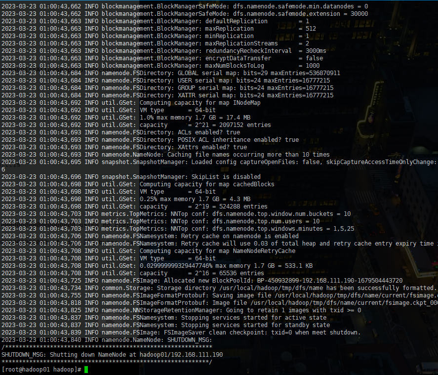
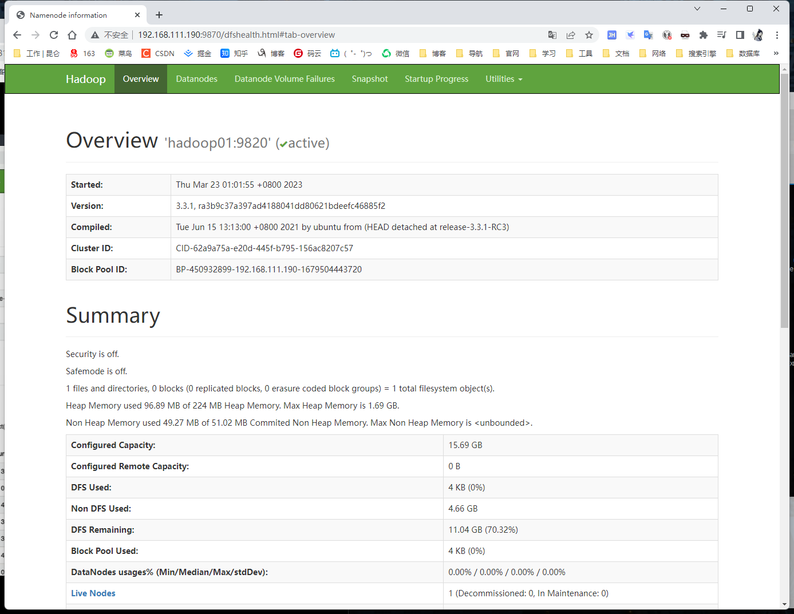

### 伪分布式模式

#### 介绍

​		伪分布式模式也是只需要一台机器，但是与本地模式不同，伪分布式使用的分布式思想，具有完整的分布式文件存储和分布式计算思想，只不过再运行存储和计算的时候涉及到相关的守护进程在同一台机器上，都是独立的Java进程，因而称为伪分布式集群。比本地模式多了代码调试功能，运行检查内存情况使用，HDFS输入输出，以及其他守护进程交互

​		总结：伪分布式集群就是只有一个节点的分布式集群


操作

```
用户：root
软件包上传路径：/root/softwares
软件安装路径:/usr/local
JDK:jdk-8u351-linux-x64.tar.gz
Hadoop:hadoop-3.3.1.tar.gz
```


检查是否存在旧版本 JDK

```
rpm -qa | grep jdk
```

如果有就删除

```sh
rpm -e xxxx -nodeps
```


**解压和添加环境变量的操作和单机搭建一样！**


当 hadoop 和 java 都解压完成后，开始特殊操作了


#### 伪集群搭建

##### 前置工作准备

```sh
# 检查防火墙
systemctl status firewalld
# 立即关闭
systemctl stop firewalld
# 永久关闭
systemctl disable firewalld


# 检查静态ip
vi /etc/sysconfig/network-scripts/ifcfg-ens33
# 检查 IPADDR="192.168.111.190" 这里咱们之前设置过

# 添加 hosts
sed -i '$a \
192.168.111.190 hadoop01 ' /etc/hosts

# 添加免密 （一直回车）
ssh-keygen -t rsa
# 自己对自己免密
ssh-copy-id hadoop01

# 修改hostname 避免混乱
hostnamectl set-hostname hadoop01
```

##### 编辑配置文件

进入目录

```sh
cd $HADOOP_HOME/etc/hadoop
```

1. core-site.xml

```xml
[root@hadoop-01 hadoop]# vim /usr/local/hadoop/etc/hadoop/core-site.xml
<configuration>
	<!-- hdfs的地址名称 schame,ip,port -->
	<!-- 在 Hadoop1.0的版本中，默认使用端口是9000。在hadoop2.x的版本中，默认使用的8020,在 hadoop3.x版本中，默认是9820 -->
	<property>
		<name>fs.defaultFS</name>
		<value>hdfs://hadoop01:9820</value>
	</property>
	<!-- hdfs的基础路径，被其他属性所依赖的一个基础路径-->
	<property>
		<name>hadoop.tmp.dir</name>
		<value>/usr/local/hadoop/tmp</value>
	</property>
</configuration>
```

2. hdfs-site.xml

```xml
<configuration>
	<!-- 块的副本数 -->
	<property>
		<name>dfs.replication</name>
		<value>3</value>
	</property>
	<!-- secondarynamenode 守护进程的http地址：主机和端口  -->
	<property>
		<name>dfs.namenode.secondary.http-address</name>
		<value>hadoop01:9868</value>
	</property>
	<!-- namenode守护进程的http地址：主机名和端口 -->
	<property>
		<name>dfs.namenode.http-address</name>
		<value>hadoop01:9870</value>
	</property>
</configuration>
```

3. hadoop-env.sh

```sh
export JAVA_HOME=/usr/local/jdk

# hadoop3，需要添加如下配置，设置启动集群角色的用户是谁
export HDFS_NAMENODE_USER=root
export HDFS_DATANODE_USER=root
export HDFS_SECONDARYNAMENODE_USER=root
```


##### 格式化集群

​		我们在 core-site.xml 中配置过 hadoop.tmp.dir 路径，在集群格式化的时候需要保证这个路径不存在，如果之前存在数据，要先删除，再进行格式化（否则失败）

```sh
hdfs namenode -format
```




##### 启动集群

```sh
start-dfs.sh
```


```sh
[root@hadoop01 tmp]# start-dfs.sh
Starting namenodes on [hadoop01]
上一次登录：四 3月 23 00:21:39 CST 2023从 192.168.111.1pts/1 上
Starting datanodes
上一次登录：四 3月 23 01:01:54 CST 2023pts/0 上
localhost: Warning: Permanently added 'localhost' (ECDSA) to the list of known hosts.
Starting secondary namenodes [hadoop01]
上一次登录：四 3月 23 01:01:57 CST 2023pts/0 上
[root@hadoop01 tmp]# jps
14352 Jps
14007 DataNode
13837 NameNode
14221 SecondaryNameNode
```


浏览器访问 http://192.168.111.190:9870/

