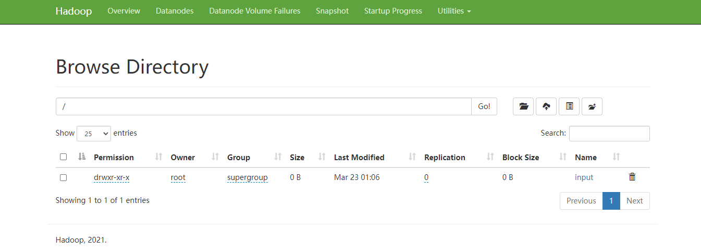
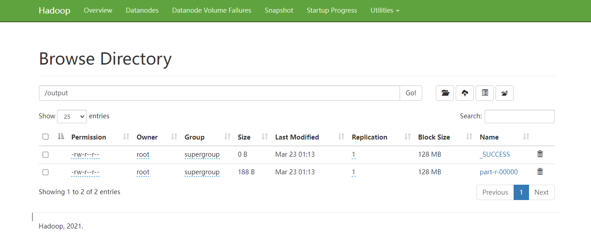

## 案例演示：wordcount

还是用单机演示 wordcount 那些文件，上传到 hdfs 上

```sh
[root@hadoop01 ~]# hdfs dfs -put input/ /
```


访问：http://192.168.111.190:9870/explorer.html#/



发现存在 input 文件夹


去执行  wordcount 案例

```sh
cd $HADOOP_HOME/share/hadoop/mapreduce
```

```sh
hadoop jar hadoop-mapreduce-examples-3.3.1.jar wordcount /input/ /output
```

注意：这里的 /input  和 /ouput 都是HDFS上的文件夹





也可以这样看

```sh
[root@hadoop01 mapreduce]# hdfs dfs -cat /output/*
go	11001001
hadoop	22002002
hdfs	22002002
help	11001001
java	22002002
jdk	11001001
linux	11001001
luya	11001001
mac	11001001
mysql	11001001
python	11001001
shell	11001001
windows	11001001
```

