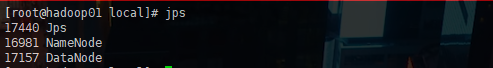
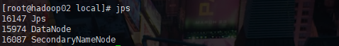
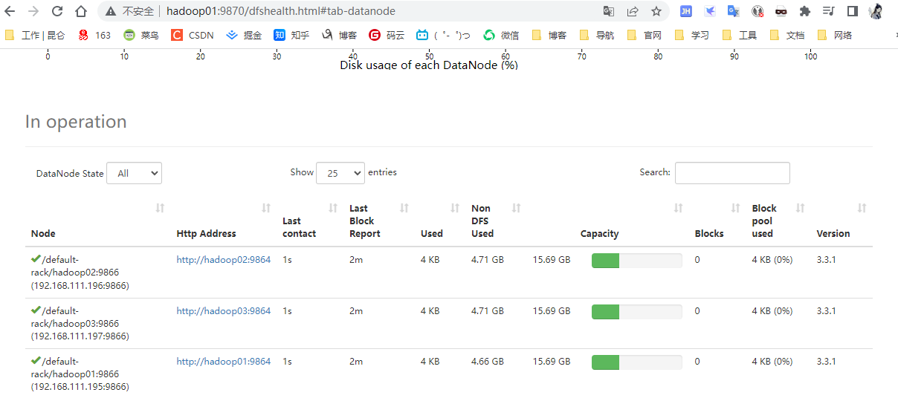

+ NameNode 守护进程
+ 其他每台机器都会部署 DataNode 守护进程
+ SecondaryNameNode 最好不要和 NameNode 在同一台服务器


守护进程布局

|          | NameNode | DataNode | ScondaryNameNode |
| :------: | :------: | :------: | :--------------: |
| hadoop01 |    √     |    √     |                  |
| hadoop02 |          |    √     |        √         |
| hadoop03 |          |    √     |                  |


集群环境搭建准备

```
1. 三台防火墙必须关闭
2、确保三台机器的网络配置畅通（NAT模式，静态IP，主机名配置）
3、确保 /etc/hosts 文件配置了 ip 和 hostname
4、确保配置了三台机器的免密认证
5、确保所有机器时间同步
6、jdk 和 hadoop 的环境变量
```


##### 

进入目录

```sh
cd $HADOOP_HOME/etc/hadoop
```

1. core-site.xml

```xml
[root@hadoop-01 hadoop]# vim /usr/local/hadoop/etc/hadoop/core-site.xml
<configuration>
	<!-- hdfs的地址名称 schame,ip,port -->
	<!-- 在 Hadoop1.0的版本中，默认使用端口是9000。在hadoop2.x的版本中，默认使用的8020,在 hadoop3.x版本中，默认是9820 -->
	<property>
		<name>fs.defaultFS</name>
		<value>hdfs://hadoop01:9820</value>
	</property>
	<!-- hdfs的基础路径，被其他属性所依赖的一个基础路径-->
	<property>
		<name>hadoop.tmp.dir</name>
		<value>/usr/local/hadoop/tmp</value>
	</property>
</configuration>
```

2. hdfs-site.xml

```xml
<configuration>
	<!-- 块的副本数 -->
	<property>
		<name>dfs.replication</name>
		<value>3</value>
	</property>
	<!-- secondarynamenode 守护进程的http地址：主机和端口  -->
	<property>
		<name>dfs.namenode.secondary.http-address</name>
		<value>hadoop02:9868</value>
	</property>
	<!-- namenode守护进程的http地址：主机名和端口 -->
	<property>
		<name>dfs.namenode.http-address</name>
		<value>hadoop01:9870</value>
	</property>
</configuration>
```

3. hadoop-env.sh

```sh
export JAVA_HOME=/usr/local/jdk

# hadoop3，需要添加如下配置，设置启动集群角色的用户是谁
export HDFS_NAMENODE_USER=xiang
export HDFS_DATANODE_USER=xiang
export HDFS_SECONDARYNAMENODE_USER=xiang
```

4. workds

指定datanode 在什么节点

```
hadoop01
hadoop02
hadoop03
```


格式化集群

```
hdfs namenode -format
```

启动集群

```sh
1.启动脚本
	-- start-dfs.sh		:用于启动hdfs集群脚本
	-- start-yarn.sh	:用于启动yarn守护进程
	-- start-all.sh		:用于启动hdfs和yarn
2.关闭脚本
	-- stop-dfs.sh		:用于关闭hdfs集群的脚本
	-- stop-yarn.sh		:用于关闭yarn守护进程
	-- stop-all.sh		:用于关闭hdfs和yarn
	

```










搭建完成