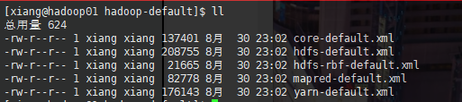

Hadoop1.x 默认 64M 一个 block

Hadoop2.x 和  Hadoop3.x 默认 128M 一个 block

​		这个值的大小和磁盘读写速度有关，2010年至今磁盘读写速度没有很大提升，所以都是以 128M 为默认大小，如果公司采用的是固态硬盘，则可以将这个值往上调整


​		HDFS 不适合小文件存储。

​		块的相关参数配置

进入 `/usr/local/hadoop/share`  目录查找 `default.xml` 相关配置复制到 home 路径下

```sh
find -name "*-default.xml" -exec cp {} ~ \;
```



`hdfs-default.xml`

```xml
<property>
  <name>dfs.blocksize</name>
  <value>134217728</value>
  <description>
      默认块大小，以字节为单位。可以使用以下后缀(不区分大小写):
      K (kilo)、m(mega)、g(giga)、t(tera)、p(peta)、e(exa)来指定尺寸(如128k、512m、1g等);
      或者以字节为单位提供完整的大小(例如134217728表示128 MB)。
  </description>
</property>


<property>
  <name>dfs.namenode.fs-limits.min-block-size</name>
  <value>1048576</value>
  <description>以字节为单位的最小块大小，在创建时由Namenode强制执行时间。这可以防止意外创建带有小块的文件大小(以及许多块)，这会降低性能。支持多个大小单位后缀(不区分大小写)，如dfs.blocksize所述。
  </description>
</property>

<property>
  <name>dfs.namenode.fs-limits.max-blocks-per-file</name>
    <value>10000</value>
    <description>每个文件的最大块数，由Namenode强制执行写。这可以防止创建非常大的文件降低性能。
    </description>
</property>
```


HDFS 优点

1. 高容错性：数据自动保存多个副本，副本丢失后，自动恢复
2. 适合大数据集：GB、TB，甚至PB
3. 数据访问：一次写入，多次读取
4. 构件成本低，构建在廉价的机器上
5. 多种硬件平台的可移植性
6. 高效性：hadoo节点之间移动数据，保证节点动态平衡
7. 高可靠：hadoo存储和处理能力值得信赖（广为人传）


HFDS 缺点

1. 不适合低延迟数据访问
2. 不适合小文件存取
3. 不适合并发写入，文件随机修改