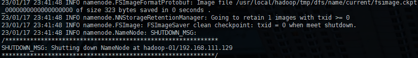
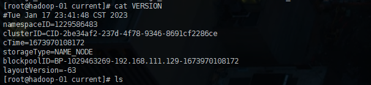
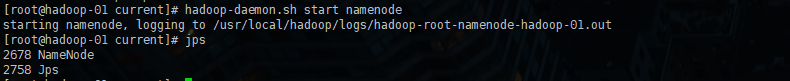

## 格式化与启动


### 格式化集群

在 hadoop-01 机器上运行命令

```sh
hdfs namenode -format
```

控制台输出即是成功



查看格式化后文件

```
cat /usr/local/hadoop/tmp/dfs/name/current/VERSION
```



格式化的相关信息解读

1. 生成一个集群唯一标识符：clusterID
2. 生成一个块池唯一标识符：blockpoolID
3. 生成namenode进程管理内容 (fsimage) 的存储路径
   1. 默认配置文件 hadoop.tmp.dir 指定的路径下生成 dfs/name 目录
4. 生成镜像文件 fsimage 记录分布式文件系统根据路径的元数据
5. 其他信息都可以查看一些，比如块副本数，集群的 fsOwner 等

### 启动集群

#### 1、启动脚本和关闭脚本介绍

```sh
1.启动脚本
	-- start-dfs.sh		:用于启动hdfs集群脚本
	-- start-yarn.sh	:用于启动yarn守护进程
	-- start-all.sh		:用于启动hdfs和yarn
2.关闭脚本
	-- stop-dfs.sh		:用于关闭hdfs集群的脚本
	-- stop-yarn.sh		:用于关闭yarn守护进程
	-- stop-all.sh		:用于关闭hdfs和yarn
	
3.守护单个进程脚本
	-- hadoop-daemons.sh	:用于单独启动或关闭hdfs的某一个守护进程脚本
	-- hadoop-daemon.sh		:用于单独启动或关闭hdfs的某一个守护进程脚本
	reg:
		hadoop-daemon.sh [start|stop] [namenode|datanode|secondarynamenode]

	-- yarn-daemons.sh		:用于单独启动或关闭hdfs的某一个守护进程脚本
	-- yarn-daemon.sh		:用于单独启动或关闭hdfs的某一个守护进程脚本
	reg:
		yran-daemon.sh [start|stop] [resourcemanager|nodemanager]
```



~~~sh
./hadoop-daemon.sh start namenode
~~~

