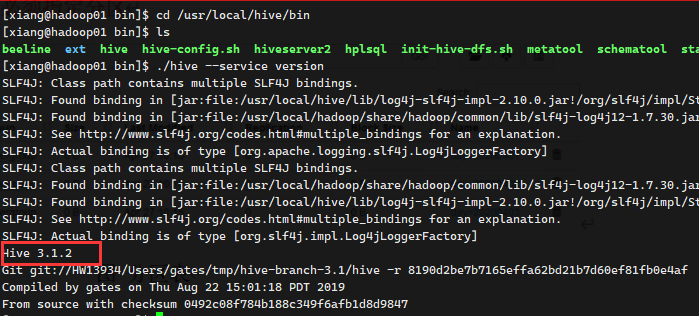

#### 启动 Hive 服务器

1. xiang 用户连接 Hadoop 相关服务器在任意路径指向 `start-all.sh` 命令启动 HDFS 组件，使用 `jps-cluster.sh` 命令查看 HDFS 相关组件是否启动成功
2. 进入 `/opt/bin` 目录，先执行 `hive-beeline.sh`，再执行 `hive-metastore.sh` 等待两三分钟后，使用  `hive-connect.sh` 进行连接

> 启动用户很关键，不要用错用户了

#### 查看 Hive 版本

进入 /usr/local/hive/bin 目录，执行` ./hive --service version`

