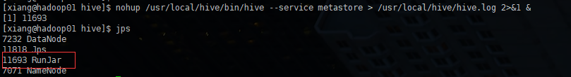

## Hadoop 整合 Hive

+ 因为 Hive 需要把数据存放在 HDFS 上，并通过 MapReduce 作为执行引擎处理数据
+ 因此需要在 Hadoop 中添加相关配置属性，以满足 Hive 在 Hadoop 上运行

修改 Hadoop 中的 core-site.xml 并且 Hadoop 集群同步配置文件，重启生效

```xml
<!-- 整合 Hive -->
<property>
    <name>hadoop.proxyuser.xiang.hosts</name>
    <value>*</value>
</property>
<property>
    <name>hadoop.proxyuser.xiang.groups</name>
    <value>*</value>
</property>
```

执行

```shell
scp core-site.xml xiang@hadoop02:$PWD
scp core-site.xml xiang@hadoop03:$PWD
```


## 内嵌模式安装


下载 `apache-hive-3.1.2-bin.tar.gz`

```sh
wget https://mirrors.aliyun.com/apache/hive/hive-3.1.2/apache-hive-3.1.2-bin.tar.gz
```

解压到 ` /usr/local` 下

```sh
tar -zxvf apache-hive-3.1.2-bin.tar.gz -C /usr/local
```

解决 hadoop 、hive 、 guava 版本差异问题

```sh
cd /usr/local/hive
rm -rf lib/guava-19.0.jar
cp /usr/local/hadoop/share/hadoop/common/lib/guava-27.0-jre.jar ./lib/
```

修改 hive 环境变量，添加 hadoop_home 

```sh
cd /usr/local/hive/conf
mv hive-env.sh.template hive-env.sh

vim hive-env.sh
export HADOOP_HOME=/usr/local/hadoop
export HIVE_CONF_DIR=/usr/local/hive/conf
export HIVE_AUX_JARS_PATH=/usr/local/hive/lib
```

初始化 metadata

```sh
cd /usr/local/hive/bin
./schematool -dbType derby -initSchema
```

提示此表示成功

```sh
Initialization script completed
schemaTool completed
[xiang@hadoop01 bin]$ 
```


启动 hive

```sh
cd /usr/local/hive/bin
./hive 
```

缺点就是每次关闭，数据都会丢失


## 本地安装

需要一个 mysql

> ```sh
> mysql -h192.168.111.36 -P3306 -uroot -p123456
> ```

上传一个 `mysql-connector-java-5.1.31.jar`  到  `/usr/local/hive/lib/` 下

在 `/usr/local/hive/conf` 下原先的 `hive-env.sh` 配置保留不变，新增 `hive-site.xml`

```xml
<configuration>
    <!-- 存储元数据mysql相关配置 -->
    <property>
        <name>javax.jdo.option.ConnectionURL</name>
        <value>jdbc:mysql://192.168.111.36:3306/hive?createDatabaseIfNotExist=true&amp;useSSL=false&amp;useUnicode=true&amp;characterEncoding=UTF-8</value>
    </property>
    <property>
        <name>javax.jdo.option.ConnectionDriverName</name>
        <value>com.mysql.jdbc.Driver</value>
    </property>
    <property>
        <name>javax.jdo.option.ConnectionUserName</name>
        <value>root</value>
    </property>
    <property>
        <name>javax.jdo.option.ConnectionPassword</name>
        <value>123456</value>
    </property>

    <!-- 关闭元数据存储授权  -->
    <property>
        <name>hive.metastore.event.db.notification.api.auth</name>
        <value>false</value>
    </property>

    <!-- 关闭元数据存储版本的验证 -->
    <property>
        <name>hive.metastore.schema.verification</name>
        <value>false</value>
    </property>
</configuration>
```

初始化 元数据

```sh
cd /usr/local/hive/bin
./schematool -initSchema -dbType mysql -verbos
```

执行成功后，和上面的效果一样，数据库也会新增 74 张表

执行

```sh
cd /usr/local/hive/bin
hive
```


## 远程模式安装

需要一个 mysql

> ```sh
> mysql -h192.168.111.36 -P3306 -uroot -p123456
> ```

上传一个 `mysql-connector-java-5.1.31.jar`  到  `/usr/local/hive/lib/` 下

在 `/usr/local/hive/conf` 下原先的 `hive-env.sh` 配置保留不变，新增 `hive-site.xml`

```xml
<configuration>
    <!-- 存储元数据mysql相关配置 -->
    <property>
        <name>javax.jdo.option.ConnectionURL</name>
        <value>jdbc:mysql://192.168.111.36:3306/hive?createDatabaseIfNotExist=true&amp;useSSL=false&amp;useUnicode=true&amp;characterEncoding=UTF-8</value>
    </property>
    <property>
        <name>javax.jdo.option.ConnectionDriverName</name>
        <value>com.mysql.jdbc.Driver</value>
    </property>

    <property>
        <name>javax.jdo.option.ConnectionUserName</name>
        <value>root</value>
    </property>

    <property>
        <name>javax.jdo.option.ConnectionPassword</name>
        <value>123456</value>
    </property>

    <!-- H2S运行绑定host -->
    <property>
        <name>hive.server2.thrift.bind.host</name>
        <value>hadoop01</value>
    </property>

    <!-- 远程模式部署metastore 服务地址 -->
    <property>
        <name>hive.metastore.uris</name>
        <value>thrift://hadoop01:9083</value>
    </property>

    <!-- 关闭元数据存储授权  -->
    <property>
        <name>hive.metastore.event.db.notification.api.auth</name>
        <value>false</value>
    </property>

    <!-- 关闭元数据存储版本的验证 -->
    <property>
        <name>hive.metastore.schema.verification</name>
        <value>false</value>
    </property>
</configuration>
```


初始化 元数据

```sh
cd /usr/local/hive/bin
./schematool -initSchema -dbType mysql -verbos
```

执行成功后，和上面的效果一样，数据库也会新增 74 张表

远程模式无法直接 hive 执行

```sh
# 前台启动 占用窗口，无法关闭
/usr/local/hive/bin/hive --service metastore

# 挂起命令
nohup /usr/local/hive/bin/hive --service metastore > /usr/local/hive/logs/hive.log 2>&1 &
```



每次需要访问的话，直接运行  `hive` 就可以访问，进去后直接 ctrl+c 退出，后台依旧还在


通常需要调试程序的时候，可以开启更详细的日志 `--hiveconf hive.root.logger=DEBUG,console`

```sh
nohup /usr/local/hive/bin/hive --service metastore --hiveconf hive.root.logger=DEBUG,console > /usr/local/hive/hive.log 2>&1 &
```

