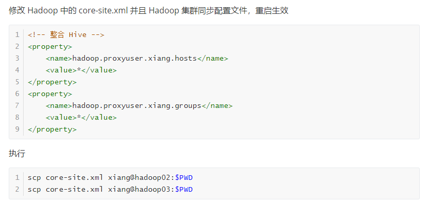

不推荐  Hive Client  （上一节讲的）

推荐 Hive Beeline Client


### 其他Hadoop节点访问Hive

> Hadoop03 访问

配置 `/conf/hive-env.sh`  同上

```sh
export HADOOP_HOME=/usr/local/hadoop
export HIVE_CONF_DIR=/usr/local/hive/conf
export HIVE_AUX_JARS_PATH=/usr/local/hive/lib
```


配置 `/conf/hive-site.xml`

```xml
<configuration>
    <!-- 远程模式部署metastore 服务地址 -->
    <property>
        <name>hive.metastore.uris</name>
        <value>thrift://hadoop01:9083</value>
    </property>
</configuration>
```

这样就可以直接在 hadoop03 节点上执行 hive 命令


## beeline 客户端访问

要在有  RunJar 服务的前提下，再次启用

```sh
nohup /usr/local/hive/bin/hive --service hiveserver2 > /usr/local/hive/logs/hiveserver2.log 2>&1 &
```

需要等待一段时间去访问


再去 hadoop03 节点执行` /usr/local/hive/bin/beeline`

```sh
!connect jdbc:hive2://hadoop01:10000
```


```sh
beeline> !connect jdbc:hive2://hadoop01:10000
Connecting to jdbc:hive2://hadoop01:10000
Enter username for jdbc:hive2://hadoop01:10000: xiang
Enter password for jdbc:hive2://hadoop01:10000: *****
Connected to: Apache Hive (version 3.1.2)
Driver: Hive JDBC (version 3.1.2)
Transaction isolation: TRANSACTION_REPEATABLE_READ
0: jdbc:hive2://hadoop01:10000> 
```

如果密码错误就执行



如果改了密码还显示拒绝连接，不要着急，等会儿再执行，大概1分钟


```sql
create table h_user(id int,name varchar(20),age int)
row format delimited
fields terminated by ','
```


长时间未启动服务导致正确密码无法连接，可以这样配置一下

[Hive 拒绝连接](https://blog.csdn.net/Java_Road_Far/article/details/98470248)


检查时否启动

```sh
lsof -i:10000
```

在 Hadoop 的 core-site.xml 添加如下内容

```xml
<property>
   <name>hadoop.proxyuser.hadoop.hosts</name>
   <value>*</value>
</property>
<property>
    <name>hadoop.proxyuser.hadoop.groups</name>
    <value>*</value>
</property>
```

使用 hdfs 命令给目录授权

```sh
hdfs dfs -chmod 777 /tmp
hdfs dfs -chmod 777 /user/hive/warehouse
```

