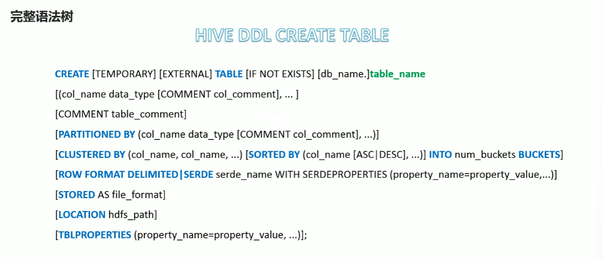

## 分区表

​		为了避免查询时全表扫描，Hive支持根据指定的字段对表进行分区，分区的字段可以是日期，地域，种类有标识意义的字段。

`PARITIONED BY`

```sql
CREATE [TEMPORARY][EXTERNAL] TABLE [IF NOT EXISTS][db_name.] table_name
[(col_name data_type [COMMENT col_comment],...)]
[COMMENT table_comment]
PARTITIONED BY (col_name data_type[COMMENT col_comment],....)
```

分区字段不能是表中已经存在的字段

#### 注意事项

1. 分区表不是建表的必要语法规则，是一种**优化手段表**，可选；
2. **分区字段不能是表中已有的字段**，不能重复
3. 分区字段是**虚拟字段**，其数据并不存储在底层的文件中；
4. 分区字段值的确定来自用户价值数据手段指定（**静态分区**），或者根据查询结果自动推断（**动态分区**）
5. Hive**支持多重分区**，也就是在分区的基础上继续分区，划分更加细粒度


## 分桶表

也叫桶表，是一种优化查询设计的类型，分桶表对应的数据文件在底层会分解为若干部分。

```
Bucket number = hash_function(bucketing_column) mod num_buckets
分桶编号       = 哈希方法（分桶字段）				    取模	
```

### 语法

+ CLUSTERED BY （col_name） 表示根据哪个字段进行分
+ NTO N BUCKETS 表示分为几个桶
+ 需要注意的是，**分桶的字段必须是表中已经存在的字段**

好处：优化 JOIN ，高效率的笛卡儿积

