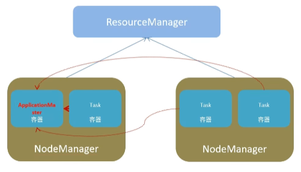

## 1、Spark 是什么

Apache Spark 是用于大数据规模（large-scala data）处理的统一（unified）分析引擎

Spark 最早是源自一篇论文。论文中提出一种弹性分布式数据集（RDD）概念，翻译过来就算一种分布式抽象内存，其是的程序员能够在大规模集群中做==内存运算==，并且有一定的==容错率==，而这也是整个 Spark 的核心数据结构，Spark 整个平台都在围绕 RDD 进行。

简而言之，Spark 借鉴了 MapReduce 思想发展而来，保留了其分布式计算的优点并改进了明显的缺陷。让中间数据存储在内存中提高了运行速度、并提供丰富的操作数据的API提高开发速度。

#### 分析引擎？

Spark 是一款分布式内存计算统一分析引擎。

其特点就算对任意类型数据进行自定义计算，Sparke 可以计算：结构化、半结构化、非结构化等各类数据结构，同时也支持Python、Java、Scala、R以及 SQL 语言去开发应用程序计算。

Spark 的适用面非常广泛，所以，被称之为统一（适用面广）的分析引擎（数据处理）


#### Spark和Hadoop(MapReduce)

|          | Hadoop                         | Spark                                                      |
| -------- | ------------------------------ | ---------------------------------------------------------- |
| 类型     | 基础平台、包含计算、存储、调度 | 纯计算工具（分布式）                                       |
| 场景     | 海量数据批处理（磁盘迭代计算） | 海量数据的批处理（内存迭代计算、交互式计算）、海量数据计算 |
| 价格     | 对机器要求较低、便宜           | 对内存要求相对较高                                         |
| 编程范式 | Map+Reduce API 较为底层        | RDD组成 DAG有向无环，方便使用                              |
| 数据存储 | MapReduce 在磁盘上，延迟大     | RDD中间件在内存中，延迟小                                  |
| 运行方式 | Task进程维护，任务启动慢       | Task 线程维护，任务启动快，批量创建提高并行能力            |

尽管 Spake 相对 Hadoop 而言有较大优势，但 Spark 并不能完全替代 Hadoop

+ 在计算层面，Spark 相对 MR（MapReduce）有巨大又是，但至今仍然有许多工具基于MR架构，比如非常成熟的Hive
+ Spake仅做计算，而Hadoop生态圈不仅有计算（MR）还有存储（HDFS）和资源管理调度（YARN），HDFS和Yarn仍然是许多大数据的核心架构


## 2、Spark 特点

### 1、速度快

由于 Spark 支持内存计算，并且通过 DAG（有向无环）执行引擎支持无环数据流，所以官方宣称其在内存中的运算速度比要 Hadoop 的 MapReduce 快 100 倍，在硬盘中要快 10倍

### 2、易使用

```python
df = spark.read.join("logs.json")
df.where("age > 21")
  .select("name.first").show()
```

### 3、通用性强

在 Spark 基础库中，Spark还提供了包括 Spark SQL、Spake Streaming、MLib 及 Graphx 在内的 多个工具库。

### 4、多方式运行

Spark 可以在 Hadoop、Mesos 上，也支持 Standalone 独立运行，也可以同时在 K8s 中。


## 3、框架模块

整个 Spark 模块包含，Spake Core、Spark SQL、Spark Streaming、Spark GraphX、Spark MLlib，而后四项的能力都建立在核心引擎之上

+ Spark Core：Spark黑犀牛，Spark核心功能均有Spark Core模块提供，是Spark运行基础。RDD为抽象数据，提供 Python、Java、Scala、R语言的API。可以编译进行海量离线数据批处理
+ SparkStreaming：基于 SparkCore 之上，提供结构化数据的处理模块。SparkSQL支持以SQL语言对数据进行处理，SparkSQL本身针对离线计算场景。同时基于 SparkSQL，Spark提供了 **StructuredStreaming**模块，可以以SparkSQL为基础，进行数据的流失计算。
+ MLlib：以 SparkCore为基础，进行机器学习计算，内置了大量的机器学习库和 API 算法等，方便用户以分布式的模式进行机器学习。
+ GraphX：以 SparkCore为基础，进行图计算，提供了大量的图计算API，方便用于分布式计算模型进行图计算。


## 4、运行模式

+ 本地模式（单机）
+ Standalone模式（集群）
+ Hadoop YARN模式（集群）
+ Kubernetes 模式（容器集群）


## 5、Spark架构角色

### 回顾Yarn

Yarn 有四类角色，从2个层面去看

+ 集群资源层面
  + 集群资源管理者（Master）ResrouceManager
  + 单机资源管理者（Worker）NodeManager
+ 任务计算层面
  + 单任务管理者（Master）ApplicationMaster
  + 单任务执行者（Worker）Task（容器内计算框架的工作角色）



### Spark

层次都是一样的，只是名字叫法不同

+ 资源层面
  + Master 集群资源管理
  + Worker 单机资源管理
+ 任务层面
  + Driver 单个任务管理
  + Executor 单个任务计算（干活的）

