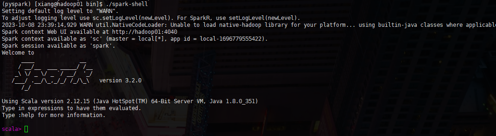

因为搭建的是 Python 版本的 Spark，所以先解决Python环境，这里不采用默认常规python安装。使用 Anaconda 环境

> 链接：https://pan.baidu.com/s/1fUA2cCpfPksm77ulsLiSWQ 
> 提取码：waew 

主要用到这两个文件

+ Anaconda3-2021.05-Linux-x86_64.sh
+ spark-3.2.0-bin-hadoop3.2.tgz

### Anaconda 安装

Anaconda是一个数据科学环境，可以不需要在安装任何python环境支持下使用，而且Anaconda内部集成了多达180+多的工具包可以很好帮助到数据分析和数据科学任务的处理。


也可以官网下载：https://www.anaconda.com/download

把 脚本放到任意位置后，执行脚本

执行之前，修改为国内镜像源，因为这是国外的一个东西 

```sh
vim ~/.condarc

channels:
  - defaults
show_channel_urls: true
default_channels:
  - https://mirrors.tuna.tsinghua.edu.cn/anaconda/pkgs/main
  - https://mirrors.tuna.tsinghua.edu.cn/anaconda/pkgs/r
  - https://mirrors.tuna.tsinghua.edu.cn/anaconda/pkgs/msys2
custom_channels:
  conda-forge: https://mirrors.tuna.tsinghua.edu.cn/anaconda/cloud
  msys2: https://mirrors.tuna.tsinghua.edu.cn/anaconda/cloud
  bioconda: https://mirrors.tuna.tsinghua.edu.cn/anaconda/cloud
  menpo: https://mirrors.tuna.tsinghua.edu.cn/anaconda/cloud
  pytorch: https://mirrors.tuna.tsinghua.edu.cn/anaconda/cloud
  simpleitk: https://mirrors.tuna.tsinghua.edu.cn/anaconda/cloud
```

##### 运行 anaconda

```sh
bash Anaconda3-2021.05-Linux-x86_64.sh
```

在运行过程中，会要求输入配置路径，注意这个路径本来是不存在的

```
Prefix=/home/xiang/soft/anaconda3
```

其他的提示 yes|no 就是yes，不提示，就算按空格。全程大概1分钟左右

##### 创建虚拟环境

```shell
# 创建虚拟环境 pyspark, 基于Python 3.8
conda create -n pyspark python=3.8

# 切换到虚拟环境内
conda activate pyspark

# 使用PyPI安装PySpark如下：也可以指定版本安装
pip install pyspark

# 或者指定清华镜像(对于网络较差的情况)：
pip install pyhive pyspark jieba -i https://pypi.tuna.tsinghua.edu.cn/simple 
```

##### 配置环境变量

/etc/profile

```properties
export SPARK_HOME=/usr/local/spark
export PYSPARK_PYTHON=/home/xiang/soft/anaconda3/envs/pyspark/bin/python3.8
export HADOOP_CONF_DIR=$HADOOP_HOME/etc/hadoop
export PATH=$SPARK_HOME/bin:$PYSPARK_PYTHON:$HADOOP_CONF_DIR:$PATH
```

~/.bashrc

```properties
export JAVA_HOME=/usr/local/jdk
export PYSPARK_PYTHON=/home/xiang/soft/anaconda3/envs/pyspark/bin/python3.8
export PATH=$JAVA_HOME/bin:$PYSPARK_PYTHON:$PATH
```

### Spark安装

```sh
tar -zxvf spark-3.2.0-bin-hadoop3.2.tgz -C /usr/local/spark/
```

#### bin 目录

+  pyspark：Python 环境
+ spark-shell：Scala 环境


#### demo 演示

首先确保在 pyspark 环境下

```sh
(pyspark) [xiang@hadoop01 bin]$
```

> 如果不是 `conda activate pyspark` 切换过去

```sh
(pyspark) [xiang@hadoop01 bin]$ pwd
/usr/local/spark/bin
(pyspark) [xiang@hadoop01 bin]$ ll pyspark
-rwxr-xr-x 1 xiang xiang 2636 10月  6 2021 pyspark
```


##### 执行 **./pyspark**


+ 计算

```sh
sc.parallelize([1,2,3,4,5]).map(lambda x: x + 1).collect()
```


##### 执行 **./spark-shell**



计算

```
sc.parallelize(Array(1,2,3,4,5)).map(x=> x + 1).collect()
```

我们也可以通过访问查看执行的任务

```sh
http://hadoop01:4040
```


##### 提交计算

```sh
./spark-submit /usr/local/spark/examples/src/main/python/pi.py 10
```


计算圆周率，可能不太精准哈

```sh
# 语法
bin/spark-submit [可选的一些选项] jar包或者python代码的路径 [代码的参数]
```


> 设置 conda 自动进入 bash 环境
>
> ```sh
> conda config --set auto_activate_base true
> ```
>
> 去掉 conda 自动进入 bash 环境
>
> ```sh
> conda config --set auto_activate_base false
> ```


在 ~/.condarc 文件中，可以看到参数有：auto_activate_base: true

