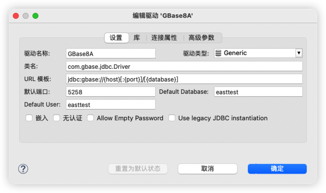
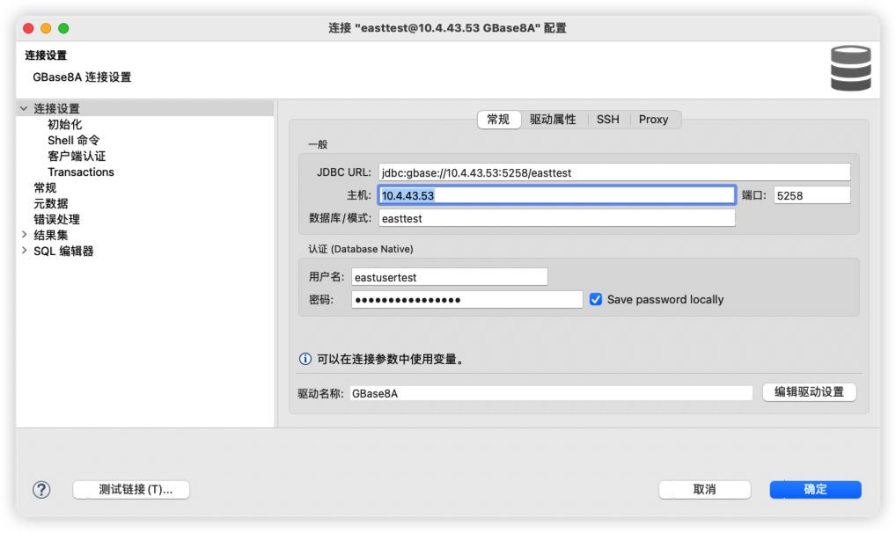
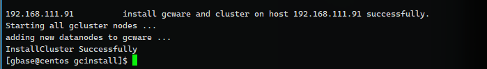
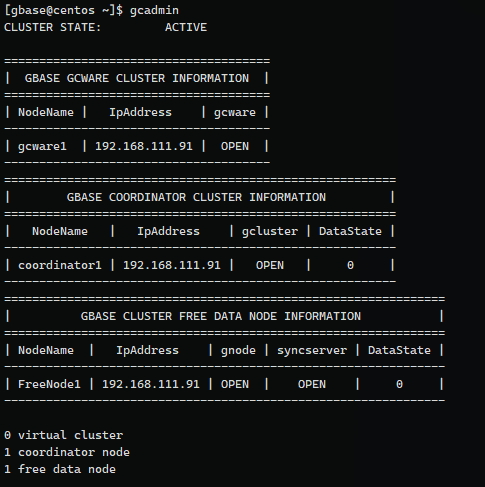
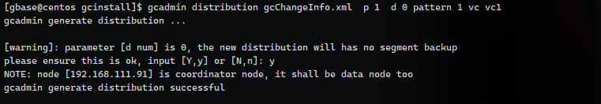

[toc]

## GBase8A

链接信息

```
IP:10.4.43.53,10.4.43.57,10.4.43.61
端口：5258
数据库：easttest
用户名：eastusertest
密码：uoz@a`h#WNk4g^&M
驱动名称：com.gbase.jdbc.Driver
JDBC连接串：jdbc:gbase://10.4.43.53:5258/easttest?user=eastusertest&password=uoz@a`h#WNk4g^&M&failoverEnable=true&hostList=10.4.43.57,10.4.43.61&gclusterId=gc1
```


驱动文件：gbase-connector-java-9.5.0.7-build1-bin.jar

下载官网：https://www.gbase.cn/download/gbase-8a?category=DRIVER_PACKAGE

创建链接驱动



连接参数




# 集群搭建


前置条件

关闭防火墙

```sh
systemctl stop firewalld && systemctl disable firewalld
```

关闭Selinux

```sh
sed -i 's/enforcing/disabled/' /etc/selinux/config

setenforce 0
```

关闭Swap

```sh
sed -ri 's/.*swap.*/#&/' /etc/fstab

swapoff -a
```


安装 解压工具

```sh
yum install -y bzip2
```

解压下载包，会生成 gcinstall 目录，在安装主节点执行

```sh
tar xfj GBase8a_MPP_Cluster-NoLicense-FREE-9.5.3.28.12-redhat7-x86_64.tar.bz2 
```


#### 创建 DBA 用户

```sh
usergroup gbase
useradd gbase -g gbase
passwd gbase
# Abcd!234
```

创建目录并授权

```sh
mkdir -p /opt/gbase
chown gbase:gbase /opt/gbase
```

日志在 /tmp/SetSysEnv.log 文件中


#### 复制环境设置脚本至所有节点

```sh
scp root@节点ip:/opt/gcinstall/SetSysEnv.py /opt
```


#### 运行脚本

>```sh
>yum install -y bc
>```
>
>

运行 SetSysEnv.py 脚本，配置安装环境（==全部节点==）root 操作

```sh
python SetSysEnv.py --dbaUser=gbase --installPrefix=/opt/gbase --cgroup
```

+  --installPrefix 指定安装目录，必须为 demo.options 文件中 installPrefix设置目录
+ --dbaUser=gbase 指定 DBA 用户
+ --cgroup 使用资源管理功能时，用于修改配置，建议加上（默认不加，后续会有问题）


##### 集群软件安装

转载节点修改 gcinstall 目录下 demo.options 文件

```sh
cp /opt/gcinstall/demo.options /opt/gcinstall/demo.options_back
vim /opt/gcinstall/demo.options
```


```yaml
# 安装目录
installPrefix= /opt/gbase
# 管理节点
coordinateHost = 192.168.111.91
coordinateHostNodeID = 91
# 数据节点
dataHost = 192.168.111.91
#existCoordinateHost =  已经存在的节点，扩容时候
#existDataHost =      
#existGcwareHost=
gcwareHost = 192.168.111.91
gcwareHostNodeID = 91
# dba 用户
dbaUser = gbase
dbaGroup = gbase
dbaPwd = 'Abcd!234'
# root 用户密码 ，如果密文处理可以用 rootPwdFile 文件
rootPwd = '123456
```


#### 执行安装

使用 ==gbase==用户，剩下节点只需要在第一个节点执行即可

```sh
./gcinstall.py --slient=demo.options [--passwordInputMode=Mode]
```

passwordInputMode 有三种方式

1. file 从文件或命令行获取，文件中的密码是明文的
2. pwdsame，表示从终端由用户输入，并且所有节点的密码一致，对于不同用户密码只输一次，适用于所有节点都这个密码
3. pwddiff，表示从终端用户输入密码，并且各节点密码不一致


我们执行下面这条

```sh
/opt/gcinstall/gcinstall.py --silent=/opt/gcinstall/demo.options --passwordInputMode=pwdsame

./gcinstall.py --silent=demo.options
```

是否确认认证：y

```sh
Do you accept the above licence agreement ([Y,y]/[N,n])? y
```

确认管理节点：y

确认 Gcluster：y

等待 1分钟左右安装完成



重新退出用户，重新连接一次，执行 gcadmin，如果是有 License版本的就都是 CLOSE 状态，需要导入License才可以。




参考：[腾讯云](https://tencentcloud.csdn.net/676376d7f3b8a55e4e98b7d3.html)

gbase 用户在 /opt/gcinstall 下执行

```sh
gcadmin createvc e vc.xml
```

```
<?xml version='1.0' encoding="utf-8"?>
<servers>
    <rack>
        <node ip="192.168.111.91"/>
    </rack>
    <vc_name name="vc1"/>
    <comment message="Home VMware VC1"/>
</servers>
```

创建 vc

```sh
gcadmin createvc vc.xml
```

查看 vc 状态

```sh
gcadmin

gcadmin showcluster vc vc1
```


创建副本数

```sh
gcadmin distribution gcChangeInfo.xml p 1 d 0 pattern 1 vc vc1
```



```
===================================================
|        GBASE VIRTUAL CLUSTER INFORMATION        |
===================================================
|    VcName    | DistributionId |     comment     |
---------------------------------------------------
|     vc1      |       1        | Home VMware VC1 |
---------------------------------------------------
```


初始化细节数据分布

```sh
gccli -uroot -p
# 两次回车
```

执行 SQL

```sql
use vc vc1;
initnodedatamap; 
```

创建数据库、表

```sh
create database yun;
use yun;
create table test_tb(id int);
```

用户设置默认VC

```sql
create user yun@'%' identified by 'Abcd!234';
grant all on *.*.* to yun@'%';
set default_vc for yun = vc1;

select * from gbase.user where user='yun'\G;
```

插入数据

```sql
insert into test_tb values(8);
```

登录用户

```sh
gccli -u yun -p
Abcd!234
```


#### 注册 License

无


#### 失败的主要问题如下

1. DBA 用户权限
2. 用户环境设置错误
3. 防火墙没关，SELinux没关
4. 端口占用
5. 重复安装

错误日志可以从 gcinstall/gcinstall.log 文件中查看


#### 启动和关闭

参考 [CSDN](https://blog.csdn.net/qq_45782319/article/details/142413880) 完全可用

