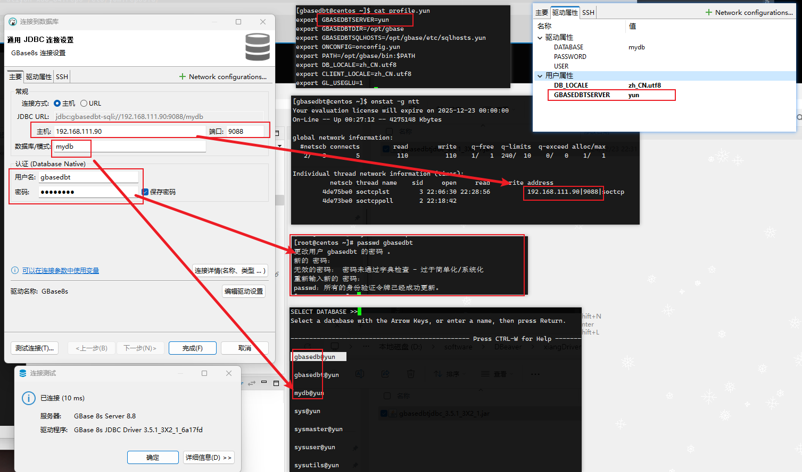

# GBase 8S 搭建

学习视频地址：https://www.bilibili.com/video/BV1Yb421Y7QY

下载地址：https://www.gbase.cn/download/gbase-8s-1?category=INSTALL_PACKAGE


服务器：root@192.168.111.90


Gbase8s 常见问题总结 [CSDN](https://blog.csdn.net/weixin_48632512/article/details/140325506)

此前需要做这些事情

```sh
yum install -y unzip net-tools.x86_64
```


创建用户

```sh
groupadd gbasedbt
useradd gbasedbt -g gbasedbt
passwd Abcd!234
# 太简单后面不好连接
```

root 用户上传 GBase8sV8.8_TL_3.5.1_3X2_x86_64.tar 至 /opt , 并解压到当前目录

```sh
tar -xvf GBase8sV8.8_TL_3.5.1_3X2_x86_64.tar
mv GBase8sV8.8_TL_3.5.1_3X2_x86_64 GBase8s
chmod 775 GBase8s/

cd GBase8s
mkdir clientsdk GBase8s
mv clientsdk_3.5.1_3X2_1_x86_64.tar clientsdk
mv GBase8sV8.8_TL_3.5.1_3X2_x86_64.tar GBase8s
cd GBase8s
tar -xvf GBase8sV8.8_TL_3.5.1_3X2_x86_64.tar
```

root 用户安装数据库 执行 ./ids_install

> 需要有 JDK 环境
>
> ```sh
> yum install -y java-1.8.0-openjdk.x86_64
> ```

按5次回车确认，按 1次Y

确认安装目录，按Y，确定创建该目录

```sh
/opt/gbase
```


默认安装：->1- Typical installation

不创建默认实例： 2- No - do not create an instance

回车下一步，回车确认安装目录。 安装中


最后回车确认安装已完成


##### 初始化用户实例

使用 gbasedbt  操作

```sh
cd /opt/gbase/etc/

# 进行初始化
sh GBaseInit_gbasedbt.sh
```

初始化实例名称

```sh
yun
```

输入安装目录，默认 /opt/gbase 直接回车

确定服务器IP，没有问题，直接回车

确认端口号，默认 9088，没有问题，直接回车

自定义初始化 选择 2) CUSTOM 

选择数据库字符集  3) zh_CN.utf8

确定数据库存放路径，没有问题，直接回车

逻辑日志空间

物理日志空间

智能大对象空间

临时空间，一般都回车

确定 Y，使用默认即可

数据空间数量，默认1 选择3

临时空间数量，默认1，选择3

最后确定 y


最后确定 y

最后回车确认，会杀掉连接进程，重新连接 gbasedbt 用户


##### 添加环境变量

```sh
source profile.yun

vi .bash_profile 
# 查看是否存在 source /home/gbasedbt/profile.yun
```


### 数据库启停

四种运行模式：在线模式、离线模式、单用户模式、静态模式

过度模式：初始化模式、快速恢复模式，关闭模式


查看是否启动

```sh
onstat -
```

在线模式：On-Line --

离线模式：shared memory not initalized xxxxx


停止数据库服务

```sh
onmode -ky
```

启动数据库服务

```sh
oninit -vy
```

查看报错信息

```sh
onstat -m
```


### 多实例部署

需要注意，多实例部署，实例名和端口须保持不一致


使用 gbasedbt 用户，输入 onstat -  查看实例情况，关闭 原本 `yun` 数据库实例

```sh
cd /opt/gbase/etc/

# 初始化脚本
sh GBaseInit_gbasedbt.sh
```

和上面的步骤差不多，端口号不能冲突，这里用 9089


初始化完成，回车退出脚本


由于有两个 profile. 文件， source 哪个，就代表操作哪个

```sh
source ~/profile.xiang
onstat -
```


同时启动两个实例，通过 netstat -naltp 发现 两个端口都被占用

总结，切换实例需要更换环境变量


#### 数据库连接工具 dbaccess


##### 菜单模式（难用）

gbasedbt 用户执行

> 确保当前实例已经启动

```
dbaccess
```


Query-language: SQL查询语言

Connection: 连接和断开数据库

Database： 操作数据库

Table：操作表

Session： 会话信息

Exit：


新建表语句

```sql
create table test_tab(id int, name varchar(20));
```

exc 然后选择 run，可以发现建表成功，然后查看数据库中有哪些表

```sh
info tables;
```


##### SQL命令模式

打开 SQL命令模式

```sh
dbaccess - -
```

提前选择数据库

```
dbaccess mydb -
```

选择数据库，执行脚本

```sh
dbaccess mydb sql1.sql
```


问题：无法使用箭头或光标

部署 rlwrap 插件：百度网盘 > 安装资源 > GBase8 > rlwrap

上传到 /opt/gbase/bin ，修改成 gbasedbt 用户组用户，并授予 可执行文件

```sh
[gbasedbt@centos bin]$ ls -als rlwrap 
252 -rw-rw-r--. 1 gbasedbt gbasedbt 256128 12月 23 22:23 rlwrap

chmod +x rlwrap
```

在 ~/.bash_profile 添加

```sh
alias dbaccess='rlwrap dbaccess'
```

source 使其生效


#### 工具连接 GBase

连接参数

主机、端口、实例名（数据库实例名称）、数据库模式（数据库名）、用户名（gbasedbt）、密码（用户密码）


```sh
onstat -g ntt
# 获取数据库相关连接信息和端口号
```


```
jdbc:gbasedbt-sqli://192.168.111.90:9088/yun;GBASEDBTSERVER=gbasedb;SQLMODE=GBase;DB_LOCALE=zh_CN.utf8
```

```sh
jdbc:gbasedbt-sqli://{host}[:{port}]/[{database}]
```


```sh
jdbc:gbase://10.4.43.53:5258/easttest?user=eastusertest&password=uoz@a`h#WNk4g^&M&failoverEnable=true&hostList=10.4.43.57,10.4.43.61&gclusterId=gc1
```

```
jdbc:gbase://{host}[:{port}]/[{database}]
```


从 ~/profile.yum 文件中查看  GBASEDBTSERVER 参数

```
export GBASEDBTSERVER=yun
```





