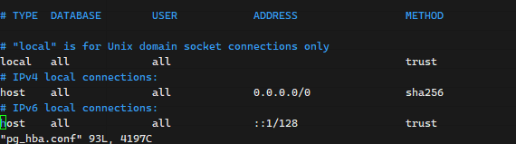

## 搭建 Gauss 数据库

找了七八个文档，尝试过 Docker 安装，一个比一个离谱，Docker 也无法启动

最后老老实实二进制启动

[CSDN](https://blog.csdn.net/qq_43585922/article/details/125570472) 适用于 5.0.3 版本 **OpenGauss **[官方网站](https://opengauss.org/zh/)

下载文件 得到文件名：**openGauss-5.0.3-CentOS-64bit.tar.bz2**


顺带一起下载链接工具，用DBeaver 链接


### 解压执行

**==注意 注意，别用 root 执行！！创建一个非 root 用户操作 gauss==**


这里可用参考 [官方文档5.1.0](https://docs-opengauss.osinfra.cn/zh/docs/5.1.0/docs/InstallationGuide/%E5%8D%95%E8%8A%82%E7%82%B9%E5%AE%89%E8%A3%85.html)

```sh
tar -zxvf openGauss-5.0.3-CentOS-64bit.tar.bz2 -C /home/xiang/soft
```

最后得到这么一堆文件


1. 进入 simpleInstall 目录

```sh
cd simpleInstall/
```

2. 安装 openGauss

```sh
sh install.sh  -w "Abcd123456" &&source ~/.bashrc
```

+ `-w` 初始化密码，强制要求的

然后这一步可能报错 ==the maximum number of SEMMNI is not correct, the current SEMMNI is xxx. Please check it.== , 报错执行 `sysctl -w kernel.sem="250 85000 250 330" ` 然后重新安装

过程中会询问是否创建demo数据库，我选择了 yes

最后就创建完了，启动成功了。


### 服务器内连接

管理员进去

```sh
gsql -d postgres -p 5432 -W 'Abcd123456' -r
```

创建数据库、创建用户名密码

```sql
# 创建新的数据库 xiang
openGauss=# CREATE DATABASE xiang ENCODING 'UTF-8' template = template0;
CREATE DATABASE
# 创建新的用户 lyc 以及密码
openGauss=# create user lyc password 'Lyc@123456';
CREATE ROLE
# 修改数据库 xiang 的所属为 lyc
openGauss=# alter database xiang owner to lyc;
ALTER DATABASE
# 将权限赋给用户
openGauss=# GRANT ALL PRIVILEGES TO lyc;
ALTER ROLE
# 退出
openGauss=# \q
```

最后 `\q` 退出sql控制台

用创建的用户登录进去

```sql
gsql -d xiang -p 5432 -W Lyc@123456 -r
```


### 工具连接

这里tm大坑，巨坑 [客户端接入认证](https://docs-opengauss.osinfra.cn/zh/docs/5.1.0/docs/DatabaseAdministrationGuide/%E9%85%8D%E7%BD%AE%E5%AE%A2%E6%88%B7%E7%AB%AF%E6%8E%A5%E5%85%A5%E8%AE%A4%E8%AF%81.html)

开启访问白名单，这里有两块地方要改

1. 修改 openGauss/data/single_node 下的 `postgresql.conf`

   加上  `listen_addresses = '*'` 


2. 修改 openGauss/data/single_node 下的 `pg_hba.conf`

   默认是：

```
host    all             all             127.0.0.1/32              trust
```

​	 修改成：

```
host    all             all             0.0.0.0/0               sha256
```

最终效果




最后一定要重启 gauss

```
# 重启
gs_ctl restart -D $GAUSSHOME/data/single_node -Z single_node
# 启动
gs_ctl start -D $GAUSSHOME/data/single_node -Z single_node
# 停止
gs_ctl stop -D $GAUSSHOME/data/single_node -Z single_node
```


### 启动 Dbeaver

[DBeaver 官方指导操作](https://opengauss.org/zh/blogs/justbk/2020-10-30_dbeaver_for_openGauss.html)


新建数据库驱动，把前面下载的驱动jar包，找个地方解压，然后加到 Dbeaver 里面来。一定选 `postgresql `这个


类名：org.postgresql.Driver

URL模板：jdbc:postgresql://{host}:{port}/{database}

默认端口：5432


