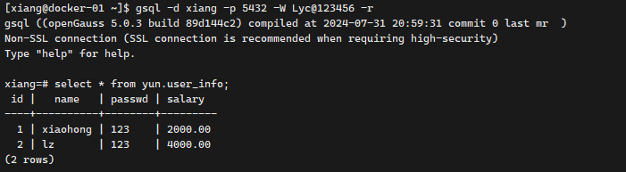

### [Gauss SQL 语法](https://docs-opengauss.osinfra.cn/zh/docs/5.1.0/docs/SQLReference/SQL%E8%AF%AD%E6%B3%95.html)

环境：

```sh
ip:192.168.58.120
user:xiang
password:123456

# 启动
gs_ctl start -D /home/xiang/soft/openGauss/data/single_node
# 停止
gs_ctl stop -D /home/xiang/soft/openGauss/data/single_node


#　连接　gauss
gsql -d xiang -p 5432 -W Lyc@123456 -r
```




数据库

```sql
--创建jim和tom用户。
CREATE USER yun PASSWORD 'Yun@123456';

--创建一个 UTF8 编码的数据库 yun（本地环境的编码格式必须也为 UTF8 ）。
CREATE DATABASE yun ENCODING 'UTF8' OWNER yun template = template0;

--删除 yun 数据库
DROP DATABASE yun;
```


表

```sql
create table yun.user_info(
    id integer not null,
    name varchar(20) not null,
    passwd varchar(20) ,
    salary decimal(10,2)
);

insert into yun.user_info (id,name,passwd,salary) values (1,'xh','123',2000.00);
insert into yun.user_info (id,name,passwd,salary) values (2,'lz','123',4000.00);

select * from yun.user_info ui ;

create table yun.user_info_back as select * from yun.user_info; 
```

