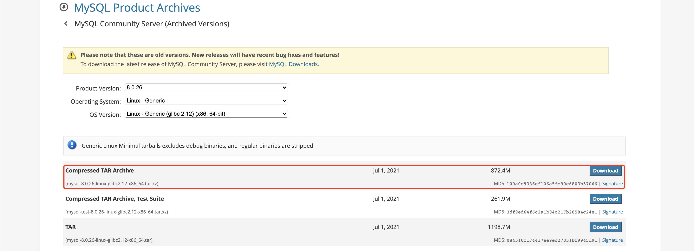
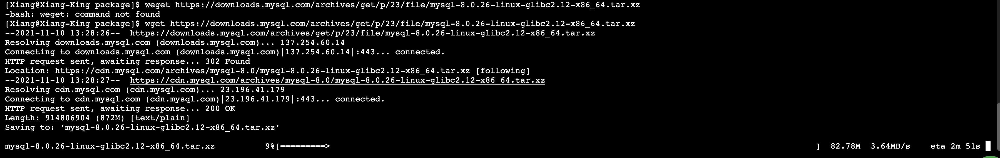

> 创建于2021年11月10日
> 作者：想想

[toc]

# MySQL 8.0 Linux下载安装


## 一、下载

查看MySQL各个版本下载地址

```
https://downloads.mysql.com/archives/community/
```

我选的版本是

```
https://downloads.mysql.com/archives/get/p/23/file/mysql-8.0.26-linux-glibc2.12-x86_64.tar.xz
```



在服务器中下载



### 二、安装

查看是否已经安装 MySQL

```sh
rpm -qa | grep mysql
```

把包放到 `/usr/local` 目录下解压

```sh
tar -xvf mysql-8.0.26-linux-glibc2.12-x86_64.tar.xz
```

### 三、初始化数据库

进入 `bin` 目录

```sh
./mysqld --user=Xiang --basedir=/usr/local/mysql-8.0.26  --datadir=/usr/local/mysql-8.0.26/data --initialize
```

日志：

```sh
[Xiang@Xiang-King bin]$ ./mysqld --user=xiang --basedir=/usr/local/mysql-8.0.26  --datadir=/usr/local/mysql-8.0.26/data --initialize
2021-11-10T05:43:59.404462Z 0 [System] [MY-013169] [Server] /usr/local/mysql-8.0.26/bin/mysqld (mysqld 8.0.26) initializing of server in progress as process 1098385
2021-11-10T05:43:59.409265Z 0 [Warning] [MY-010122] [Server] One can only use the --user switch if running as root
2021-11-10T05:43:59.416955Z 1 [System] [MY-013576] [InnoDB] InnoDB initialization has started.
2021-11-10T05:44:00.244814Z 1 [System] [MY-013577] [InnoDB] InnoDB initialization has ended.
2021-11-10T05:44:01.500672Z 0 [Warning] [MY-013746] [Server] A deprecated TLS version TLSv1 is enabled for channel mysql_main
2021-11-10T05:44:01.501028Z 0 [Warning] [MY-013746] [Server] A deprecated TLS version TLSv1.1 is enabled for channel mysql_main
2021-11-10T05:44:01.537569Z 6 [Note] [MY-010454] [Server] A temporary password is generated for root@localhost: !Hu(qILnl5Du
```

配置 `/etc/my.cnf` 文件

参考 `https://blog.csdn.net/gzt19881123/article/details/109511245`

```
[client]
port = 3388
socket = /tmp/mysql.sock

[mysqld]
port = 3388
socket = /tmp/mysql.sock

log-error = /usr/local/mysql-8.0.26/logs/error.log
basedir = /usr/local/mysql-8.0.26
datadir = /usr/local/mysql-8.0.26/data
pid-file = /usr/local/mysql-8.0.26/mysql.pid


#数据库默认字符集, 主流字符集支持一些特殊表情符号（特殊表情符占用4个字节）
character-set-server = utf8mb4

#设置client连接mysql时的字符集,防止乱码
init_connect='SET NAMES utf8mb4'


#它控制着mysqld进程能使用的最大文件描述(FD)符数量。
#需要注意的是这个变量的值并不一定是你设定的值，mysqld会在系统允许的情况下尽量获取更多的FD数量
open_files_limit    = 65535

#最大连接数
max_connections = 300

#最大错误连接数
max_connect_errors = 600


[mysqldump]
quick
max_allowed_packet = 128M
```

### 四、建立MySQL 服务

在MySQL根目录下执行

```
[Xiang@Xiang-King mysql-8.0.26]$ pwd
/usr/local/mysql-8.0.26
```

添加MySQL 到系统服务

```sh
sudo cp -a ./support-files/mysql.server /etc/init.d/mysql
```

```sh
chkconfig --add mysql
chkconfig --list mysql
```


### 五、启动mysql

查看状态

```sh
service mysql status
```

启动mysql

启动前，在 mysql 跟目录创建一个 logs 文件夹

```sh
mkdir /usr/local/mysql-8.0.26/logs
```

```sh
service mysql start
```

> ```sh
> [Xiang@Xiang-King logs]$ service mysql start
> Starting MySQL. SUCCESS!
> ```

### 六、连接

```sh
mysql -uroot -p
```

如果命令失败，则建立软件软连接

```sh
ln -s /usr/local/mysql-8.0.26/bin/mysql /usr/bin/
```

> 连接中报了这个错误
>
> ==mysql: error while loading shared libraries: libtinfo.so.5: cannot open shared object file: No such file or directory==
>
> 执行
>
> ```sh
> sudo ln -s /usr/lib64/libtinfo.so.6.1 /usr/lib64/libtinfo.so.5
> ```
>
> 解决！


第一步修改密码，否则不让你操作 

```sh
mysql> alter user user() identified by "546820.0@lyc";
Query OK, 0 rows affected (0.00 sec)
```

将 Host 修改为 `%`


==记得刷新==

```sh
mysql> flush privileges;
Query OK, 0 rows affected (0.01 sec)
```


