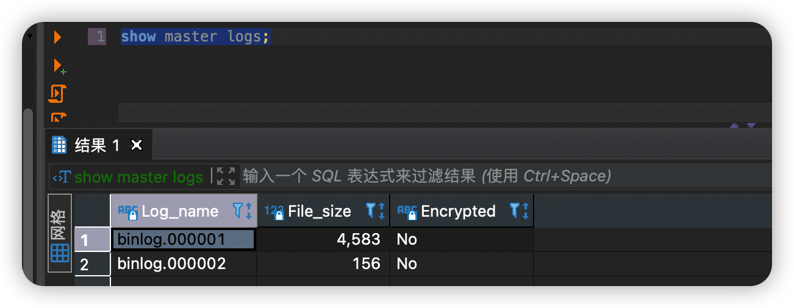

> 创建于2022年9月15日
>
> 标签：MySQL、运维、数据恢复与恢复
>
> 参考：[CSDN-hzp666](https://blog.csdn.net/hzp666/article/details/125678602)、[博客园-宇宙神奇](https://www.cnblogs.com/yuzhoushenqi/p/15784227.html)

## 浅谈 MySQL 数据恢复与备份

[toc]

### 浅谈恢复形式

本地模拟一次数据恢复。在说数据恢复之前，先说一下数据恢复的过程，防止有些童鞋带有偏见，一直以为数据恢复就像是我们编辑文档 `Ctrl+Z` 撤回操作一样，至少我在刚开始接触数据恢复就是这样以为的。实际上不是这样的。

准确的来说，在开启 `binlog` 之后，mysql 会记录此后的每一步操作，就像是日志一样

```
创建库 > 创建表 > 插入数据 > 删库 > 跑路
```

`binlog` 会依次记录在小本本上，等到发现有人删库跑步之后，就对其进行恢复操作，而恢复的步骤，不是 ctrl+z 形式的回滚，而是找到开始点和结束点，就比如上面的例子，我们只要找到 创建库 到 插入数据那一段的日志，然后重新执行一遍。

```
创建库 > 创建表 > 插入数据 
```

这样数据就能恢复回来，那既然如此，他能存多少天，具体恢复的步骤又是如何呢？

咱们下回揭晓！！！

开个玩笑

### 开启 binlog 及配置

在我们学习使用 mysql 的 binlog 日志之前，我们要先打开 binlog

> 使用 root 权限登录 MySQL 
>
> 我这里是 `8.0.23`版本的MySQL ，使用的是 DBeaver 数据库链接工具

```sql
show variables like '%log_bin%';
```


如果你查询出来的 log_bin  不是和我一样，找到 MySQL 的配置文件


这里解释一下

+ server-id = 1(单个节点id)
+ log-bin= /var/lib/mysql/mysql-bin(位置一般和mysql库文件所在位置一样) 
+ expire_logs_days = 10(表示此日志保存时间为10天)

配置完成后，重启 MySQL，再次查询就可以看到 binlog 为 ON 状态啦

binlog日志包含两类文件

1. 第一个是二进制索引文件，后缀名为 `.index`  
2. 第二个为日志文件，后缀为 `00000*`，这个是记录数据库所有 DDL 和 DML （除了查询语句select）语句事件

可以通过

```sql
show master logs;
```

查看所有 binlog 日志文件列表



那一个文件能存多少呢，存太多了，会不会撑着了呢！mysql 为我们想好了，所以你可以看到上图，有 00001、00002 这样的文件

```sql
show master status; 
```

查看最后一个 binlog 日志的编号名称及最后一个操作事件pos结束点，说的直白一点，每一个操作都会有一个 `position` 操作点。他可以理解为操作的流水ID 是唯一的而且是逐渐增长的


如果我们觉得一个这个文件有点撑着了，可以执行

```sql
Flush logs
```


这里我执行了5遍，再查看，就有5个文件了。除了我们自己手动执行之外，每次重启 mysqld 服务时，都会自动刷新 binlog 日志，mysqldump 备份数据，如果加 -F 选项也会刷新 binlog 日志

删的时候，执行 :

```sql
reset master;
```

删完之后，只会保留初始的那个 `binlog.00001` 


这些文件都是真实存在于服务器磁盘中的，我们直接通过 `vi`、`cat` 命令去查看是看不出个什么玩意儿出来的


要想搞懂里面写了个啥，可以通过这个sql查看

```sql
show binlog events in 'binlog.000001'; 
```


上面说了 pos 的作用，我们也可以指定从 Pos 125  开始查起


他也支持 `limit` 用法，这个我就不过多解释了

```sql
show binlog events in 'binlog.000001' from 125 limit 2,4 
```

好，知道了日志文件在什么地方，知道了怎么看历史记录。我们来准备删库吧！！！

### 删库跑路（搭建测试数据库，然后删除它）

不是让你真去 `drop` 掉生产环境上的表，你要这样干，可别说是我教的，我教不出这么傻的徒弟来。

我们自己创建一个数据库玩玩吧。

创建库之前，先清一下所有历史日志，方便我们后续的查找

```sql
reset master;
```

初始化一个 `binlog_test` 数据库，创建一张 `user` 表，并插入四条数据

```sql
create database binlog_test;
use binlog_test;
create table user(
id varchar(255),
name varchar(255),
passwd varchar(255)
);
insert into user values ('1','小明','123456');
insert into user values ('2','小张','111111');
insert into user values ('3','小李','999999');
insert into user values ('4','小虎','123456');
```


好！

二话不说，带着满腔热情，咱们就直接就给他 drop 掉

```sql
drop table user;
```

再来查询，表已经无了


搁以前，咱们 `drop` 表的时候，内心十分畏惧，生怕再也找不回来了，不要怕！咱们现在给他变回来！

哦，麻里麻里哄！

### 起死回生（分析binlog，然后恢复数据）

首先，查询 binlog 列表

```sql
show master logs;
```


再查询一下 binlog 具体的日志

```sql
show binlog events in 'binlog.000001'; 
```


看到这满屏的日志，是不是内心就不慌了

我们来解读一下


通过上面的分析，我们可以知道

+ Pos 235 创建数据库 binlog_test 
+ Pos 443 创建 user 表
+ Pos 844 - 2021（这里取 commit 结束）插入4条数据
+ Pos 2098 最后删掉了 user 表

我们要恢复 `user` 表的数据，那就要从 创建`user` 表到插入4条数据这一块来恢复 ，选取 443 - 2021

请看如下语句

```sh
mysqlbinlog --start-position=443 --stop-position=2021 --database=binlog_test binlog.000001 | mysql -uroot -proot
```

注意，这个语句是一个 shell 脚本，可不是让在 sql 对话框执行的。

+ 因为命令涉及到 `binlog.000001` 文件，所以要到这个文件下去执行，或者你在命令里补齐全路径
+ 此外当前用户还需要 mysqlbinlog 的执行权限
+ `|` 管道符后面接mysql 的登录命令，所以需要输入密码


再去查询 `select * from user` 数据就回来了，就是这么 `so easy`

### 再显神通（根据时间恢复数据）

那有同学就说了，我就记的我昨天晚上不小心敲错了几个字母，昨天晚上到现在又有好多人执行了好多写入操作，这咋找呀！

mysql 统统都想到了，既然知晓时间概念，那我们就从时间的维度来进行分析

为了方便理解，我们还是用 binlog.00001 这个文件来操作，既然不能直接读取，我们用 mysqlbinlog 给他转换成可读文件！

```sh
mysqlbinlog --base64-output=decode-rows -v binlog.000001 --result-file=/Users/xiang/Desktop/binlog.000001.sql
```


然后我们就得到了这样一个文件


大家注意到没有，这里有时间信息，pos 信息，还有具体操作的日志文件，只能说比 `show binlog events in 'binlog.000001'; ` 更详细有没有！

老样子，你可以根据你自己的回忆评估大致的时间，也可以查看这个文件，找到具体的时间


这里我们找到：

#220915 14:20:29  创建表

#220915 14:22:49  插入最后一条记录先执行一遍 drop table，你甚至可以多执行几遍，确认给他`drop`干净了

再执行

```sh
mysqlbinlog --start-datetime="2022-09-15 14:20:29" --stop-datetime="2022-09-15 14:22:49" --database=binlog_test binlog.000001 | mysql -uroot -proot
```


`select * from user` 它又神奇的回到了你的面前。

### 永久封印（定时备份，防止老6偷家）

既然我们清楚了他的恢复逻辑，只要我们定时对数据库进行 binlog 备份

打个比方，每隔1个小时 `Flush logs;` 一次，生成一个新的 binlog 文件。假设有一天，有老6偷了家，我们可以找到所有的 binlog，然后依次执行到被偷家的前一个小时。虽然保不住那最后1个小时的数据，但是，好比啥都没了要强，您说是吧！！