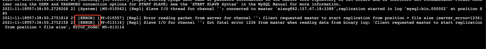

> 创建于 2021年11月18日
> 作者：想想

[toc]


### 前言：

​	两台服务器：

+ King 82.157.67.18
+ Queen 82.157.58.225

两台服务器所配置都相似，CentOS8.0、MySQL8.0.26

## 一、准备环境

两台服务器都已经部署好 MySQL 8.0.26，并本地可以成功访问

安装依赖

```sh
sudo yum -y install numactl
sudo yum -y install libaio.so.1 libgcc_s.so.1 libstdc++.so.6
sudo yum update libstdc++-4.4.7-4.el6.x86_64
sudo yum install libaio
sudo yum install net-tools
```


### 1.1、修改配置

在 `etc/my.cnf` 文件中

```
# master
port = 3388
server-id = 100
log-bin = mysql-bin
innodb-file-per-table =ON
skip_name_resolve=ON

socket = /tmp/mysql.sock

log-error = /usr/local/mysql-8.0.26/logs/error.log
basedir = /usr/local/mysql-8.0.26
datadir = /usr/local/mysql-8.0.26/data
pid-file = /usr/local/mysql-8.0.26/mysql.pid
```

```
# slave
port = 3388
relay-log=relay-log1
relay-log-index=relay-log.index
server-id = 101
innodb_file_per_table=ON
skip_name_resolve=ON
socket = /tmp/mysql.sock

log-error = /usr/local/mysql-8.0.26/logs/error.log
basedir = /usr/local/mysql-8.0.26
datadir = /usr/local/mysql-8.0.26/data
pid-file = /usr/local/mysql-8.0.26/mysql.pid
```

修改完成后，重启数据库，查询状态 

`systemctl` 命令方式操作数据库。需要用sudo权限

```sh
# 启动
systemctl start mysql
# 停止
systemctl stop mysql
# 重启
systemctl restart mysql
# 查看状态
systemctl status mysql
```

`service` 方式操作数据库，必须使用 Xiang 用户

```sh
# 查看状态
service mysql status
# 启动
service mysql start
# 停止
service mysql stop
# 重启
service mysql restart
```

### 1.2、主库 master 操作

1、创建用于同步到用户并授权

```sql
#创建用户
CREATE USER 'xiang'@'%' IDENTIFIED BY 'xiaocencen';
#授权
grant replication slave on *.* to 'xiang'@'%';
#刷新权限
flush privileges;
```

### 1.3、重库 slave 操作

1、同步

```sql
change master to master_host='82.157.67.18', master_user='xiang',  master_port=3388,master_password='xiaocencen',master_log_file='mysql-bin.000002', master_log_pos=156, master_connect_retry=30;
```

其中 mysql-bin-000002为在主库从查询到二进制文件名，885为位置

如果需要更换主库，需要先关闭io线程

```sql
STOP SLAVE IO_THREAD;  
```

2、启动同步库

```sql
start slave;
```

3、查看状态

```sql
show slave status\G
```


标识已经启动成功了

> 但是这一块比较容易出一个问题，就是 
>
> ```sh
> Slave_IO_Running: No
> Slave_SQL_Running: Yes
> ```
>
> 如果出现这个问题，就需要排查一下

在 `etc/my.cnf` 中，我们可以找到 `log-error = /usr/local/mysql-8.0.26/logs/error.log` 配置，知道mysql的错误日志都在这里

```
tail -f /usr/local/mysql-8.0.26/logs/error.log
```

实时监控这个文件

在`启动同步库` 时，就会报错



其主要错误是 `Client requested master to start replication from position > file size`

百度过后，发现我们在同步 salve 时，其中有个参数是：`master_log_pos=156`，这个配置我在第一次配置的时候，直接用的百度的命令，给的是885，结果就报错了，这里应该根据 主库的大小来设定。

我们进到主库跟目录下，找到 `master_log_file='mysql-bin.000002'`  配置中的 `/usr/local/mysql-8.0.26/data/mysql-bin.000002` 文件

```sh
/usr/local/mysql-8.0.26/bin/mysqlbinlog /usr/local/mysql-8.0.26/data/mysql-bin.000002 > /usr/local/mysql-8.0.26/data/mysqlbin000002.log
```

生成 `mysqlbin000002.log` 文件，查看后发现

```
CigB8hzWdQ==
'/*!*/;
# at 125
#211118 15:09:26 server id 100  end_log_pos 156 CRC32 0xbf56afe2        Previous-GTIDs
# [empty]
....
```

参数为 `end_log_pos 156`，所以，我们在同步主库的时候，参数也应该是 `master_log_pos=156`

再关闭IO线程、同步主库、启动同步，发现成功！