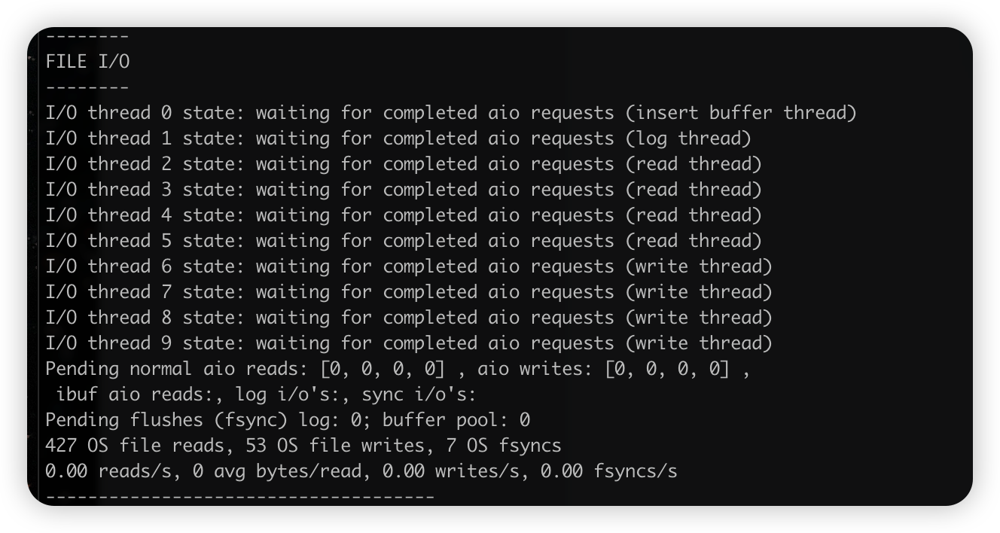

[toc]

大家好，我是想想

### 闲言秽语

很长一段时间没有给大家分享技术了，其实是偷偷的去闭关修炼了。

之前发了一些不痛不痒的技术，属实没什么意思。所以就间接的学习何同学，提升提升文章质量吧。

前一段时间和一位朋友聊天的时候，说到了MySQL，我说，那还不简单吗，CRUD、索引、事务、简单的一些优化，复杂一点就分库分表、读写分离。我觉得这些搞明白，那MySQL 就差不多了。

奈何计算机行业是一个十分内卷的行业。什么问题都要追究个底层原理，我个人也提倡这种，多学无害嘛。

之前在学 Spring 源码的的时候，我还在想，学之前，我只要会用就行了，知道可以解耦、横切，就够了。但在我学习的时候，发现 Spring 内部在制造一个 bean 的时候是经历了如此多的步骤。在实例化一个对象的时候，要考虑选择哪个构造器，如何解决循环依赖，选用什么代理实现AOP。这些都是开发Spring的工程师思考的问题。我们作为使用者，多少应该去了解一点。

这样在我们碰到一些问题时候，就知道如何去排查问题，而不是反向`抛出问题`。

### 言归正传

> 本次分享的技术内容主要为 MySQL 的架构原理，涵盖 MySQL存储机制、体系结构（内存、磁盘结构）、SQL 运行机制，存储引擎、Undo、Redo 等。学习之后。你可以利用一些参数，用**时间和空间互换**的这种方式来实现对MySQL的系统进行一些调整。绝大数的参数及配置均会实操测试。

# MySQL 架构

## MySQL 体系架构


自上而下，可分为 网络、服务、引擎、系统文件 四个模块

我们重点关注 服务层、引擎、系统日志层

+ SQL 接口：用于接受各种SQL命令，并且返回用户需要查询的结果。

+ 解析器：将SQL解析成“解析树”，并且校验解析树是否合法

+ 查询优化器：高效的获取数据（简单的讲、后面运行机制细说）

+ 缓存（后面细说）

+ 引擎：可插拔的引擎各有各的本领，适合不同场景，与Oracle不同的是，MySQL 的引擎是表级别的。

+ 系统文件层：

	+ 日志文件

		+ 错误日志 默认开启

		+ 通用查询日志 使用 show variables like '%general%'; 查询

		+ 二进制日志 binlog、log_bin，` show binary logs;` 查看

		+ 慢查询日志 查询超时SQL，默认10s

			```sql
			// 是否开启
			show variables like '%slow_query%';
			// 时长
			show variables like '%long_query_time%';
			```

			

			开启命令：

			```sql
			set global slow_query_log='ON';
			```

			同理，除了binlog 等，大多数的 variables 都可以通过上述 SQL 值进行修改

	+ 配置文件：Windows的 my.ini 、Linux 的 my.cnf

	+ 数据文件

		+ db.opt：记录这个库的字符集校验规则
		+ frm：存储表相关的元数据（表结构、字段信息）每一张都会有一个 frm 文件
		+ MYD：MyISAM 引擎专用，存放数据的，每张表都会有一个 MYD 文件
		+ MYI：MyISAM 引擎专用，存放索引的，每张表都有一个MYI文件（以后讲到**聚集索引**和**非聚集索引**的时候就用到这两个文件了）
		+ ibd、IBDATA：存放 InnoDB 数据（包括索引），innodb引擎存储有两种方式，独享表空间，一张表占一个idb文件，另外一种是共享表空间使用 ibdata 文件，所有表公用 ibdata文件。（后面讲到磁盘结构细说）
		+ ibdata1：系统表空间，存储元数据、undo 日志等
		+ ib_logfile0、iblogfile1：redo 日志文件

	+ pid

	+ socket 在 Unix/Linux 环境下才有。

## MySQL 运行机制

1. 建立连接，MySQL 的通讯方式是 “半双工”

	通讯机制：

	+ 全双工：能同时接收和发送
	+ 半双工：要么在发送，要么在接收，不能同时
	+ 单工：只能发送或只能接收

	线程状态

	```sql
	show processlist;
	```

	

	+ id：线程ID ，可以`kill 3;` 杀掉
	+ user：启动这个线程的用户
	+ db：当前命令在哪个库执行
	+ Command：当前正在执行什么命令
		+ Create DB 创建库
		+ Drop DB 删库
		+ Execute 执行一个 PreparedStatement
		+ Close Stmt 正在关闭一个 PreparedStatement
		+ Query 正在查询一个语句
		+ Sleep 等待客户端发送语句
		+ Quit 正在退出
		+ Shutdown 正在关闭服务器
	+ Time：出于当前状态的时间，单位是秒
	+ State 线程状态
		+ Updating 正在搜索匹配，进行修改
		+ Sleeping 正在等待客户端发送
		+ starting 正在执行请求处理
		+ Checking table 正在检查表数据
		+ Closing table 正在将表中数据刷新到磁盘
		+ Locked 被其他查询锁住了记录
		+ Sending Data 正在处理 select 查询，同时将结果发给客户端
	+ Info：一般记录执行语句，这里只显示100字符，如果要全部显示 ，执行 `show full processlist;`

2. 查询缓存，命中换成直接返回，不经过IO

	key值要求完全相同包括参数，这样才能命中，即使开启缓存，以下SQL也不能缓存

	+ 查询语句用到 SQL_NO_CACHE
	+ 查询的结果大于 query_cache_limit 设置
	+ 查询中不确定参数，比如 now()

	```sql
	// 查看缓存是否开启，空间大小，限制等
	mysql> show variables like '%query_cache%';
	+------------------------------+---------+
	| Variable_name                | Value   |
	+------------------------------+---------+
	| have_query_cache             | YES     |
	| query_cache_limit            | 1048576 |
	| query_cache_min_res_unit     | 4096    |
	| query_cache_size             | 1048576 |
	| query_cache_type             | OFF     |
	| query_cache_wlock_invalidate | OFF     |
	+------------------------------+---------+
	6 rows in set (0.02 sec)
	```

	```sql
	// 查询更详细的缓存参数，可用缓存空间，缓存块，缓存多少
	show variables like '%cache%';
	```

3. 解析器，可以理解为校验 SQL 是否正确，检查数据表的数据列是否存在。最后会生成一个新的解析树。

4. 查询优化器，分为静态优化（编译时优化）、动态优化（运行时优化）

	+ 等价变化侧率
		+ a = 5 and a > 5 改为 a > 5
		+ a < b and a = 5 改为 b > 5 and a = 5
		+ 基于联合索引修改条件位置等
	+ 优化 count、int、max 等函数
		+ InnoDB min 函数找索引最左边
		+ InnoDB max 函数找索引最右边
		+ MyISAM count(0) 不计算，直接返回
	+ 提前终止查询，用了 limit，就不再遍历后续的数据了
	+ in 优化，in (2 , 1, 3) 会排序，变成 in ( 1, 2, 3) 再二分法查找。

5. 引擎：根据表中的引擎类型，查询结果并返回客户端，细节咱们后面细讲。查询到的结果会完整的保存到查询缓存中，以便后续查询相同的SQL可以直接返回。

	+ 如果开启了查询缓存，先把查询结果做缓存操作，再返回
	+ 如果结果很多，采用增量模式返回

## MySQL 存储引擎

存储引擎位于系统架构第三层，负责MySQL 数据存储和提取。

```sql
show engines;
```


大致我给翻译了一下，再简单介绍一下

+ InnoDB：支持事务、具有提交、回滚和崩溃恢复能力，事务安全
+ MyISAM：不支持事务，访问快
+ Memory：利用内存建表，因为内存，访问非常快，默认使用 Hash 索引，一旦关闭数据丢失。
+ Archive：归档引擎，只支持insert select
+ CSV：以csv进行存储，所以所有的列必须 not null，此外不支持索引和分区，此引擎适合做数据交换中间表
+ BlackHole：黑洞，只进不出，所有执行的数据都不保存。因为 binlog 所以可以做主从备份（少用）
+ Federated：访问远程的MySQL数据库，本地表，但是不保存数据，访问远程表的数据
+ MRG_MYISAM：一组MyISAM表组合，这一组里面MyISAM表结构必须相同

这个稍微了解一下即可，除了玩玩，没什么人会用他们。

主要关注的是 InnoDB 和 MyISAM

我们来看一下两者的不同

+ 事务外键
	+ InnoDB：支持事务外键、安全、完整性，适合大量插入和修改
	+ MySIAM：不支持事务、外键，提供高速存储和索引，适合大量 select 查询操作。只读或大部分情况只读的表，不介意崩溃恢复的话，MyISAM 合适。
+ 锁机制
	+ InnoDB 行级锁，锁定指定记录，基于索引加锁实现
	+ MyISAM 支持表锁，锁整张表
+ 索引结构
	+ InnoDB 聚集索引，索引和数据放一块
	+ MyISAM 非聚集索引，索引和数据两个文件
+ 并发处理能力
	+ MyISAM 使用表锁，导致并发率低，读不阻塞，但写会阻塞
	+ InnoDB 读写阻塞和隔离级别有关，可以采用 MVCC 多版本并发控制来支持高并发（这个后面细讲）
+ 存储文件
	+ InnoDB 两个文件， .frm 表结构、.idb 数据文件。 InnoDB 最大支持 64TB。
	+ MyISAM 三个文件， .from 表结构、MYD 数据、MYI 索引，从MySQL5.0开始默认限制 256TB

总结一下

MyISAM：

+ 不需要事务支持（不支持）
+ 并发率较低（锁机制问题导致的）
+ 数据修改相对较少，读为主
+ 数据一致性要求不高（没有事务、没有回滚）

InnoDB： 

+ 需要事务支持
+ 行级锁对并发适应性高
+ 数据更新较为频繁
+ 数据一致性高
+ 硬件设备较大，可以利用 InnoDB 较好的提高内存利用率，减少IO

言归到底：还是用 InnoDB，不要用 MyISAM，除非你追去快速查询，且没什么修改


## InnoDB 存储结构


### 内存结构

看上面的图，这是 MySQL 5.5 版本开始默认使用 InnoDB 作为引擎的，InnoDB引擎架构图

主要分内存和磁盘两块，左边内存、右边磁盘

我们可以看到左边主要有四块：Buffer Pool、Change Buffer、Adaptive Hash Index 和 Log Buffer 四个组件

1. Buffer Pool 缓冲池，简称 BP， 以 Page 为单位，里面颜色深浅不一的就是 Page，默认 16K，BP 底层采用链表管理 Page。在 InnoDB 要访问记录和索引的时候，就会来这里查找缓存，便于减少磁盘 IO 操作。以提高效率。

	1. Page 可以分为三种类型

		1. free Page：空闲 page ，未被使用
		2. clean Page：被使用 Page，数据没有被修改过
		3. dirty Page：脏页，被使用过，也被修改过，也中的数据和磁盘产生了不一致情况。

		针对这三种 page 类型，InnoDB 通过三种链表来维护管理

		1. free list：空闲缓冲区，管理 free page
		2. flush list：刷新缓冲区，管理 dirty page。按时间修改顺序排列。把脏页写入IO
		3. lru list：正在使用的缓冲区。

	2. LRU 淘汰策略

		普通的 LRU，末尾淘汰，新数据从链表头写入，释放时，从尾部淘汰。

		新的 LUR，分为new 、old 两部分，加入元素从中间 midpoint 一个基点加入，

		

		到了编辑就往另一头挤，挤到头就淘汰。

	3. Buffer Pool 配置参数

		+ Page 页大小

			

		+ lru list中 old 列表参数

			

		+ buffer pool 参数

			

			这里的 innodb_buffer_pool_size 建议设置为总内存的 60% - 80%，占比太多，容易导致其他组件资源不足，太少了，缓存少效率低。如果要修改的话，就要看业务场景是否存在重复查询的概率。

			也可以用这种方式看的更明显

			```sql
			mysql> select @@innodb_buffer_pool_size/1024/1024;
			+-------------------------------------+
			| @@innodb_buffer_pool_size/1024/1024 |
			+-------------------------------------+
			|                        128.00000000 |
			+-------------------------------------+
			1 row in set (0.00 sec)
			```

			这里的 innodb_buffer_pool_instances 可以设置多个，避免缓存争夺。

2. Change Buffer 写缓冲区，简称 CB，Change Buffer 占 Buffer Pool 的 25%，最大允许占 50%

	```sql
	mysql> show variables like '%innodb_change_buffer_max_size%';
	+-------------------------------+-------+
	| Variable_name                 | Value |
	+-------------------------------+-------+
	| innodb_change_buffer_max_size | 25    |
	+-------------------------------+-------+
	1 row in set (0.01 sec)
	```

	如果写操作比较多，读操作比较少，可以适当把 Change Buffer 调高

3. Adaptive Hash Index：自适应哈希索引，优化 Buffer Pool 对数据的查询，InnoDB 会监控表索引的查找。如果发现建立 Hash 会优化查询速度，那就建立，所以是一个自适应的。

4. Log Buffer：日志缓冲区，用来写 Undo 、 Redo 数据，当遇到BLOB 或多行大事务时候，增加日志缓冲区可以节省磁盘IO

	```sql
	mysql> show variables like '%innodb_flush_log_at_trx_commit%';
	+--------------------------------+-------+
	| Variable_name                  | Value |
	+--------------------------------+-------+
	| innodb_flush_log_at_trx_commit | 1     |
	+--------------------------------+-------+
	1 row in set (0.01 sec)
	# 0：每隔一秒写入日志和刷盘，最多丢失1秒数据
	# 1：事务提交，立刻写入日志和磁盘，数据不丢失，但是会频繁IO （默认）
	# 2：事务提交，立刻写入日志和磁盘，每隔1秒进行刷盘
	```


### 磁盘结构

我们可以翻回去重复一下 MySQL 官方给的架构图，右边那块是磁盘

InnoDB 磁盘主要包含 TableSpace，InnoDB dataDictionary，Doublewrite Buffer，Redo Log 和  Undo Logs。

1. TabeSpace（表空间），用于存储表结构和数据，之间又区分为系统表空间（SystemSpace）、独立表空间（File-Per-Table TableSpaces）、通用表空间（General Tablesspace）、临时表空间（Temporary Tablespaces)、和 Undo 表空间（Undo TableSpaces）

	

	1. 系统表空间：这是一个共享表空间，被多个表共享，通过  `innodb_data_fifile_path` 参数控制

		```sql
		mysql> show variables like '%innodb_data_file_path%';
		+-----------------------+------------------------+
		| Variable_name         | Value                  |
		+-----------------------+------------------------+
		| innodb_data_file_path | ibdata1:12M:autoextend |
		+-----------------------+------------------------+
		1 row in set (0.00 sec)
		# 默认值，表示 文件名为 ibdata1   12M  自动扩展
		```

	2. 独立表空间，一个表单独一个表空间，而非创建于系统表。当 `innodb_fifile_per_table` 开启时，表将会创建在自己的表空间里，否则就在系统表空间中。（5.7 以后默认此表空间）

	3. 通用表空间，这种表空间是通过 create tablespace 语法创建的共享表空间，可以容纳多张表。

		```sql
		CREATE TABLESPACE ts1 ADD DATAFILE ts1.ibd Engine=InnoDB; 
		# 创建表空 间ts1 
		CREATE TABLE t1 (c1 INT PRIMARY KEY) TABLESPACE ts1; 
		# 将表添加到ts1 表空间
		```

	4. 撤销表空间 Undo Tablespaces，5.7 之前，undo 是在系统表空间内的，之后分离了出来，`innodb_undo_tablespaces` 参数默认是 0，表示使用系统表空间 ibdata1。当大于0时，就表示使用 undo_001 、undo_002 等。

	5. 临时表空间

		1. session temporary tablespaces 存储用户创建的临时表
		2. global temporary tablespaces 存储用户临时表的回滚段（rollback segments）

		MySQL 服务正常关闭或异常终止时。临时表空间都会清空，每次启动重新创建


我们来看一下系统表空间

2. InnoDB data Dictionary，数据字典，内部是由元数据，（表字段、表结构）这类组成的。我们之前说到 .frm 文件 InnoDB 元数据文件里也存储这些信息。所以由于历史原因，这部分信息重复了。

3. Doublewirte Buffer 双写缓冲区，这是一个存储区域，在Buffer Page 的 page 页刷到磁盘真正的位置前，会将数据存在 Doublewrite 缓冲区，如果 page 页写入过程出现操作异常、存储子系统mysqld崩溃了，InnoDB 可以在崩溃恢复期间从 DoubleWirte 找到页面的一个好的备份。大多数情况，默认开启双写缓冲区，如果要禁用的话，将`innodb_doublewrite` 设置为 0。要使用的话，建议将 `innodb_flush_method` 设置为 `O_DIRECT`

	这个参数控制 innodb 数据文件以及 redo log 打开刷新方式。

	1. fdatasync （默认）先去操作系统缓存，然后在调用 fsync() 函数去异步刷数据文件的 redo log 缓存信息
	2. O_DSYNC
	3. O_DIRECT  文件写入操作会通知系统不要缓存数据，也不要预读，直接写磁盘

4. Redo 重做日志，用于在崩溃恢复期间更正不完整事务写入的数据，比如说 断电了，重启数据库时，需redo，重新把数据更新到数据文件。所以会不断产生 redo，默认情况会在磁盘上生产 ib_logfile0 和 ib_logfile1 两个物理文件

	

	

	### 新版本演变

	

这是 8.0 版本，我们可以发现，很多东西从 System Tablespace 中抽离出来。

+ Buffer Pool 大小可以动态修改，无需重启服务器实例（5.7 既已实现）
+ InnoDB 数据字典和 Undo 空间从元数据表空间彻底分离出来，之前和 frm 文件重复的元数据信息也没有了。
+ temporary 临时表空间也可以配置多个物理文件，而且 均为 InnoDB 存储引擎创建了索引，这样加快了处理速度。
+ 用户可以向 Oracle 那样给设置表空间，每个表空间对应多个物理文件，每个表空间可以给多个表使用。但是一个表只能存储在一个表空间
+ 将 双写缓存也从共享表空间 ibdata 中分离出来

### 线程模型


+ IO Thread 

	InnoDB 中使用了大量 AIO（Async IO）来做读写，这样可以极高的提升数据库性能，在 InnoDB 1.0 版本之前共有4个 IO Thread，分别是 write、read、insert buffer 和 log thread，后来版本将 read thread 和 write thread 分别增大到了4个，一共是10个了

	+ read thread 读取，将数据加载到 page 页，4个
	+ write thread 写，将缓存中的脏页刷到磁盘 4个
	+ log thread 日志缓冲区划到磁盘 1个
	+ insert buffer thread 写缓冲区刷到磁盘 1个

	```sql
	show engine innodb status \G;
	```

	

+ Purge Thread 事务提交后，其使用 undo 日志将不再需要，因此需要 Purge Thread 回收已经分配的 undo 页

	```sql
	mysql> show variables like '%innodb_purge_thread%';
	+----------------------+-------+
	| Variable_name        | Value |
	+----------------------+-------+
	| innodb_purge_threads | 4     |
	+----------------------+-------+
	1 row in set (0.00 sec)
	```

+ Page Cleaner Thread 

	将脏数据刷到磁盘，对应的 redo 日志就会被覆盖，既可以同步数据，又可以达到 redo log 循环目的，会调用 IO Thread 里的 write thread 线程处理这个事情。自己不做，调别人~

	```sql
	mysql> show variables like '%innodb_page_cleaners%';
	+----------------------+-------+
	| Variable_name        | Value |
	+----------------------+-------+
	| innodb_page_cleaners | 1     |
	+----------------------+-------+
	1 row in set (0.00 sec)
	```

+ Master Thread

	这是老大，InnoDB 的主线程，负责调度各个线程，优先级最高，作用是将缓冲区的数据异步刷到磁盘，保证数据一致性。工作内容有：脏页刷新、undo页回收、redo日志刷新、合并写缓冲区。内部主要两个循环

	1. 每隔1秒循环操作

		1. 刷新日志缓冲区，刷到磁盘

		2. 合并写缓冲区数据，根据IO读写压力来决定是否操作

		3. 刷新脏页数据到磁盘，根据脏页比例达到75%才操作，（innodb_max_dirty_pages_pct ，inndb_io_capacity）

			```sql
			mysql> show variables like '%innodb_max_dirty_pages_pct%';
			+--------------------------------+-----------+
			| Variable_name                  | Value     |
			+--------------------------------+-----------+
			| innodb_max_dirty_pages_pct     | 75.000000 |
			| innodb_max_dirty_pages_pct_lwm | 0.000000  |
			+--------------------------------+-----------+
			2 rows in set (0.00 sec)
			
			mysql> show variables like '%innodb_io_capacity%';
			+------------------------+-------+
			| Variable_name          | Value |
			+------------------------+-------+
			| innodb_io_capacity     | 200   |
			| innodb_io_capacity_max | 2000  |
			+------------------------+-------+
			2 rows in set (0.00 sec)
			```

	2. 每隔10秒操作

		1. 刷新脏页到磁盘
		2. 合并写缓冲区数据
		3. 刷新日志缓冲区
		4. 删除无用的undo 页


## InnoDB 数据文件


InnoDB 文件存储结构分为一个 .idb 数据文件 里面包含 segment（段） --> Extent (区）--> Page（页）--> Row （行） 

+ Tablespace 

	表空间，用于存储多个 ibd 数据文件，存储表的记录和索引（聚集索引）一个文件包含多个段

+ Segment

	段，用于管理多个 Extent，数据段（Lef node segment）、索引段（Non-leaf node segment）、回滚段 (Rollback Segment)

+ Extent

	区，一个区固定 64 个连续的页，1M大小，如果空间不足，会直接再分配一个区

+ Page

	页，存储多个Row记录，16K大小，包含 数据页，undo 页，系统页，事务数据页，大的BLOB对象页

+ ROW

	行，记录字段值、事务ID、滚动指针、字段指针等信息


### 文件存储格式

```sql
mysql> use xiang;
Database changed
mysql> SHOW TABLE STATUS \G;
*************************** 1. row ***************************
           Name: hello
         Engine: InnoDB
        Version: 10
     Row_format: Dynamic
           Rows: 2
 Avg_row_length: 8192
    Data_length: 16384
Max_data_length: 0
   Index_length: 0
      Data_free: 0
 Auto_increment: NULL
    Create_time: 2023-03-03 01:19:03
    Update_time: NULL
     Check_time: NULL
      Collation: utf8mb4_general_ci
       Checksum: NULL
 Create_options:
        Comment:
1 row in set (0.00 sec)

ERROR:
No query specified
```

一般情况下，如果row_format为REDUNDANT、COMPACT，文件格式为Antelope

如果row_format为DYNAMIC和COMPRESSED，文件格式为Barracuda。


### File文件格式

上面我们通过查询  FILE_FORMAT

```sql
select * from information_schema.innodb_sys_tables;
// MySQL 8.0 是下面这条
select * from information_schema.tables;
```

看到 FILE_FORMAT 分为 Antelope  和 Barracuda 两种格式，早期是只有一种的。

+ Antelope：先前未命名的，最原始的 InnoDB 文件格式，支持两种行格式 COMPACT 和 REDUNDANT，
+ Barracuda：新格式，支持 InnoDB 的所有格式，包括新格式 COMPRESSED 和 DYNAMIC

### ROW行格式

Row_Format 表的行格式决定了它的行是如何物理存储的，反过来又会影响查询和 DML 操作性能，如果在单个 Page 页中容纳了更多行，查询和索引查询可以更快的工作，缓冲池中所需的内存更少，写入更新时所需的I/O更少


+ Redundant

	表会将变长列值的前 768 字节存储在 B 树节点的索引记录中，其余的存储在溢出页

+ Compact

	和 Redundant 相比，compact 节省了 20% 存储空间，但是代价是增加了操作 CPU 使用量，如果系统负载受缓存命中率和磁盘限制，compact 会更快。如果 CPU 受限，Compact 会更慢

+ Dynamic

	索引只记录20字节指针，其余的统统到溢出页，大于等于 768的，变为长度字段，最多 3072字节，支持大索引前缀，通过 innodb_large_prefix 参数控制

	```sql
	mysql>  show variables like '%innodb_large_prefix%';
	+---------------------+-------+
	| Variable_name       | Value |
	+---------------------+-------+
	| innodb_large_prefix | ON    |
	+---------------------+-------+
	1 row in set (0.01 sec)
	```

+ Compressed

	和 Dynamic 差不多，但是增加了对表和索引的压缩支持

要修改的话 	`ALTER TABLE 表名 ROW_FORMAT=格式类型;`

```sql
mysql> ALTER TABLE hello ROW_FORMAT=COMPRESSED;
Query OK, 0 rows affected (0.10 sec)
Records: 0  Duplicates: 0  Warnings: 0
```


### Undo Log

可不要小看了 Undo Log 这是为了实现原子性而出现的产物。

实现了：

1. 事务原子性
2. 多版本并发控制（MVCC）undo 就是旧的版本，每多一个事务就有一个多的版本，所以叫多版本并发控制。


Undo  意为撤销或取消，以撤销操作为目的，返回指定某个状态的操作。数据库事务开始之前，会将修改的记录存到 undo 日志里，当事务回滚或数据库崩溃时，可以利用 undo 日志，撤销未提交事务对数据产生的影响。

事务提交时，并不会立刻删除 undo log，innodb 会将事务对应的 undo log 放到删除列表里，后面会通过后台线程 purge thread 进行回收

undo log 属于逻辑日志，记录一个变化的值，例如执行一个 delete，undo 会记录一个 insert，执行一个update ，undo 会记录一个相反的 update。

undo 存储采用段的方式管理，在innodb 数据文件中包含一种 rollback segemt 回滚段，里面有 1024个 undo log segment，可以通过 undo log 参数修改

```sql
mysql> show variables like '%innodb_undo%';
+--------------------------+-------+
| Variable_name            | Value |
+--------------------------+-------+
| innodb_undo_directory    | ./    |
| innodb_undo_log_truncate | OFF   |
| innodb_undo_logs         | 128   |
| innodb_undo_tablespaces  | 0     |
+--------------------------+-------+
4 rows in set (0.00 sec)
```


### Redo Log 和 Binlog

先说 Redo

#### Redo

重做，以恢复操作为目的，在数据库发生意外时重现操作。


之前我们说 undo 是为了实现mvcc 多版本并发控制，那 redo 就是实现数据一致性。

每个 InnoDB 存储引擎至少 1个重做日志文件组 （redo 组），每个文件组又有至少2个redo文件，默认为 ib_logfile0、ib_logfile1

```sql
mysql> show variables like '%innodb_log%';
+-----------------------------+----------+
| Variable_name               | Value    |
+-----------------------------+----------+
| innodb_log_buffer_size      | 16777216 |
| innodb_log_checksums        | ON       |
| innodb_log_compressed_pages | ON       |
| innodb_log_file_size        | 50331648 |
| innodb_log_files_in_group   | 2        |
| innodb_log_group_home_dir   | ./       |
| innodb_log_write_ahead_size | 8192     |
+-----------------------------+----------+
7 rows in set (0.00 sec)
```

redo buffer 持久到 redo log 的策略可以通过 innodb_flush_log_at_trx_commit 进行设置

```sql
mysql> show variables like '%innodb_flush_log_at_trx_commit%';
+--------------------------------+-------+
| Variable_name                  | Value |
+--------------------------------+-------+
| innodb_flush_log_at_trx_commit | 1     |
+--------------------------------+-------+
1 row in set (0.00 sec)
```


解读一下

+ 0：每秒提交到 redo buffer > os （系统内存）>  磁盘，可能会丢失1秒内的事务数据，由后台 Master 线程每隔1秒执行一次
+ 1（默认值）：每次事务提交执行 redo buffer > os > 磁盘，最安全，性能最差。因为都是实时同步
+ 2：每次事务提交到 redo buffer > os 再由 Master 每秒提交到磁盘

一般建议是 2，因为MySQL 挂了不会丢失数据，而整个服务器（os )挂了，也才丢失1秒。

#### Binlog

之前出过一期 binlog 相关的文章，只是讲了怎么用，现在说一下底层结构

上面说的 redo log 是InnoDB 引擎特有的日志，而 MySQL 有自己的日志，那就是 binlog，binlog 有两种使用场景

1. 主从复制：在主库中开启 binlog 功能，主库把 binlog 传给从库，从库拿到 binlog 实现数据一致性。
2. 数据恢复，使用 mysqlbinlog 工具来恢复数据

binlog 的文件记录模式有三种

+ ROW ：日志中会记录每一行数据被修改的情况，然后 slave 段对相同的数据进行修改
	+ 优点：能清晰的记录每一行数据，实现完全主从同步
	+ 缺点：批量操作产生大量日志，尤其是 alter table
+ STATMENT：每一条修改都会记录，但是 从节点拿到sql后会解析优化
	+ 优点：日志小，减少磁盘IO，提升存储和恢复速度
	+ 缺点：在某些情况下会导致主从数据不一致，比如 now() 函数等
+ MIXED：两种结合，一般使用 STATMENT，如果发现无法复制时，采用 ROW


binlog 文件结构 （了解一下即可）

+ timestamp 时间开始时间
+ event Type 该事件类型
+ server_id 服务器 server ID
+ event_size 事件长度
+ Next_log pos 固定4个字节下 event 开始位置
+ Flag 固定2字节 event_flags
+ Fixed part 每种Event 对应固定结构
+ Variable Part 每种 Event 对应可变结构

binlog 写入机制

+ 事件触发（提交）
+ 事务执行过程中产生 log event 写入缓冲区，一个 stmt_cache 存放不支持事务的信息，另一个 trx_cache 存放事务信息
+ 事务提交不同阶段的 log event 写入到外部 binlog 文件中

查看 binlog 状态

```sql
mysql> show variables like 'log_bin';
+---------------+-------+
| Variable_name | Value |
+---------------+-------+
| log_bin       | OFF   |
+---------------+-------+
1 row in set (0.00 sec)
```

这里不能用 set 开启，需要到 my.ini 或者 my.cnf 的配置文件添加

```properties
[mysqld]
log_bin=mysql_bin_log
```

再重启服务

具体恢复操作不再重复，可以看这盘文章

