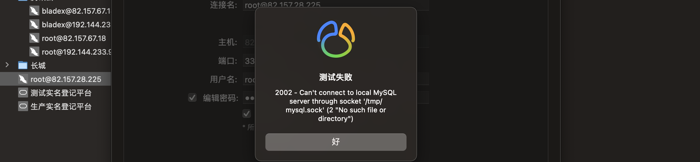

> 创建于2021年11月12日
> 作者：想想

[toc]


## ERROR 2002 (HY000): Can't connect to local MySQL server through socket '/tmp/mysql.sock' (2)



到 mysql 跟目录

```
/usr/local/mysql-8.0.26
```

执行 `./support-files/mysql.server start`

```sh
[Xiang@Xiang-King mysql-8.0.26]$ ./support-files/mysql.server start
Starting MySQL.. SUCCESS! 
```

