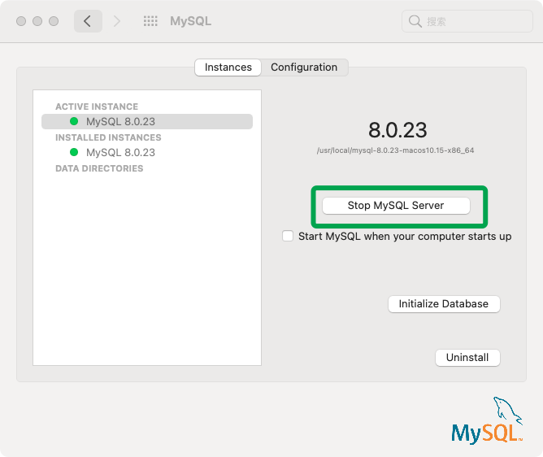
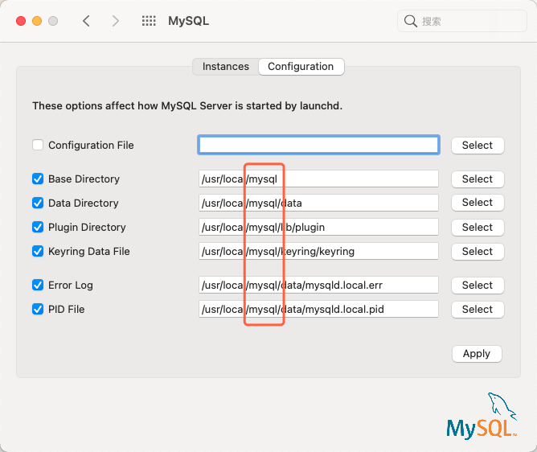

> 创建于 2021年5月26日
>
> 作者：想想

[toc]


## 安装配置

​		我是在官网下载的MySQL，进行安装，直接安装在Mac上，安装完毕后，可以在设置看到这个图标。


​		通过此按钮实现 Mysql 的启动和关闭



​	不知道大家注意到 版本号下面的地址没 `/usr/local/mysql-8.0.23-macos10.15-x86_64` ，此路径正是MySQL 的文件路，==但是，我们在此文件的同级目录下，还能找到一个叫 mysql 的文件夹== 此文件夹是 通过 上面路径映射过来的。既然是映射，更改 mysql 文件夹内的东西，等同于修改了 mysql-8.0.23-macos10.15-x86_64 文件路的东西。**其作用相当于起了一个别名**，在 confiuratiion 页面，我们也可以验证前面的观点



## 配置环境变量

​		下载完的mysql 只能在 mysql bin 目录下操作 mysql 命令，这时我们可以配置环境变量让 mysql 文件在任意路径下可以执行，便于开发直接调用

```sh
vim ~/.zshrc
# .zshrc 是mac的环境变量配置 （～/表示当前用户）

# 在中间添加如下命令
export MYSQL_HOME=/usr/local/mysql/bin
PATH=$MYSQL_HOME:.
exprot PATH
```

保存退出后

```sh
source ~/.zshrc
# 刷新当前环境变量
```

> 注释：如果有多个 PATH 要配置 写法如下：
>
> ```sh
> export H1 = /user/h1
> export H2 = /user/h2
> export H3 = /user/h3
> PATH = $H1:$H2:$H3:.
> export PATH
> ```
>
> 多个路径添加到 PATH 中时，用(冒号): 隔开，最后加上 （点）. 
>
> 保存退出后，source 更新 使用 
>
> ```sh
> echo $PATH
> ```
>
> 来查看配置到路径是否已经添加到环境变量中。


## 通过mysql 命令登录mysql

```sh
mysql -h localhost -P 3306 -u cxeast -pcxeast


Welcome to the MySQL monitor.  Commands end with ; or \g.
Your MySQL connection id is 497
Server version: 8.0.23 MySQL Community Server - GPL

Copyright (c) 2000, 2021, Oracle and/or its affiliates.

Oracle is a registered trademark of Oracle Corporation and/or its
affiliates. Other names may be trademarks of their respective
owners.

Type 'help;' or '\h' for help. Type '\c' to clear the current input statement.

mysql>
```

