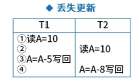
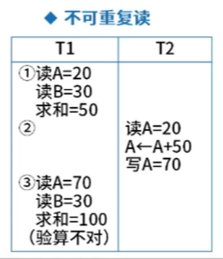
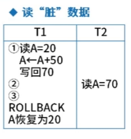

> 2024-08-31

### 丢失更新

此时，无论是 T1、T2 谁先提交，都会导致另一个线程的写回操作失败。

典型的特点就是两次写回，丢失先写的那一个

### 不可重复读

主要存在验算相关的问题

T1 （1）、T1（3） 两次验算结果对不上，是因为其他线程修改了计算中的数据。

### 读脏数据

读取到了其他线程还未提交的数据。

### 总结一下

不可重复读和读脏数据的区别

不可重复读和验算相关，自己的数据被其他线程所修改，导致前后不一致。

读脏数据，不等其他线程提交，我就可以看到其他人还未提交的数据。（安全性比不可重复读更低）

## 三级封锁协议

一级封锁协议：在修改之前先加X锁，直到事务结束才释放，防止丢失更新

二级封锁协议：在一级协议之上，读取数据先加S锁，读完释放S锁，防止丢失更新、防止脏读

三级封锁协议：在一级协议之上，读取数据先加S锁，直到事务结束才释放，防止丢失更新、脏读、不可重复读

两段锁协议化，串行化的，可能发生死锁

