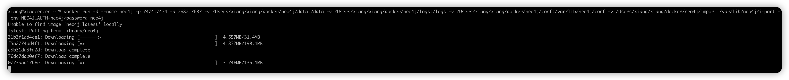
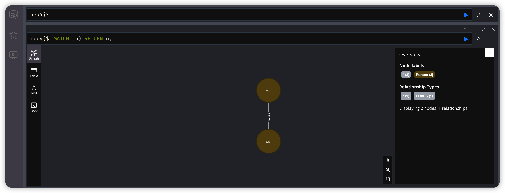
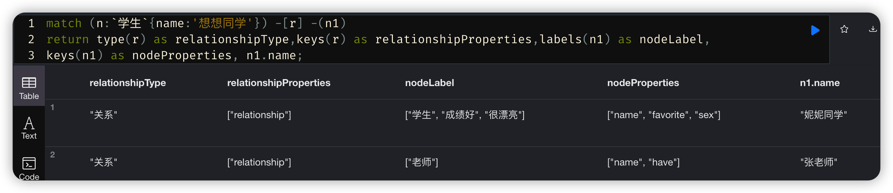

> 创建于2022年9月7日
>
> 标签：数据库、图形数据库
>
> 内容：初步了解图形数据库 Neo4j

[toc]


#### 前言：安装一个可用的 Neo4j

对一个靠技术吃饭的人来说，无论是学什么新技术，一定有其目的性，有可能是单纯的了解其特性，解决某一个问题，也有可能是为了别的组件而去学习这个东西。总之目的很多，但想要真正学好它，就要带着一些问题去学习！

学习三部走，第一：这是什么？第二：对我有什么帮助？第三：我现在用的上他吗？

带着这三个问题，我相信，你的问题会越来越多，hhhhh，皮了一波

正文开始

docker 启动一个 Neo4j （提示一下，-v 挂载   你本地路径`:`容器内部路径，你只需要改本地路径地址就行了！）

```sh
docker run -d 
	--name neo4j 
	-p 7474:7474  
	-p 7687:7687 
	-v /Users/xiang/xiang/docker/neo4j/data:/data 
	-v /Users/xiang/xiang/docker/neo4j/logs:/logs 
	-v /Users/xiang/xiang/docker/neo4j/conf:/var/lib/neo4j/conf 
	-v /Users/xiang/xiang/docker/neo4j/import:/var/lib/neo4j/import 
	--env NEO4J_AUTH=neo4j/neo4j 
	neo4j
```



安装时间挺长的，反正我是等了1个多小时，中间可以干点别的事情。


现在已经可以运行了

## 1、Neo4j 增删查改

```http
http://localhost:7474/browser/
```


> neo4j/neo4j


在使用一些命令之前，先要了解命令的结构

### 1.1、Create 创建数据结构

```sql
CREATE (:Person { name:"Dan"} ) -[:LOVES]-> (:Person { name:"Ann"} )
```


放到 Neo4j 里执行


### 1.2、Match 查询结果

```sql
MATCH (n) RETURN n;
```



除此之外他还有很多不同的展示形式


### 1.3、进阶创建和查询

我们来看这样一个关系图，你可以用那种形式表现出来呢？


所以可以这样写


```sql
CREATE (n1:`老师`{name:'张老师',have:'知识'}) - [:`关系`{relationship:'师生'}] -> (n2:`学生`{name:'想想同学',sex:'男',favorite:'玩'}),
(n2) -[:`关系`{relationship:'同学'}] -> (n3:`学生`{name:'妮妮同学',sex:'女',favorite:'学习'}),
(n1) -[:`关系`{relationship:'师生'}] -> (n3),
(n1) -[:`关系`{relationship:'同事'}] -> (n4:`领导`{name:'教务处长',have:'小汽车'});
```

放到 Neo4j  里执行


查询结果得出 `MATCH path = () -- () RETURN path;`


如果在设置中取消勾选  `Connect result nodes`


```sql
// 查询所有节点，并返回其关系
MATCH path = () -- () RETURN path;

// 查询所有节点
match (n) return n;
```

更多查询

```sql
// 查找想想同学节点
match (n:`学生`{name:'想想同学'}) return n

// 等同于
match (n:`学生`) where n.name = '想想同学' return n;

// 寻找想想同学的同学
match (n:`学生`{name:'想想同学'}) -[:`关系`*2{relationship:'同学'}] -> (n1) return n1;

// 寻找想想所有的社会关系。关系可以双向
match (n:`学生`{name:'想想同学'}) -[:`关系`] - (n1) return n1;
```

根据id条件查询

```sql
// 查找 Id 为 0 的标签
MATCH (n) WHERE id(n) = 0 RETURN n;
```


### 1.4、更改和显示节点标签

```sql
// 给妮妮同学新增2个标签
match (n:`学生`{name:'妮妮同学'}) set n:成绩好:很漂亮

// 显示妮妮同学节点的标签和属性
match (n:`学生`{name:'妮妮同学'}) return labels(n) as nodeLabel,keys(n) as nodeProperties,n.name;
```


```sql
// 删除想想同学 坏学生 的标签
match (n:`学生`{name:'想想同学'}) remove n:`坏学生` 

// 显示节点的标签和属性，以及关系的类型和属性，并以表结构返回结果
match (n:`学生`{name:'想想同学'}) -[r] -(n1) 
return type(r) as relationshipType,keys(r) as relationshipProperties,labels(n1) as nodeLabel,
keys(n1) as nodeProperties, n1.name;
```



### 1.5、更改节点属性

```sql
// 给妮妮同学增加属性
match (m:`学生`{name:'妮妮同学'}) set m.grade = 100;

// 删除想想同学 玩 属性
match (n:`学生`{name:'想想同学'}) set n.favorite = null;
```

节点第一次被赋值会被创建，同样的，如果赋值为null 则会被删除。

### 1.6、删除节点

```sql
// 如果没有节点关系
match (n:Person{name:'Dan'})  delete n;

// 如果有节点关系，使用 detach 先删除关系再删除节点
match (n:Person{name:'Dan'}) detach  delete n;

// 删除所有节点，如果节点有关系，也删除关系
  match (n) detach delete n;

// 仅删除关系，保留节点
match (n:`学生`{name:'妮妮同学'}) -[r] -() delete r;
```

当然啦，全库删还有一个更为简单有效的办法到 Neo4j 服务器中删除 Neo4j 路径下  data/databases/graph.db 文件，需要先停止服务器

### 1.7、小结

在对数据库规模不清楚的时候，谨慎使用下面的查询

```sql
MATCH (n:人物) RETURN n; // 相当于SELECT * FROM 人物
MATCH (n) RETURN n; // 相当于SELECT * FROM *
MATCH path = () –[*]- () RETURN *; // 相当于查询所有节点，以及所有路径组合
```

为了避免查询结果过多导致服务停止响应，可以在 return 后面使用 limit 限制返回数量

```sql
MATCH (n:人物) RETURN n LIMIT 10;
```


## 2、Neo4j 索引限制

+ Neo4j是“本地图数据库”(Native Graph Database)，也就是说Neo4j 以节点、关系和属性的形式物理地保存数据。与此相对比，关系 型数据库按照表、字段和行保存数据。 
+  关系型数据库在对邻接表的主键和外键进行连接(JOIN)时，通常 需要建立索引，以提高键值匹配的效率。 •
+ Neo4j在保存数据的同时也保存数据之间的关系。因此它实现的 一个重要突破叫做“无需索引的邻接跳转”(Index-free Adjacency)。 简单地说，在从一个节点到另一个节点、沿着关系的方向查询、 或者说遍历图时，只需要读取保存的起始节点的地址、然后进行 跳转就可以了，无须做连接(JOIN)。这也是Neo4j在处理复杂和深 度关系遍历型查询时性能远远超过任何关系型数据库的关键所在。
+ 因此说，在Neo4j“本地图数据库”中，是没有连接、主键、外键 的概念的，因为不需要！ •
+ 但是，Neo4j中仍然有索引(Index)！ 
+ Neo4j中可以对属性建立索引，以实现快速的节点或关系查询。 例如节点‘人物’拥有属性‘姓名’，那么对‘姓名’建立索引可以快速 地根据姓名找到相应的‘人物’节点。 
+  另外，Neo4j自动对节点的标签，以及关系的类型建立了索引。

### 2.1、索引类型

1. legacy index 遗留索引，又称为明确索引，基于 lucene 索引，3.0版本之前使用，现在不推荐使用
2. schema index 数据库索引，又称本地索引，与关系型数据库实现机制类似，由数据库管理的索引，数据库模式索引支持节点属性和基本数据类型，包括字符串、数字、布尔、浮点、空间坐标等。索引不能在列表型数据建立
3. External lndex 外部索引，基于 lucene 索引，使用APOC过程创建和维护，支持节点和关系属性、以及 全文索引。

### 2.2、创建索引

数据库模式索引只能定义在节点属性上

```sql
CREATE INDEX ON :`学生`(name);
```

显示所有索引

```sql
CALL db.indexes
:schema 
// 两个都可以
```


也支持符合索引

```sql
CREATE INDEX ON :`学生`(title,sex);
```

此时，我们的数据库还没有 title 属性，Neo4j是Schema-Lite(轻型模式数据 库)，可以在属性还不存在的时候就为其定义索引。

+ 查询时，Cypher查询生成器会自动寻找相关索引并应用到对属性 值的搜索中。
+  对于单属性索引，WHERE子句中使用= 、<>、> 、<、IN 、STARTS WITH、ENDS WITH 、 CONTAINS 、exists()时都会自动应用索引； 
+ 对于复合索引，WHERE子句中使用= 、IN时会自动应用索引。

> 数据库模式索引在创建后会自动更新；在数据量较大时，索引的创建会需要一定的时间，这时查询可能 会出现“索引未准备好”的错误，可以调用以下过程来等待索引建立完成
>
> ```sql
> CALL db.awaitIndex(":`学生`(name)"); // 等待一个索引完成
> CALL db.awaitIndexes(); // 等待所有索引完成
> ```
>
> * 企业版专享

删除索引

```sql
DROP INDEX ON

drop index on :`学生`(name)
```


### 2.3、创建限制

Neo4j是“轻型模式”数据库(Schema-Lite)，除了索引，限制 (Constraint)是另外一个属于数据库模式的概念； 

+ 节点的限制包括以下类型：
	+ 属性唯一性限制 
	+ 属性存在性限制 
	+ 复合键唯一性限制 
+  关系的限制包括以下类型： 
	+ 关系属性存在性限制

```sql
// 节点限制唯一性
CREATE CONSTRAINT ON (person:`人物`) ASSERT person.name IS UNIQUE;

// 节点属性存在性限制
CREATE CONSTRAINT ON (person:`人物`) ASSERT exists(person.name);

// 节点复合键(多个属性)唯一性限制：
CREATE CONSTRAINT ON (person:`人物`)
ASSERT (person.name, person.title) IS NODE KEY;
```

> 创建唯一性限制时，数据库会同时自动在相关属性上创建索引。如果属性已经有索引，必须先 删除索引后再创建限制

关系型限制

```sql
// 关系属性的存在性限制：
CREATE CONSTRAINT ON ()-[r:`关系`]->() ASSERT exists(r.relationship);

// 查看已定义的限制：
CALL db.constraints; // 仅显示限制
:schema // 显示索引和限制
```

删除限制

```sql
DROP CONSTRAINT ON
```

