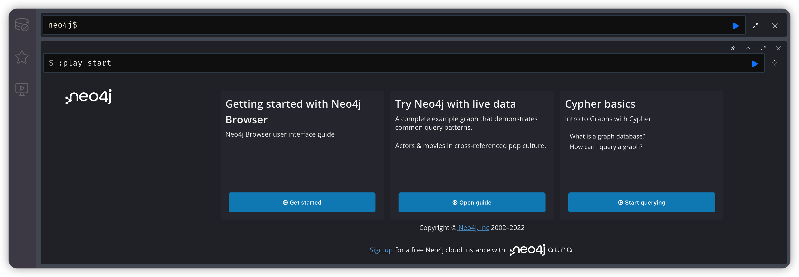
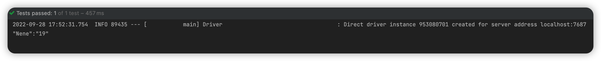
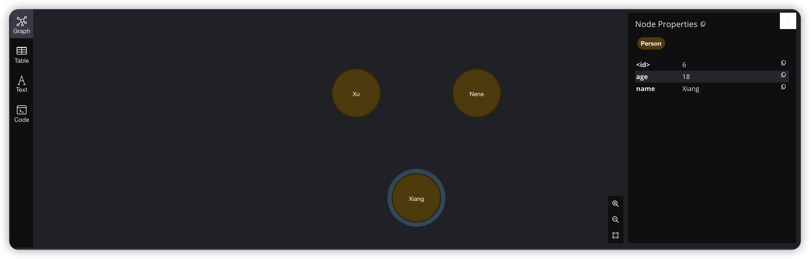
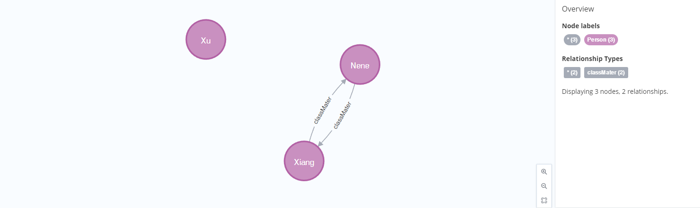
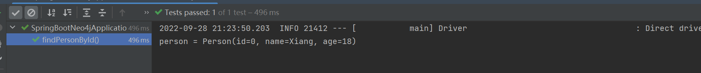

> 2022年9月28日
>
> 标签：SpringBoot、Neo4j
>
> 引用：[Neo4j创建节点之间关系](https://blog.csdn.net/fuhanghang/article/details/89373429)

[toc]

阅读此文之前，必须对 Neo4j 有个初步的了解，如果要实际操作的话，需要自备一个 Neo4j 数据库



>  本文所涉及代码已开源至 Gitee
>
> https://gitee.com/Array_Xiang/spring-boot-neo4j

创建一个 SpringBoot 项目，引入 Neo4j 的依赖

```xml
<dependency>
  <groupId>org.springframework.boot</groupId>
  <artifactId>spring-boot-starter-data-neo4j</artifactId>
</dependency>
```

配置文件可以参考我这个 `application.yml`

```yml
spring:
  data:
    neo4j:
      uri: bolt://localhost:7687
      username: neo4j
      password: password
```

### 1、创建测试类

#### 1.1、创建节点

创建3个节点，为了防止数据污染，可以在执行前，清空所有数据

```sql
// 清空所有数据和对应关系
match (n) detach delete n;
```

我们要创建三个节点，分别是 `Xiang`、`Nene`、`Xu` Neo4j 的语法是

```sql
CREATE (n:Person{name:"Xiang",age:18})
CREATE (n:Person{name:"Nene",age:18})
CREATE (n:Person{name:"Xu",age:18})
```

清楚了语法如何书写，我们开始写测试类

`SpringBootNeo4jApplicationTests` 测试类

```java
package com.liuyuncen;

import org.junit.jupiter.api.Test;
import org.neo4j.driver.*;
import org.springframework.boot.test.context.SpringBootTest;

import static org.neo4j.driver.Values.parameters;

@SpringBootTest
class SpringBootNeo4jApplicationTests {

    @Test
    void createNode() {
        Driver driver = GraphDatabase.driver("bolt://localhost:7687", AuthTokens.basic("neo4j", "password"));
        Session session = driver.session();
        session.run("CREATE (n:Person {name:$name, age:$age})",
                parameters("name","Xiang","age","18"));
        session.run("CREATE (n:Person {name:$name, age:$age})",
                parameters("name","Nene","age","18"));
        session.run("CREATE (n:Person {name:$name, age:$age})",
                parameters("name","Xu","age","18"));
        // 最后查询一下 Nene
        Result result = session.run( "MATCH (n:Person) WHERE n.name = $name " +
                        "RETURN n.name as name, n.age as age",
                parameters( "name", "Nene"));
        while (result.hasNext()) {
            Record record = result.next();
            System.out.println(record.get("name") +":"+ record.get("age"));
        }
        session.close();
    }
}
```

这里输出了查询的 Nene 结果



Neo4j 控制台页面查询 `match (n) return n`



这样，我们三个节点就创建完了，如果要创建对应关系，把 Neo4j 的 sql 语句替换上面程序就可以了

#### 1.2、创建关联关系

已经存在现有节点属性，新增新的关联

语法：

```sql
MATCH (<node1-label-name>:<node1-name>),(<node2-label-name>:<node2-name>)
CREATE  
	(<node1-label-name>)-[<relationship-label-name>:<relationship-name>]->(<node2-label-name>)
RETURN <relationship-label-name>
-- RETURN子句是可选的。 如果我们想立即看到结果，那么使用它。 否则，我们可以省略这个子句。
```

案例：

```sql
match (p:Person{name:"Nene"}),(m:Person{name:"Xiang"})
CREATE (m) -[:classMater] -> (p)
CREATE (p) -[:classMater] -> (m)
```



所以第二段程序可以这样写

```java
    @Test
    void createRelation(){
        Driver driver = GraphDatabase.driver("bolt://192.168.111.139:7687", AuthTokens.basic("neo4j", "password"));
        Session session = driver.session();
        session.run("match (p:Person{name:$name1}),(m:Person{name:$name2}) " +
                "CREATE (m) -[:classMater] -> (p) " +
                "CREATE (p) -[:classMater] -> (m)",
        parameters("name1","Xiang","name2","Nene"));
        session.close();
    }
```

同样的 ，其他语法，删除、修改等都是类似。这个可以看我上一篇文章内容。

### 2、集成 SpringBoot

既然我们是 SpringBoot 项目，那自然以对象为存储介质，将数据都封装到对象中。`spring-boot-starter-data-neo4j` 早就帮我们想好了这一切。

创建 Person 对象

```java
package com.liuyuncen.entity;

import lombok.Builder;
import lombok.Data;
import lombok.ToString;
import org.neo4j.ogm.annotation.GeneratedValue;
import org.neo4j.ogm.annotation.Id;
import org.neo4j.ogm.annotation.NodeEntity;
import org.neo4j.ogm.annotation.Property;

import java.io.Serializable;

/**
 * @belongsProject: SpringBoot-Neo4j
 * @belongsPackage: com.liuyuncen.entity
 * @author: Xiang想
 * @createTime: 2022-09-28  14:29
 * @description: TODO
 * @version: 1.0
 */
@Data
@Builder
@NodeEntity("person")
@ToString
public class Person implements Serializable {
    @Id
    @GeneratedValue
    private Long id;

    @Property("name")
    private String name;

    @Property("age")
    private Integer age;
}

```

创建dao层，`PersonRepository`  并继承 `Neo4jRepository`

```java
package com.liuyuncen.repository;

import com.liuyuncen.entity.Person;
import org.springframework.data.neo4j.annotation.Query;
import org.springframework.data.neo4j.repository.Neo4jRepository;
import org.springframework.stereotype.Repository;

import java.util.List;

/**
 * @belongsProject: SpringBoot-Neo4j
 * @belongsPackage: com.liuyuncen.repository
 * @author: Xiang想
 * @createTime: 2022-09-28  15:03
 * @description: TODO
 * @version: 1.0
 */
@Repository
public interface PersonRepository extends Neo4jRepository<Person, Long> {

    @Query("MATCH (n:Person) WHERE id(n) = $0 RETURN n")
    List<Person> findChildList(Long id);
}

```

最后测试类

```java
@Test
void findPersonById(){
    Long id = 0L;
    List<Person> childList = repository.findChildList(id);
    for (Person person : childList) {
        System.out.println("person = " + person.toString());
    }
}
```

