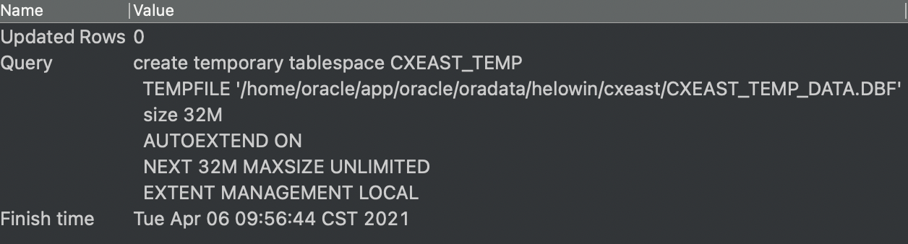
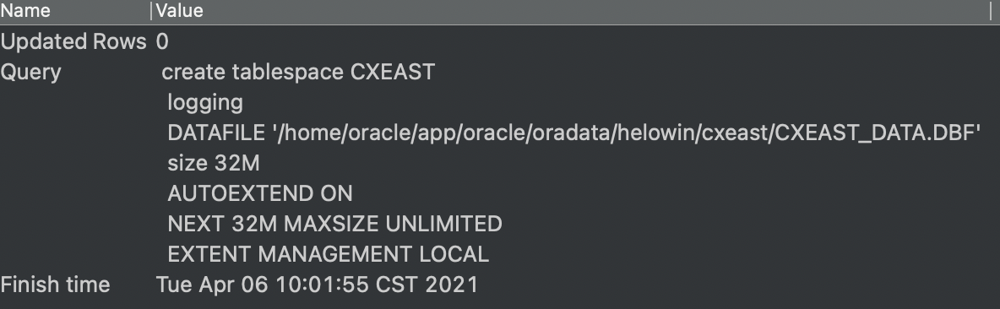
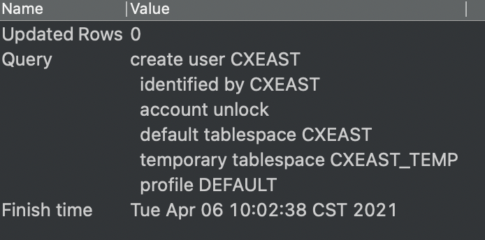
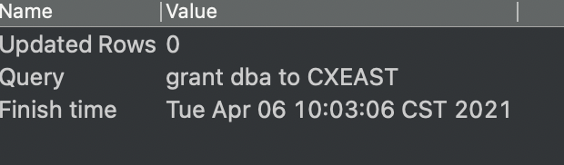
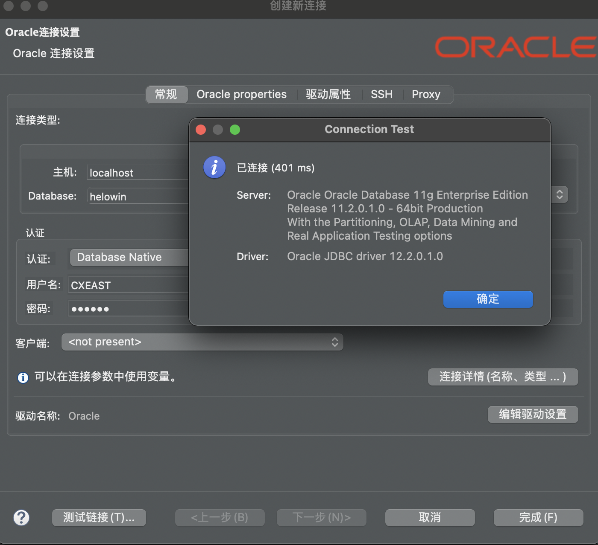

[toc]

# Oracle_11g

## 创建用户

基于 小岑岑的Mac 上新建表空间及用户

> 需要将  `CXEAST_TEMP`  修改为自己需要创建的用户名

### 查看数据库表空间位置

```sql
SELECT * FROM DBA_DATA_FILES;
```


### 创建正式表空间

```sql
---创建临时表空间
create temporary tablespace CXEAST_TEMP 
  TEMPFILE '/home/oracle/app/oracle/oradata/helowin/cxeast/CXEAST_TEMP_DATA.DBF'
  size 32M 
  AUTOEXTEND ON 
  NEXT 32M MAXSIZE UNLIMITED 
  EXTENT MANAGEMENT LOCAL;
```

DBeaver 21.0.0  result >>



### 创建临时表空间

> 需要将  `CXEAST`  修改为自己需要创建的用户名

```sql
 -----创建 正式表空间
 create tablespace CXEAST 
  logging 
  DATAFILE '/home/oracle/app/oracle/oradata/helowin/cxeast/CXEAST_DATA.DBF' 
  size 32M 
  AUTOEXTEND ON 
  NEXT 32M MAXSIZE UNLIMITED 
  EXTENT MANAGEMENT LOCAL;
```

DBeaver 21.0.0 result >>



### 创建用户

```sql
-----创建用户
create user CXEAST 
  identified by CXEAST 
  account unlock 
  default tablespace CXEAST 
  temporary tablespace CXEAST_TEMP 
  profile DEFAULT;
```

DBeaver 21.0.0 result >>



### 授权

```sql
-------给权限
grant dba to CXEAST;
```

DBeaver 21.0.0 result >>




此时，可以登录 CXEAST 用户，验证是否创建成功

==连接成功==

