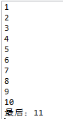
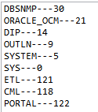
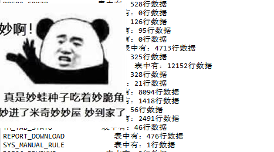

## Oracle 使用loop、cursor 查询所有表总行数

[toc]

> 对于刚接触数据库的小伙伴们来说，SQL语句只是方便我们查询的工具，但是伴随着我们日精月益的开发。简单的查询已经不能满足我们的开发需求，我们需要使用到SQL进行编程，这个过程，我们称之：SQL编程

### 1、简单实现循环

```sql
-- Auth Xiang想
declare 
  i number:=0;          						-- 定义变量 i number类型，并且赋值 0
begin
  loop                  						-- 开启循环
     i:=i+1;            						-- 自增 
     if i>10 then       						-- if 判断 当 i>10 时
        exit;           						--              退出循环
     end if;            						--         if 为 非
     dbms_output.put_line(i);                   -- 输出   
  end loop;             						-- 结束循环
  dbms_output.put_line('最后：'||i);             -- 输出      
end;
```

输出结果：



### 2、简单实现游标

```
DECLARE
  -- 把 emp 表中的所有数据，全部放进游标中
  cursor c is select * from all_users;
  u all_users%rowtype;
BEGIN 
  open c;
    loop
      fetch c into u;
      exit when c%notfound;
      dbms_output.put_line(u.username||'---'||u.user_id);
    end loop;
  close c;
END;
```

我们可以这么理解，==c==  是一个List<Map>类型的集合，他把整个 all_users 表都装进去了

其次，我们定义了  ==u==  是List<Map> 中众多Map中的一个， 类型为 all_users 类型

然后 我们打开游标 c ，进行循环

因为是循环遍历一个 List<Map> 我们每遍历出来的一个Map都将放进 ==u== 中，也符合 all_users 类型  【all_users%rowtype】

当游标 ==c== 循环遍历到找不到的时候，退出 【exit】

最后，我们输出这个Map中的值， u.username    u.user_id

退出循环、关闭游标、退出



> 当我们理解Loop 和 游标之后，就想是理解了 循环 和 容器，有了容器，我们就可以干一些奇奇怪怪的事情了，就比如，把数据库中所有的表的数据条数输出出来

### 3、通过 loop、cursor 查出数据库中所有表的总条数

==前提是我们操作数据库的权限必须是dba==

我们可以通过查询 user_tables 视图，获取到数据库的所有表

```sql
select table_name from user_tables;
```

现在可以查询到所有的表名，我们就可以进行遍历这个表名了

```sql
-- Auth Xiang想
DECLARE
  -- 把 user_tables 表中的所有数据，全部放进游标中
  cursor c1 is select table_name from user_tables;
  v_tabNm varchar2(100);
BEGIN
  open c1;
    loop
      exit when c1%notfound;
      fetch c1 into v_tabNm;
      DBMS_Output.put_line(v_tabNm);
    end loop;
  close c1;
END;
```

用 v_tabNm 来获取表名，并打印出来

很显然，我们最终的目的并不是打印出来，而是利用获取到的表名拼接处查询语句  例如：  select count(0) from [表名]

所以，我们可以加两个变量， 

+ v_num  number类型，用来获取查询出数据的总量
+ v_sql     varhcar2类型，用来拼接sql使用

再利用 ==EXECUTE IMMEDIATE== 关键字，执行我们拼接处的sql语句，把值返回到 v_num 中实现，查询出表的总行数

```sql
-- Auth Xiang想
DECLARE
  -- 把 user_tables 表中的所有数据，全部放进游标中
  cursor c1 is select table_name from user_tables;
  v_tabNm varchar2(100);                          -- 表名
  v_sql varchar2(200);                            -- sql语句   
  v_num NUMBER(10);                               -- 查到的总条数
BEGIN
  open c1;
    loop
      exit when c1%notfound;
      fetch c1 into v_tabNm;
      v_sql:='select count(*) from '||v_tabNm;
      EXECUTE IMMEDIATE v_sql INTO v_num;
      DBMS_Output.put_line(v_tabNm||'表中有：'||v_num||'行数据');
    end loop;
  close c1;
END;
```

结果:



快去试试吧！

><center><b><font color=blue >好了到这我们的分享也就结束了😉</font></b></center>
>
><center><b><font color=blue >希望以上方法可以帮到您，祝您工作愉快！💖</font></b></center>
>
><center>👇</center>
><center><b><font color=pink >对您有帮助的话记点赞得收藏哦！👍</font></b></center>
><center><font color=blue>我是</font>       <font color=red>Xiang想</font>     <font color=blue>从一个小白一步一步地变成工具人 😛</font></center>

