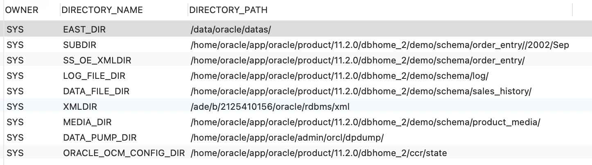

[TOC]

## 数据泵

数据泵可以高效备份、复制、保护和传输大量的数据和元数据

1. 对整个数据库或数据自己进行时实逻辑备份
2. 为测试或开发，复制整个数据库或数据子集
3. 快熟生成用于重建对象的DDL代码
4. 通过旧版本导出数据，然后像新版本导入数据的方式，升级数据库


数据泵包含了exp/imp 实用程序功能

1. 高效处理大量数据的功能。可以高效导出和导入大量数据
2. 交互式命令行实用程序，使用它可以先断开链接，然后恢复连接活动的数据泵作业
3. 在不创建数据泵文件的情况下，从远处数据导入大量数据，并将这些数据直接导入本地数据库
4. 通过导入和导出文件，在运行时更改方案，表空间，数据文件和存储位置
5. 精细过滤对象和数据
6. 对目录对象应用受安全模式（通用数据库）
7. 高级功能，如压缩和加密


### 1、数据泵结构

1. expdp。==导出应用程序==
2. impdp。==导入应用程序==
3. DBMS_DATAPUMP  软件包  ==数据泵API==
4. DBMS_METADATA  软件包  ==数据泵元数据API==

在导入和导出数据和元数据时，expdp 和 impdp 实用程序会使用内置的 DBMS_DATAPUMP 和 DBMS_METADATA 软件包。DBMS_DATAPUMP 软件包可以在不同的数据库之间移动整个数据库或数据子集。DBMS_MATEDATA软件包可以导出和导入数据对象的信息，当启动数据泵导出和导入作业时，数据库服务器上就会初始化一个OS 主线程，这个主线程的名称格式为 ora_dmNN_ 在linux 中通过 进行查询

```sh
ps -ef | grep ora_dm
```

因为数据泵使用期内部的PL/SQL 代码执行操作，所以需要使用共享池中的一些内存加载 PL/SQL 软件，如果共享次中空间不足，系统会提示

> ORA-04031:unable to allocate bytes of shcared memory.... 
>
> 错误提示，并中断数据泵，当出现该错误时,可以将数据库参数 `SPARED_POOL_SIZE`   设置为 500M 以上


### 2、执行数据泵

> 此次操作数据库在  Mac 中数据库 EAST 用户下操作
>
> EAST/EAST@127.0.0.1:hellwin

1. 创建指向OS目录的数据库目录对象，这个OS目录用于读/写数据泵文件

```SQL
-- 查看目录对象细节
select owner,directory_name,directory_path from dba_directories
```



```SQL
-- 创建数据库目录对象
-- dp_dir  ->  schame_dir
create directory dp_dir as '/data/oracle/datas/'
```

2. 为用户赋予访问目录对象权限

```SQL
-- 为用户赋予访问目录对象权限
grant read,write on directory EAST_DIR to EAST
```


#### 2.1、导出操作

> 因为我是Mac 本，我的数据库装在了 Docker 容器中，我需要先进入Docker 环境，再切换到 oracle 所在到用户 再执行导出（可忽略）
>
> ```shell
> // 进入docker 环境
> docker exec -it oracle_11g bash
> // 切换 oracle 用户
> su - oracle (一定要切换到 oracle 用户)
> // 密码 oracle
> ```

==导出语句：==

```shell
expdp EAST/EAST@helowin schemas=EAST dumpfile=EAST20210404.dmp directory=EAST_DIR logfile=EAST20210404.log 
```

==解释：==

+ EAST/EAST@helowin

  用户名/密码 实例名

  > ==注意：== 这里建议使用当前用户账号去进行导出，如果使用SYS用户，会将序列及其他一些系统数据导出到 dmp 文件中，后续如果再想导入到目标数据库中，也必须使用 SYS 用户去导入，否则无法导入！！！

+ schemas=EAST

  导出的 schemas ，这里也可以改成 tables = ${具体的某张表}$  

+ directory=EAST_DIR

  上述我们创建数据库目录对象 也就是dmp 文件存放的位置

+ dumpfile 、 logfile

  dmp 文件和 log 文件名

检查环境，我们将 EAST_DIR 路径设置为了 ==/data/oracle/datas==. 我们可以到当前目录查看一下，


当前目录没有任何文件，在我们执行导出语句后，此时应该会新增一个dmp 和 一个 log 文件，==此时我们执行==


==执行成功！==


#### 2.2、导入操作

我们已经拿到了 EAST20210404.dmp 文件了

此时，我们只需要将dmp文件导入目标数据库即可

> 目标服务器：linux 环境
>
> 用户名及密码 就不公开了，会以【用户名】 【密码】 次等方式代替
>
>
> 准备一个目标数据库服务器的窗口

将目标服务器的数据库目录对象查看一下  为 ==EAST_DIR==  ->    ==/u01/app/oracle19/datas/==，然后将 dmp 文件远程传递过去

==传递中：==

==导入语句：==

```shell
impdp [用户名]/[密码]@[ip地址]:[端口号]/[实例名] remap_schema=EAST:EAST directory=EAST_DIR  table_exists_action=replace dumpfile=EAST20210404.dmp logfile=EAST20210404.log
```

==参数介绍：==

+ table_exists_action 数据导入数据库的四种方式：
  + skip：默认操作
  + replace：先drop 表
  + append：在原先数据的基础上增加数据
  + truncate：先truncate，然后插入数据
+ dumpfile / logfile
  + 导入的 dmp 文件， 和生成的 log 文件

+ remap_schema
  + remap_schema=old_schema_name:new_schema_name  将导出时的数据源 导入到 新的数据源中


// 翻车了，远程 19c 我导不进去... 

```shell
-- 导入回本地
impdp EAST/EAST@helowin remap_schema=EAST:EAST directory=EAST_DIR  table_exists_action=replace dumpfile=EAST20210404.dmp logfile=EAST20210404_1.log
```


导入 .7 服务器数据库

```sql
-- 通过 SQL 语句查询到当前数据库版本 得知是 19.0.0.0.0
SELECT * FROM v$version
```

在原来基础上 增加IP地址端口号  和 `VERSION=19.0.0.0.0`  条件即可

```sh
# 导入 远程 19c 版本数据库
impdp IMAS/IMAS@【IP地址】:1521/pdb remap_schema=IMAS:IMAS directory=IMAS_DIR  table_exists_action=replace dumpfile=IMAS20210507.dmp logfile=IMAS20210507.log VERSION=19.0.0.0.0
```

