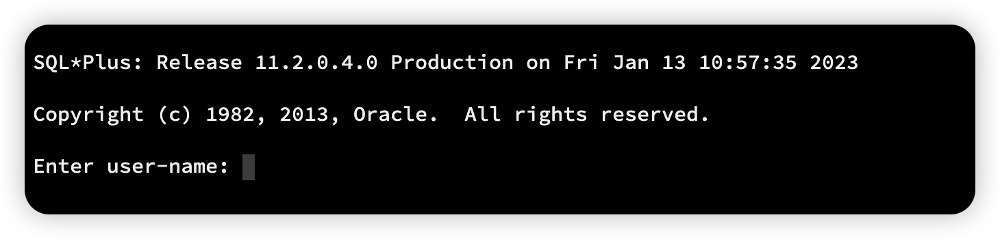
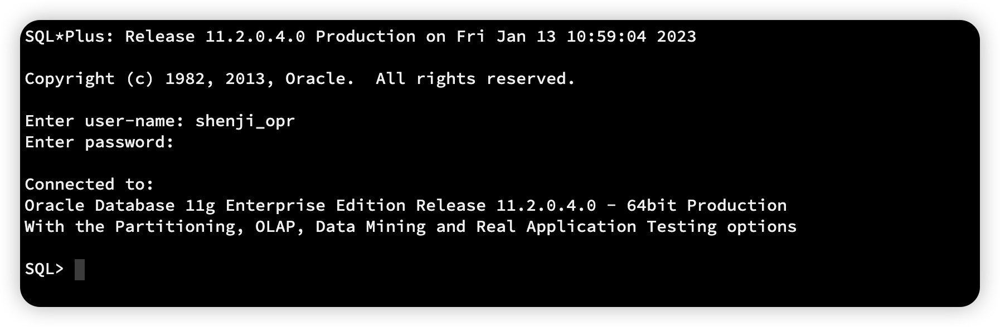

## 终端直连 Oracle 数据库 ORA-12162 错误

出于各种网络原因，无法直连数据库，但又必须查询数据库数据

我们只能选择直连数据库的服务器

然后通过 sqlplus 连接 Oracle

从配置文件里获取这样一段信息

```properties
url=jdbc:oracle:thin:@192.168.1.3:1521:testdb
username=test
password=test1234
```

因为端口、网络各种原因，服务器直连服务器、数据库，我们通过跳板机连接到服务器终端

执行 sqlplus 发现命令失效

```sh
[test@192.168.1.3 ~]$ sqlplus
-bash: sqlplus: command not found
```

我们找到 oracle 目录 `/oracle/u01/app/oracle/product/11.2.0/db_1`

执行如下命令

```sh
export ORACLE_HOME=/oracle/u01/app/oracle/product/11.2.0/db_1
export PATH=$ORACLE_HOME/bin:$PATH
export ORACLE_SID=testdb
```

这里采用临时导入的方式，你也可以放到环境变量里，记得 `srouce` 一下

然后 执行

```sh
sqlplus
```



下面输入用户名和密码即可

> **如果 ORACLE_SID 配置错误，则会有报 ORA-12162: TNS:net service name is incorrectly specified**

最后就连接成功了



