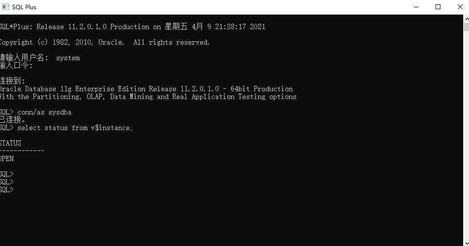

[TOC]

## ORA-12514监听无法识别

登录Oracle数据库时提示“ORA-12514:TNS 监听程序当前无法识别连接描述符中请求的服务

版本：oracle_11g

环境：windows

数据库刚刚安装完成，使用自带的 SQL-PLUS 可以进行连接



但就只限于这个可以连接到数据库，无论是用 PL/SQL 还用 用 cmd 命令窗口或者是 Navicat 等其他工具都会提示 ora-12514 错误

百度上的，一般都是提示修改

tnsnames.ora    和    listener.ora  文件，这两个文件都在安装根目录的下

> \product\11.2.0\dbhome_1\network\admin\

一般情况，新安装的数据库实例都是  CLRExtProc 这时候，我们只需要再配置一条 orcl 即可 ，这样就是我们常见的 orcl 实例了

文件附下，注意替换文件路径

==listener.ora==

```ora
# listener.ora Network Configuration File: F:\app\Array\product\11.2.0\dbhome_1\network\admin\listener.ora
# Generated by Oracle configuration tools.

SID_LIST_LISTENER =
  (SID_LIST =
    (SID_DESC =
      (GLOBAL_DBNAME = ORCL)
      (ORACLE_HOME = F:\app\Array\product\11.2.0\dbhome_1)
      (SID_NAME = ORCL)
    )
    (SID_DESC =
      (SID_NAME = CLRExtProc)
      (ORACLE_HOME = F:\app\Array\product\11.2.0\dbhome_1)
      (PROGRAM = extproc)
      (ENVS = "EXTPROC_DLLS=ONLY:F:\app\Array\product\11.2.0\dbhome_1\bin\oraclr11.dll")
    )
  )


LISTENER =
  (DESCRIPTION_LIST =
    (DESCRIPTION =
      (ADDRESS = (PROTOCOL = IPC)(KEY = EXTPROC1521))
      (ADDRESS = (PROTOCOL = TCP)(HOST = 127.0.0.1)(PORT = 1521))
    )
  )

ADR_BASE_LISTENER = F:\app\Array
```

==tnsnames.ora==

```ora
# tnsnames.ora Network Configuration File: F:\app\Array\product\11.2.0\dbhome_1\network\admin\tnsnames.ora
# Generated by Oracle configuration tools.

LISTENER_ORCL =
  (ADDRESS = (PROTOCOL = TCP)(HOST = 127.0.0.1)(PORT = 1521))


ORACLR_CONNECTION_DATA =
  (DESCRIPTION =
    (ADDRESS_LIST =
      (ADDRESS = (PROTOCOL = IPC)(KEY = EXTPROC1521))
    )
    (CONNECT_DATA =
      (SID = CLRExtProc)
      (PRESENTATION = RO)
    )
  )

ORCL =
  (DESCRIPTION =
    (ADDRESS = (PROTOCOL = TCP)(HOST = 127.0.0.1)(PORT = 1521))
    (CONNECT_DATA =
      (SERVER = DEDICATED)
      (SERVICE_NAME = orcl)
    )
  )
```

