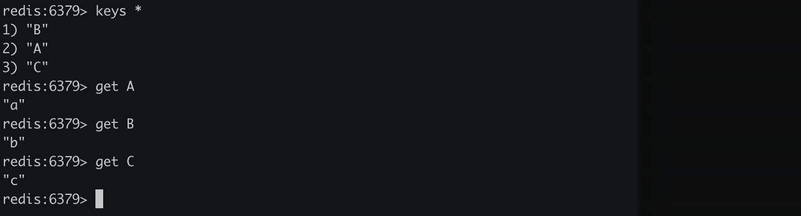

> 创建于 2021年9月27日
> 作者：想想

[toc]

# Redis-Cli - API

> Mac 环境
> Docker 中运行的 Redis （redis-1） 
>
> ```sh
> xiang@xiaocencen ~ % docker exec -it  redis  redis-server -v
> ```

```
# 进入 redis-cli
docker run -it --rm --link redis:redis redis redis-cli -h redis
```


初始化

```sh
redis:6379> set A a
OK
redis:6379> set B b
OK
redis:6379> set C c
OK
```




## 一、Key相关指令

### 1.1 exists 检测是否存在

exists key，返回 1 表示存在，0 不存在

```shell
redis:6379> exists A
(integer) 1 
# 存在
redis:6379> exists D
(integer) 0
# 不存在
```

### 1.2、del 删除

del key1 key2 ... keyN 删除给定的key，0 表示 key都不存在

```sh
redis:6379> del A B C
(integer) 3
```

### 1.3、type 返回类型

type key 返回数据类型

```sh
redis:6379> type A
string
```

### 1.4、keys 返回匹配制定模式的所有key

```sh
redis:6379> keys *
1) "B"
2) "C"
3) "AAA"
4) "A"
5) "AA"
```

可以使用通配符查看

```sh
redis:6379> keys A?
1) "AA"
redis:6379> keys A*
1) "AAA"
2) "A"
3) "AA"
```

### 1.5、randomkey  返回随机一个key

只返回 key

```sh
redis:6379> randomkey
"B"
redis:6379> randomkey
"C"
```

如果一个key都没了

```sh
redis:6379> randomkey
(nil)
```

### 1.6、rename 修改key

将 key 为A 的修改为 key 为AA，其值不变

```sh
redis:6379> rename A AA
OK
```

### 1.7、expire 指定过期时间

expire key seconds ,单位是秒，返回1成功，返回0 失败

```sh
redis:6379> expire C 10
(integer) 1
redis:6379> get C
"c"
# 10秒后
redis:6379> get C
(nil)
```

### 1.8、ttl 返回过期时间key剩余的时间

单位秒，-1 表示不过期，-2 表示不存在

```sh
redis:6379> keys *
1) "B"
2) "AA"
redis:6379> expire B 20
(integer) 1
redis:6379> ttl B
(integer) 16
redis:6379> ttl AA
(integer) -1
redis:6379> ttl C
(integer) -2
```

### 1.9、select 选择索引数据库

默认连接 0 ，默认数据库数量是16，返回1 表示成功，0 失败

```sh
redis:6379> select 8
OK
redis:6379[8]> select 0
OK
```

### 1.10、move 将key从当前数据库移到指定数据库

move key db-index ，1表示成功， 2 表示失败

```sh
redis:6379[1]> keys *
(empty array)
redis:6379[1]> select 0
OK
redis:6379> keys *
1) "AA"
redis:6379> move AA 1
(integer) 1
redis:6379> select 1
OK
redis:6379[1]> keys *
1) "AA"
```

移动，是剪贴，不是复制！

## 二、value 相关指令

Redis 提供五种数据类型

+ String
+ hash
+ list
+ set
+ zset

### 2.1、String

​		String 类型是基本的类型，String类型是二进制安全的，redis 中 String 类型可以包含任何数据，比如 一张图片，可以用二进制存储，==最大上限是1G==

#### 2.1.1、set 写入值

```sh
redis:6379> set A a
OK
```

#### 2.1.2、setnx 如果存在则不写入，不存在则写入

成功返回1 ，失败返回0

```sh
redis:6379> keys *
1) "A"
redis:6379> setnx A b
(integer) 0
redis:6379> setnx B b
(integer) 1
```

#### 2.1.3、get 获取值

为空返回 nil

```sh
redis:6379> get B
"b"
```

#### 2.1.4、getset 先获取key值，在设置key的值

如果key值不存在，则返回 nil

```sh
redis:6379> get B
"b"
redis:6379> getset B c
"b"
redis:6379> get B
"c"
redis:6379> getset D d
(nil)
```

返回的值，是原先的值，然后再查的时候，就是新值了

#### 2.1.5、mget 一次获取多个值

```sh
redis:6379> keys *
1) "D"
2) "B"
3) "A"
redis:6379> mget A B D
1) "a"
2) "c"
3) "d"
redis:6379> mget A c
1) "a"
2) (nil)
```

#### 2.1.6、mset 一次设置多个 key

mset key1 value1 key2 value2

```sh
redis:6379> mset A a B b M m
OK
redis:6379> get A
"a"
redis:6379> mset A aa B bb M mm
OK
redis:6379> get A
"aa"
```

#### 2.1.7、msetnx 一次设置多个值，不会覆盖已存在的

```sh
redis:6379> msetnx O ooo P ppp
(integer) 1
```

只要存在一个重复的，就全都失败，要么全部成功，要么全部失败。

#### 2.1.8、incr 对key做++操作

```sh
redis:6379> keys *
(empty array)
redis:6379> set A 1
OK
redis:6379> get A
"1"
redis:6379> incr A
(integer) 2
redis:6379> incr A
(integer) 3
redis:6379> get A
"3"
```

如果不存在的key 也可以 incr操作

```sh
redis:6379> get C
(nil)
redis:6379> incr C
(integer) 1
redis:6379> get C
"1"
```

#### 2.1.9、decr 对 key做 --操作

```sh
redis:6379> get A
"3"
redis:6379> decr A
(integer) 2
redis:6379> decr A
(integer) 1
redis:6379> decr H
(integer) -1
```

对不存在的值，设置为 -1

#### 2.1.10、incrby 加上指定的值

incrby key integer 对key加上指定值，如果这个值不存在，就默认在0的基础上添加

```sh
redis:6379> get A
"1"
redis:6379> incrby A 20
(integer) 21
redis:6379> incrby B 10
(integer) 10
```

#### 2.1.11、decrby 对key减去指定值

用法和 incrby 一样

```sh
redis:6379> decrby A 30
(integer) -9
redis:6379> decrby N 10
(integer) -10
```

### 2.2、hash

​	hash 上一个String类型的 field 和 value 的映射表，添加删除返回的都是 0、1，可以理解为一张表，一个列存在多个值。如果 filed 或者 value 超出大小限制，redis 会内部自动将 zipmap 替换成正常的 hash 实现，这个限制可以在配置文件中定义

```sh
hash-max-zipmap-entries 64 # 配置字段最多 64
hash-max-zipmap-value 512  # 配置 value 最大为 512 字节
```

#### 2.2.1、hset 设置field 为指定值

如果key不存在则创建一个

```sh
redis:6379> hset A name xiaomi
(integer) 1
redis:6379> hset A age 10
(integer) 1
```

#### 2.2.2、hget 获取 field

```sh
redis:6379> hget A age
"10"
# 重新设置
redis:6379> hset A age 19
(integer) 0
redis:6379> hget A age
"19"
```

#### 2.2.3、hmget 获取全部的 filed

Hmget key filed1 filed2 filed....

```sh
redis:6379> hmget A name age
1) "xiaomi"
2) "19"
```

#### 2.2.4、hmset 同时设置多个 filed

hmset key filed1 value1 filed2 value2 .....  

```sh
redis:6379> hmset A name xiaomi age 10
OK
redis:6379> hmset B name Coco age 20
OK
redis:6379> hmset A name jack age 22
OK
```

#### 2.2.5、hincrby 将指定 filed 加上指定值

返回新增后到值

```sh
redis:6379> hget A age
"23"
redis:6379> hincrby A age 1
(integer) 24
```

#### 2.2.6、hexists 检测指定 field 是否存在

hexists key field 

```sh
redis:6379> hexists A good
(integer) 0 	# 不存在
redis:6379> hexists A name
(integer) 1  # 存在
```

#### 2.2.7、hdel 删除指定的 field

```sh
redis:6379> hmget A name age
1) "jack"
2) "24"
redis:6379> hdel A age
(integer) 1
redis:6379> hmget A name age
1) "jack"
2) (nil)
```

#### 2.2.8、hlen 返回指定 hash 的filed 数量

```sh
redis:6379> hmget A name age
1) "Coco"
2) "20"
redis:6379> hlen A
(integer) 2
redis:6379> hdel A age
(integer) 1
redis:6379> hlen A
(integer) 1
```

#### 2.2.9、hkeys 返回 hash 所有 filed

```sh
redis:6379> hkeys A
1) "name"
redis:6379> hkeys V
(empty array)
redis:6379> hkeys B
1) "name"
2) "age"
```

#### 2.2.10、hvals 返回 hash 所有value

```sh
redis:6379> hvals A
1) "Coco"
redis:6379> hvals B
1) "Coco"
2) "20"
```

#### 2.2.11、返回hash 到所有 filed 和 value

```sh
redis:6379> hgetall A
1) "name"
2) "Coco"
redis:6379> hgetall B
1) "name"
2) "Coco"
3) "age"
4) "20"
```

### 2.3、list

​		list 是一个链表结构，可以理解为每一个元素都是String类型的双向链表。主要功能是push pop，获取一个范围的值等，操作中 key 理解为 链表名

#### 2.3.1、lpush 在链表头部添加元素

lpush key string 

```sh
redis:6379> lpush A 1
(integer) 1
redis:6379> lpush A 2
(integer) 2
```

如果不是list类型，则报错

```sh
redis:6379> set B Hello
OK
redis:6379> lpush B morning
(error) WRONGTYPE Operation against a key holding the wrong kind of value
```

#### 2.3.2、rpush 尾部添加元素

```sh
redis:6379> rpush A 3
(integer) 4
```

#### 2.3.3、llen 返回key长度

key不是list类型报错，没有的key 为0

```sh
redis:6379> llen A
(integer) 4
redis:6379> llen B
(error) WRONGTYPE Operation against a key holding the wrong kind of value
redis:6379> llen C
(integer) 0
```

#### 2.3.4、lrange 返回指定区间元素

lrange key start stop，开始和结束范围 可以超出list长度

```sh
redis:6379> lrange A 0 10
1) "0"
2) "1"
3) "2"
4) "3"
```

#### 2.3.5、ltrim 保留范围内的key

ltrim key start stop 

```sh
redis:6379> lrange list 0 -1
1) "A"
2) "B"
3) "C"
4) "D"
redis:6379> ltrim list 1 3
OK
redis:6379> lrange list 0 -1
1) "B"
2) "C"
3) "D"
```

#### 2.3.6、lset 指定下标插入

```sh
redis:6379> lset list 1 BB
OK
redis:6379> lrange list 0 -1
1) "A"
2) "BB"
3) "C"
4) "D"
```

#### 2.3.7、lrem 删除一定数量的元素

```sh
redis:6379> lrange list 0 -1
 1) "A"
 2) "B"
 3) "A"
 4) "B"
 5) "A"
 6) "B"
 7) "A"
 8) "B"
 9) "A"
10) "B"
# 删掉 4 个 B
redis:6379> lrem list 4 B
(integer) 4
redis:6379> lrange list 0 -1
1) "A"
2) "A"
3) "A"
4) "A"
5) "A"
6) "B"
```

#### 2.3.8、lpop 从头部返回一个并删除

```sh
redis:6379> lpop list
"A"
```

#### 2.3.9、rpop 从尾部返回一个并删除

```sh
redis:6379> rpop list
"B"
```


### 2.4、set 类型

​		set 是无序集合，最大可包含（2的32次方-1）个元素，set 是通过 hash table 实现的，所以添加，删除，查找的复杂度都是 O（1），hash table会随着添加或删除自动调整大小，需要注意的是调整的 hash table 大小时候需要同步 （获取写锁）会阻塞其他读写操作，可能不久后就会改用跳表来实现，跳表已经在 sorted sets 中使用了，关于 set 集合类型除了基本的添加删除操作，其他有用的操作还包含集合的取并交，交集，差集。通过这些操作可以很容易实现SNS中的好友推荐和blog 的tag功能

#### 2.4.1、sadd 新增一个string元素到 set集合中

```sh
redis:6379[2]> sadd set 2
(integer) 1
```

#### 2.4.2、 srem 从key中移除对应元素

```sh
redis:6379[2]> srem set 2
(integer) 1
```

如果找不到，返回0

```sh
redis:6379[2]> srem set 100
(integer) 0
```

#### 2.4.3、spop 删除并返回 key，随机选一个

```sh
redis:6379[2]> spop set
"1"
```

#### 2.4.4、srandmember 随机取一个 不删除

```sh
redis:6379[2]> srandmember set
"2"
```

#### 2.4.5、smove 从一个set移动到另一个set 中

smove oldSet newSet elemet 讲元素从老到set移动到新的set

```sh
redis:6379[2]> smove set set1 2
(integer) 1
```

#### 2.4.6、scard 返回 set 的个数

```sh
redis:6379[2]> scard set
(integer) 3
```

#### 2.4.7、sismember 判断 member 是否在 set 中

```sh
redis:6379[2]> smembers set
1) "A"
2) "C"
3) "1"
redis:6379[2]> sismember set A
(integer) 1
redis:6379[2]> sismember set B
(integer) 0
```

#### 2.4.8、sinter 返回所有 key 给定的交集

```sh
redis:6379[2]> sinter set1 set
1) "1"
```

#### 2.4.9、sintersotre  返回所有给定 key 的交集，并保留到 指定set中

sinterstore dstkey key1 key2 .... keyn

```sh
redis:6379[2]> sinterstore setjiao set1 set
(integer) 1
```

#### 2.4.10、sunion 返回所有key 的并集

```sh
redis:6379[2]> sunion set set1
1) "2"
2) "1"
3) "C"
4) "A"
5) "3"
6) "4"
```

#### 2.4.11、sunionstore 返回所有key并集，并保留到指定 set中

```sh
redis:6379[2]> sunionstore setbin set1 set
(integer) 6
```

#### 2.4.12、sdiff 返回所有给定 key 到差集

```sh
redis:6379[2]> sdiff set1 set
1) "2"
2) "3"
3) "4"
```

#### 2.4.13、sdiffstore 返回所有key差集，并写入指定set中

```sh
redis:6379[2]> sdiffstore setcha set1 set
(integer) 3
```

#### 2.4.14、查询key中所有元素（乱序）

```sh
redis:6379[2]> smembers set
1) "A"
2) "C"
3) "1"
```

### 2.4、sorted set类型

​		sorted set 是有序集合，他在 set 到基础上增加了 一个有序性，这一有序性在天津修改元素的时候可以指定，每次指定后，会自动重新挑战顺序，可以理解了有两列 mysql 表，一列存 value，一列存顺序，操作中 key 理解为 sorted set 的名字

#### 2.4.1、zadd 添加元素

zadd key scope member

```sh
redis:6379[3]> zadd zset 1 A
(integer) 1
```

#### 2.4.2、zrem 删除指定key

zrem key member

```sh
redis:6379[3]> zrem zset B
(integer) 1
```

#### 2.4.3、zincrby  新增对应 member 的 score 值

Zincrby key score member 返回 score的值，并自动排序

```sh
redis:6379[3]> zincrby zset 4 5
"4"
```

#### 2.4.4、zrank 指定元素的集合排序下标

```sh
redis:6379[3]> zrank zset 5
(integer) 2
# 说明排第二个
```

#### 2.4.5、zrevrank 按 score 逆序

```sh
redis:6379[3]> zrevrank zset A
(integer) 2
```

#### 2.4.6、zrange 返回指定元素

```sh
redis:6379[3]> zrange zset 0 -1
1) "A"
2) "3"
3) "5"
```

#### 2.4.7、zrevrange 同上，但是按 socre 逆序

```sh
redis:6379[3]> zrevrange zset 0 -1
1) "5"
2) "3"
3) "A"
```

#### 2.4.8、zrangebyscore 返回集合中 score 区间元素

```sh
redis:6379[3]> zrangebyscore zset 3 4
1) "3"
2) "5"
```

#### 2.4.9、zcount 返回集合中 score 在给定区域个数

```sh
redis:6379[3]> zcount zset 3 10
(integer) 2
```

#### 2.4.10、zcard 返回集合中元素个数

```sh
redis:6379[3]> zcard zset
(integer) 3
```

#### 2.4.11、zscore 返回给定元素对应的score

```sh
redis:6379[3]> zscore zset 5
"4"
```

#### 2.4.12、zremrangebyrank 删除集合中排名给定区间元素

```sh
redis:6379[3]> zremrangebyrank zset 2 3
(integer) 1
```

#### 2.4.13、zremrangebyscore 删除集合中 score 在指定区间的元素

```sh
redis:6379[3]> zremrangebyscore zset 3 4
(integer) 2
```


## 三、系统管理指令

### 3.1、dbsize 返回当前数据库数量

```sh
redis:6379[2]> dbsize
(integer) 5
```

### 3.2、info 返回redis服务器信息

```sh
redis:6379[2]> info
# Server
redis_version:6.2.5
redis_git_sha1:00000000
redis_git_dirty:0
.....
```

### 3.3、monitor 实时监听 redis 服务接收请求

```sh
redis:6379[2]> monitor
OK
```

### 3.4、shutdown 把数据同步到磁盘上，并关闭 redis 服务

### 3.5、config get 获取一个redis 配置信息

config get parameter 

```sh
redis:6379> config get port
1) "port"
2) "6379"
```

### 3.6、config set设置一个参数

config set parameter value

### 3.7、config resetstat 重制info命令统计系信息

### 3.8、debug object 获取一个key的调试信息

### 3.9、debug segfault 制造一次服务器宕机

### 3.10、flushdb 删除当前数据库所有数据（不会失败）

### 3.11、flushall 删除所有数据库中数据（不会失败）

