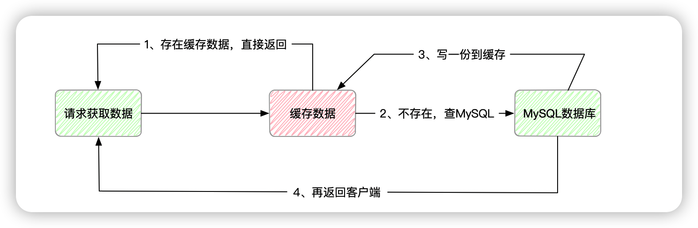

> 创建：2022年9月9日
>
> 标签：SpringBoot、Redis
>
> 内容：针对大量数据频繁请求数据，不断对数据库进行查询，造成额外性能开销，采取缓存方式解决
>
> 适用：了解SpringBoot、Redis，解决数据缓存问题
>
> 参考：[CSND_专注写bug](https://writing-bugs.blog.csdn.net/article/details/112822735)

前言：

在实际项目中，针对于查询业务而言，平时会有大量的请求获取数据，这些请求会不断的对Oracle、MySQL 数据库进行操作。但这些数据不会频繁变动，导致造成额外开销，同时影响服务性能，为了提高性能，我们可以采取设置缓存的形式

## Spring Cache

`SpringCache` 是 `Spring 3.1` 版本发布的，对于缓存进行了封装抽象，通过注解就可以使用，针对于 `Redis` 来说，`SpringCache` 只支持 `String` 类型。

### 先来起一段代码吧

写代码之前先看一下业务逻辑



这里涉及到 MySQL 和 Redis 

```xml
<dependency>
  <groupId>org.springframework.boot</groupId>
  <artifactId>spring-boot-starter-cache</artifactId>
</dependency>
<dependency>
  <groupId>mysql</groupId>
  <artifactId>mysql-connector-java</artifactId>
</dependency>
<dependency>
  <groupId>com.baomidou</groupId>
  <artifactId>mybatis-plus-boot-starter</artifactId>
  <version>3.5.2</version>
</dependency>
```

这里还包括上一期 parent 工程里的 pom 配置，我就不贴了哈

配置文件

```yml
server:
  port: 8190

spring:
  redis:
    host: 127.0.0.1
    port: 6379
    database: 10
    password:
    jedis:
      pool:
        max-idle: 8
        max-active: 8
        max-wait: 3000
        min-idle: 0
  datasource:
    url: jdbc:mysql:///uniapp?serverTimezone=UTC&useSSL=false&useUnicode=true&characterEncoding=utf-8
    driver-class-name: com.mysql.cj.jdbc.Driver
    username: uniapp
    password: uniapp

mybatis-plus:
  configuration:
    map-underscore-to-camel-case: true
    log-impl: org.apache.ibatis.logging.stdout.StdOutImpl
  type-aliases-package: com.liuyuncen.entity
  mapper-locations:
    - classpath:mapper/*.xml
```

还有Redis 的配置文件

```java
package com.liuyuncen.config;

import org.springframework.cache.CacheManager;
import org.springframework.context.annotation.Bean;
import org.springframework.context.annotation.Configuration;
import org.springframework.data.redis.cache.RedisCacheConfiguration;
import org.springframework.data.redis.cache.RedisCacheManager;
import org.springframework.data.redis.connection.RedisConnectionFactory;
import org.springframework.data.redis.core.RedisTemplate;
import org.springframework.data.redis.serializer.GenericJackson2JsonRedisSerializer;
import org.springframework.data.redis.serializer.RedisSerializationContext;
import org.springframework.data.redis.serializer.StringRedisSerializer;

/**
 * @belongsProject: radis_springboot Redis 相关配置文件
 * @belongsPackage: com.liuyuncen.config
 * @author: Xiang想
 * @createTime: 2022-09-09  13:57
 * @description: TODO
 * @version: 1.0
 */
@Configuration
public class RedisConfig {


    /**
     * @description: 重写Redis序列化定义方式，采取Json方式，避免Json格式乱码
     * @author: Xiang想
     * @date: 2022/9/9 1:58 PM
     * @param: [factory]
     * @return: org.springframework.data.redis.core.RedisTemplate<java.lang.String,java.lang.Object>
     **/
    @Bean
    public RedisTemplate<String,Object> redisTemplate(RedisConnectionFactory factory){
        RedisTemplate<String, Object> redisTemplate = new RedisTemplate<String, Object>();
        redisTemplate.setConnectionFactory(factory);
        // 创建json序列化对象
        GenericJackson2JsonRedisSerializer genericJackson2JsonRedisSerializer = new GenericJackson2JsonRedisSerializer();
        // 设置key序列化String
        redisTemplate.setKeySerializer(new StringRedisSerializer());
        // 设置value序列化 json
        redisTemplate.setValueSerializer(genericJackson2JsonRedisSerializer);
        // 设置hash key序列化String
        redisTemplate.setHashKeySerializer(new StringRedisSerializer());
        // 设置hash value 序列化json
        redisTemplate.setHashValueSerializer(genericJackson2JsonRedisSerializer);

        // 初始化redis完成序列化的方法
        redisTemplate.afterPropertiesSet();
        return redisTemplate;
    }

    /**
     * @description: 缓存配置
     * @author: Xiang想
     * @date: 2022/9/9 2:01 PM
     * @param: [factory]
     * @return: org.springframework.cache.CacheManager
     **/
    @Bean
    public CacheManager cacheManager(RedisConnectionFactory factory){
        RedisCacheConfiguration cacheConfiguration = RedisCacheConfiguration.defaultCacheConfig()
//                .entryTtl(Duration.ofMillis(30))
                .disableCachingNullValues()
                .serializeKeysWith(RedisSerializationContext.SerializationPair.fromSerializer(new StringRedisSerializer()))
                .serializeValuesWith(RedisSerializationContext.SerializationPair.fromSerializer(new GenericJackson2JsonRedisSerializer()));
        return RedisCacheManager.builder(factory).cacheDefaults(cacheConfiguration).build();
    }
}
```

User 实体类，这里要注意，因为配置文件中用了序列，这里实体类也一定要序列化喔

```java
package com.liuyuncen.entity;

import lombok.Data;

import java.io.Serializable;

/**
 * @belongsProject: radis_springboot
 * @belongsPackage: com.liuyuncen.entity
 * @author: Xiang想
 * @createTime: 2022-09-09  14:20
 * @description: TODO
 * @version: 1.0
 */
@Data
public class User implements Serializable {

    private static final long serialVersionUID = 1L;

    private String id;
    private String name;
    private String passwd;
    private String sex;
}
```

```java
package com.liuyuncen.mapper;

import com.liuyuncen.entity.User;
import org.apache.ibatis.annotations.Mapper;
import org.apache.ibatis.annotations.Select;

import java.util.List;

/**
 * @belongsProject: radis_springboot
 * @belongsPackage: com.liuyuncen.mapper
 * @author: Xiang想
 * @createTime: 2022-09-09  14:21
 * @description: TODO
 * @version: 1.0
 */
@Mapper
public interface UserMapper {
    @Select("select * from user")
    List<User> queryUser();

    @Select("select * from user where id = #{id}")
    User queryById(String id);
}
```

```java
package com.liuyuncen.service;

import com.liuyuncen.entity.User;
import com.liuyuncen.mapper.UserMapper;
import org.springframework.beans.factory.annotation.Autowired;
import org.springframework.cache.annotation.Cacheable;
import org.springframework.stereotype.Service;

import java.util.List;

/**
 * @belongsProject: radis_springboot
 * @belongsPackage: com.liuyuncen.service
 * @author: Xiang想
 * @createTime: 2022-09-09  15:04
 * @description: TODO
 * @version: 1.0
 */
@Service
public class UserService {
    @Autowired
    UserMapper userMapper;

    public List<User> queryUserList(){
        return userMapper.queryUser();
    }

    @Cacheable(cacheNames = "userCache",key = "#id")
    public User queryUserById(String id){
        return userMapper.queryById(id);
    }
}
```

```java
package com.liuyuncen.controller;

import com.liuyuncen.entity.User;
import com.liuyuncen.service.UserService;
import org.springframework.beans.factory.annotation.Autowired;
import org.springframework.cache.annotation.CacheConfig;
import org.springframework.web.bind.annotation.GetMapping;
import org.springframework.web.bind.annotation.RequestMapping;
import org.springframework.web.bind.annotation.RestController;

import java.util.List;

/**
 * @belongsProject: radis_springboot
 * @belongsPackage: com.liuyuncen.controller
 * @author: Xiang想
 * @createTime: 2022-09-09  14:23
 * @description: TODO
 * @version: 1.0
 */
@RestController
@RequestMapping("/user")
@CacheConfig(cacheNames = "user")
public class UserController {

    @Autowired
    UserService userService;

    @GetMapping("/queryUserList")
    public List<User> queryUserList(){
        return userService.queryUserList();
    }

    @GetMapping("/queryUserById")
    public User queryUserById(String id){
        return userService.queryUserById(id);
    }
}
```

最后还需要注意在启动类上添加 `@EnableCaching` 注解，开启缓存