> 创建时间：2022年9月2日
>
> 标签：Redis、SpringBoot
>
> 内容：结合 Redis 高并发环境，探索买超问题的解决思路
>
> 适用人群：会SpringBoot，了解Redis大致原理，想要学习SpringBoot实操Redis的人
>
> 参考：https://writing-bugs.blog.csdn.net/article/details/112603213
>
> https://www.cnblogs.com/rgcLOVEyaya/p/RGC_LOVE_YAYA_1003days.html

前言：


需要有可用的 Redis 及 SpringBoot 整合 Redis 的基础操作，jmeter 工具 （jmeter下载地址：https://jmeter.apache.org/download_jmeter.cgi）

**浪费别人的时间就是在谋财害命**


本文从Redis出发，搭建模拟高并发场景并实现超卖情况，再从redis角度解决这个问题。场景也是从单机环境到集群环境，模拟此操作，需要jmeter工具和单个redis服务（因为是模拟，只是为了测线程安全，无需集群）

[toc]

## 先写一段简单的代码

> 两个接口，创建一个`stock` 商品设置200个库存
>
> 另一个接口，获取 redis 的库存数，判断是否有库存，如果有，就取出来-1再放回去。

```java
package com.liuyuncen.shop.controller;

import org.springframework.beans.factory.annotation.Autowired;
import org.springframework.data.redis.core.StringRedisTemplate;
import org.springframework.web.bind.annotation.RequestMapping;
import org.springframework.web.bind.annotation.RestController;

/**
 * @belongsProject: radis_springboot
 * @belongsPackage: com.liuyuncen.shop.controller
 * @author: Xiang想
 * @createTime: 2022-09-05  16:59
 * @description: TODO
 * @version: 1.0
 */
@RestController
public class ShopController {

    @Autowired
    StringRedisTemplate stringRedisTemplate;

    /**
     * @description: 创建一个库存量为200的商品
     * @author: Xiang想
     * @date: 2022/9/5 5:00 PM
     * @param: []
     * @return: java.lang.String
     **/
    @RequestMapping("/setStock")
    public String setStock(){
        stringRedisTemplate.opsForValue().set("stock",200+"");
        return "ok";
    }

    /**
     * @description: 卖出商品，有库存就减1 没有库存就打印无库存日志
     * @author: Xiang想
     * @date: 2022/9/5 5:02 PM
     * @param: []
     * @return: java.lang.String
     **/
    @RequestMapping("/deductStock")
    public String deductStock(){
        int stock = Integer.parseInt(stringRedisTemplate.opsForValue().get("stock"));
        if (stock>0){
            int realStock = stock - 1;
            stringRedisTemplate.opsForValue().set("stock",String.valueOf(realStock));
            System.out.println("商品扣减成功，剩余商品："+realStock);
        }else {
            System.out.println("库存不足....");
        }
        return "end";
    }
}

```

写好了，启动服务

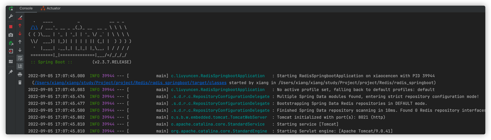

**先执行第一个接口，创建一个stock 商品**，然后创建 jmeter 测试案例

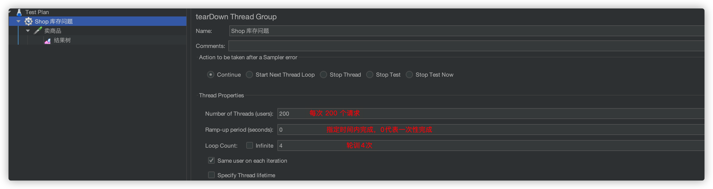

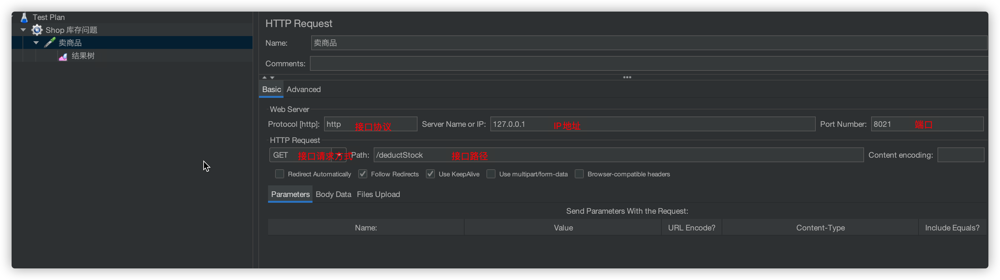

如果不知道怎么用，看这个连接：https://blog.csdn.net/bin0503/article/details/123543484。创建完成后，点击上面的绿色箭头

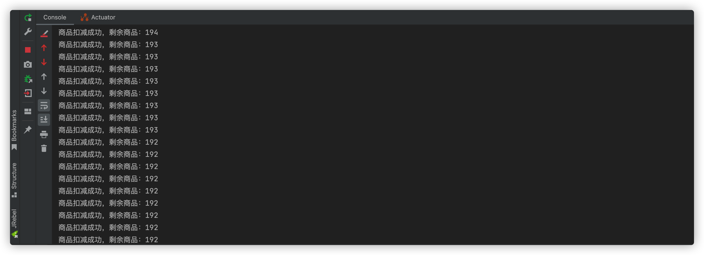

看到这里，大家就知道发生了啥了，一个库存被卖了七八次，肯定是卖超了，但是有问题了，redis 是单线程的呀，为啥会卖超呢？

这个问题我们占时保留，先解决问题！


### 解决方案一：设置 synchronzied

既然因为并发太高导致的问题，那肯定和线程有关，我们尝试加个锁呗

先调用第一个接口，重置库存数，使用客户端命令排查一下


添加 `synchronized` 关键字

```java
    /**
     * @description: 在卖出的服务中添加 synchronized 关键字 添加锁
     * @author: Xiang想
     * @date: 2022/9/5 5:02 PM
     * @param: []
     * @return: java.lang.String
     **/
    @RequestMapping("/syncDeductStock")
    public String syncDeductStock(){
        synchronized (this){
            int stock = Integer.parseInt(stringRedisTemplate.opsForValue().get("stock"));
            if (stock>0){
                int realStock = stock - 1;
                stringRedisTemplate.opsForValue().set("stock",String.valueOf(realStock));
                System.out.println("商品扣减成功，剩余商品："+realStock);
            }else {
                System.out.println("库存不足....");
            }
            return "end";
        }
    }
```

重新调用一遍卖出接口

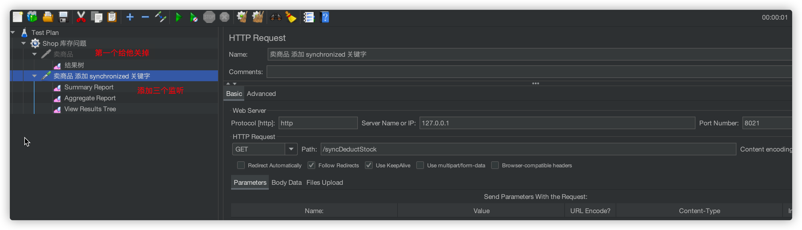


**发现在单机模式下，添加 synchronized  关键字，确实能够避免商品卖超的问题！**

但是在微服务情况下，针对该服务设置了集群，`synchronized` 还能保证数据的正确性吗？假设多个服务，被注册到服务器中心，每个微服务中的处理接口都有 `synchronized` 关键字

我创建了三个服务，用三个不同的端口模拟集群环境下 synchronized 问题

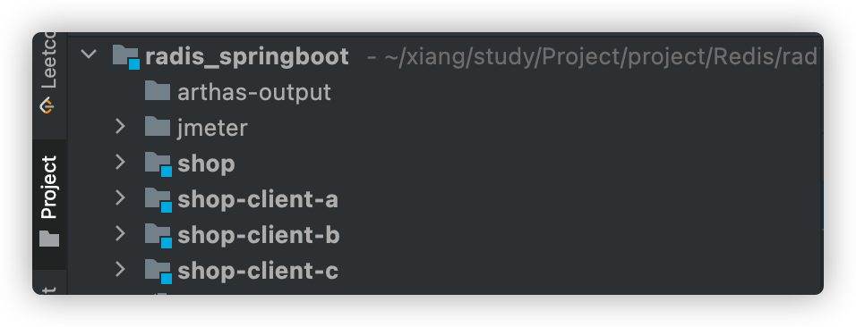

然后把 stock 库存数调整为3的倍数，300

```sh
127.0.0.1:6379[10]> set stock 300
OK
```

创建 jmeter 测试接口

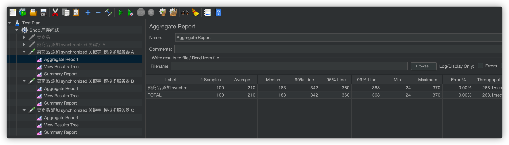

执行后，发现三个接口都调用了100次，但是库存还有 `145`

```sh
127.0.0.1:6379[10]> get stock
"145"
```

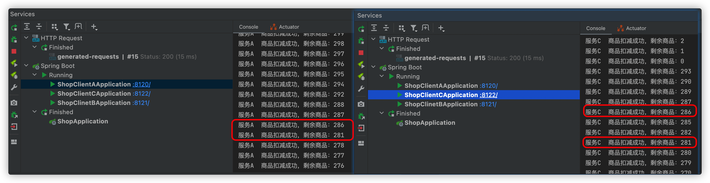

分别打开两个服务的日志，发现他们消费了重复的商品。

### 解决方案二：Redis setnx实现分布式锁

在Redis中存在一条命令`setnx (set if not exists)`

> setnx key value
>
> 如果不存在key，则可以设置成功；否则设置失败。


我们对 controller 方法进行修改一下

```java
@RequestMapping("/redisLockStock")
public String redisLockStock(){
  String key = "lock";
  // setnx
  // 由于redis是一个单线程，执行命令采取“队列”形式排队！
  // 优先进入队列的命令先执行，由于是setnx，第一个执行后，其他操作执行失败。
  boolean result = stringRedisTemplate.opsForValue().setIfAbsent(key, "this is lock");
  // 当不存在key时，可以设置成功，回执true；如果存在key，则无法设置，返回false
  if (!result) {
    // 前端监测，redis中存在，则不能让这个抢购操作执行，予以提示！
    return "err";
  }
  // 获取Redis数据库中的商品数量
  Integer stock = Integer.parseInt(stringRedisTemplate.opsForValue().get("stock"));
  // 减库存
  if (stock > 0) {
    int realStock = stock - 1;
    stringRedisTemplate.opsForValue().set("stock", String.valueOf(realStock));
    System.out.println("商品扣减成功，剩余商品：" + realStock);
  } else {
    System.out.println("库存不足.....");
  }

  // 程序执行完成，则删除这个key
  stringRedisTemplate.delete(key);

  return "end";
}
```

大概解释一下

`setnx` 这个命令是一个上锁的命令

```sh
127.0.0.1:6379[10]> exists lock
(integer) 0
127.0.0.1:6379[10]> setnx lock "hi"
(integer) 1
127.0.0.1:6379[10]> setnx lock "good"
(integer) 0
127.0.0.1:6379[10]> get lock
"hi"
```

通过这一段命令，我们可以看出来，setnx 设置的值，无法被修改。但是可以对其进行删除，再结合上面的代码，我们可以得到这样一个流程

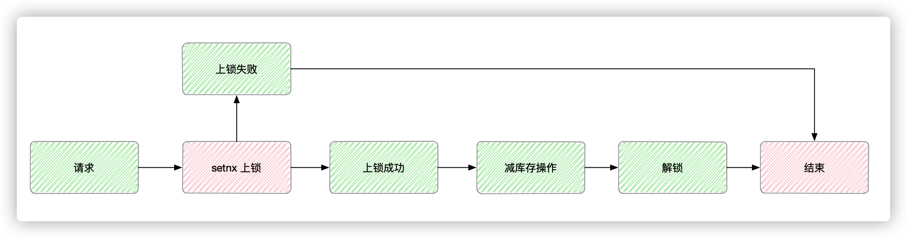

但就这样一块代码来说，不够严谨，一旦减少库存操作出现了异常，导致解锁无法执行，以至于其他请求一直无法拿到 key，程序逻辑死锁！

我们可以尝试用 try...finally 解决异常问题！

```java
@RequestMapping("/redisLockStock")
public String redisLockStock(){
  	// 创建一个key，保存至redis
		String key = "lock";
		// setnx
		// 由于redis是一个单线程，执行命令采取队列形式排队！优先进入队列的命令先执行，由于是setnx，第一个执行后，其他操作执行失败
		boolean result = stringRedisTemplate.opsForValue().setIfAbsent(key, "this is lock");
		// 当不存在key时，可以设置成功，回执true；如果存在key，则无法设置，返回false
		if (!result) {
			// 前端监测，redis中存在，则不能让这个抢购操作执行，予以提示！
			return "err";
		}
		
		try {
			// 获取Redis数据库中的商品数量
			Integer stock = Integer.parseInt(stringRedisTemplate.opsForValue().get("stock"));
			// 减库存
			if (stock > 0) {
				int realStock = stock - 1;
				stringRedisTemplate.opsForValue().set("stock", String.valueOf(realStock));
				System.out.println("商品扣减成功，剩余商品：" + realStock);
			} else {
				System.out.println("库存不足.....");
			}
		} finally {
			// 程序执行完成，则删除这个key
			// 放置于finally中，保证即使上述逻辑出问题，也能del掉
			stringRedisTemplate.delete(key);
		}

		return "end";
}
```

这样，就显得更严谨了。

But，但是！！！

如果有一台服务器在减库存的过程中，出现了断电、宕机等原因导致 finally 中的语句没有指执行，同样出现 key 一直存在，导致死锁！

我们可以通过设置超时时间，我们可以用

```java
stringRedisTemplate.expire(key, 10, TimeUnit.SECONDS);
```

设置超时时间吗？不行！！因为可在创建锁成功的一瞬间就宕机，导致的设置时长无法执行，而死锁！所以我们要找一个原子类的操作API

```java
stringRedisTemplate.opsForValue().setIfAbsent(key, "this is lock", 10, TimeUnit.SECONDS);
```

将 `setIfAbsent` 和 `expire` 合并成一条 原子命令。


好了，我们现在设置了10秒的过期时长，这样就万无一失了吗？

如果？执行减少库存的时间超过了10秒呢？而正好另一台服务器又接收到了请求，依然出现了 `锁` 不存在的情况，超卖依旧没有解决。

所以我们到目前总结一下

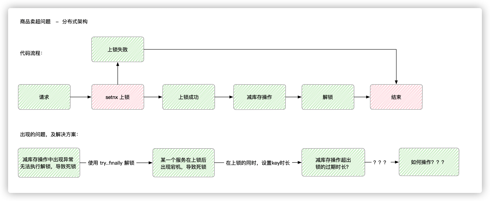

### 解决方案三：Redisson API

setnx 的方式会出现无法准确判断业务操作时长，而无法保证安全，设置时间太长，性能不好，设置时间短，容易出现卖超问题。

难道就没有其他办法了吗？

Redisson 和 jedis 都是 Java 实现 Redis 的客户端，但是 Redisson 比 jedis 具有更多功能

引入新的 pom 文件

```xml
        <dependency>
            <groupId>org.redisson</groupId>
            <artifactId>redisson</artifactId>
            <version>3.17.6</version>
        </dependency>
```

创建 bean 配置类

```java
package com.liuyuncen.config;

import org.redisson.Redisson;
import org.redisson.config.Config;
import org.springframework.beans.factory.annotation.Value;
import org.springframework.context.annotation.Bean;
import org.springframework.context.annotation.Configuration;

/**
 * @belongsProject: radis_springboot
 * @belongsPackage: com.liuyuncen.config
 * @author: Xiang想
 * @createTime: 2022-09-08  09:08
 * @description: TODO
 * @version: 1.0
 */
@Configuration
public class RedissonConfig {

    @Value("${spring.redis.host}")
    private String redisHost;
    @Value("${spring.redis.port}")
    private String redisPort;
    @Value("${spring.redis.password}")
    private String password;
    @Value("${spring.redis.database}")
    private Integer dataBase;


    @Bean
    public Redisson createRedisson(){
        Config config = new Config();
        config.useSingleServer().setAddress("redis://" + redisHost + ":" + redisPort).setDatabase(dataBase).setPassword(null);
        return (Redisson) Redisson.create(config);
    }
}
```

这里要注意一下，因为我本地的 redis 没有密码，所以在 setPassword(null) 这里给了空。否则会报 ==Unable to connect to Redis server: 127.0.0.1/127.0.0.1:6379== 错误

然后就是消费的接口方法

```java
@GetMapping("/redissonLockStock")
    public String redissonLockStock() throws InterruptedException {
        String key = "lock";
        RLock lock = redisson.getLock(key);
        try {
            lock.lock();
            int stock = Integer.parseInt(stringRedisTemplate.opsForValue().get("stock"));
            if (stock % 100 == 0){
                System.out.println("A服务 延迟10秒");
                Thread.sleep(10000);
                System.out.println("A服务 延迟10秒结束 继续后续操作");
            }
            if (stock>0){
                int resultStock = stock - 1;
                stringRedisTemplate.opsForValue().set("stock",String.valueOf(resultStock));
                System.out.println("A服务 商品扣除成功，剩余商品:"+resultStock);
            }else {
                System.out.println("A服务 库存不足...");
            }
        }finally {
            lock.unlock();
        }
        return "end";
    }
```

这里我还特地添加了 10秒延迟，可以在这个时间段看到 lock 的值

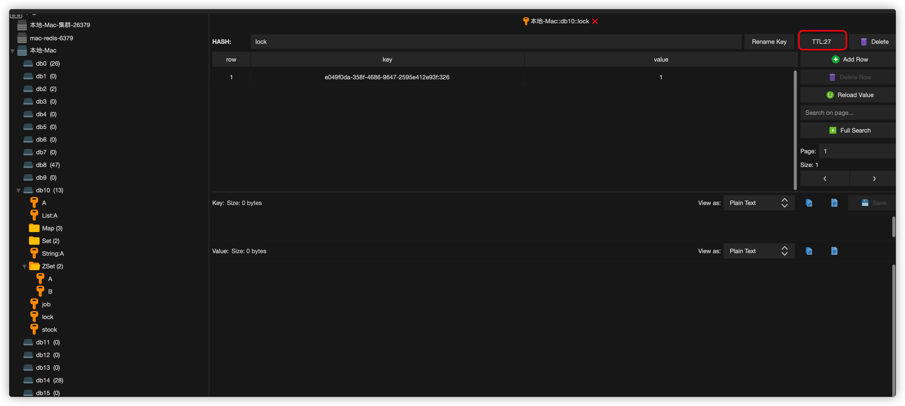

我们看到他也是通过 TTL 延时过期来实现的。那到底是咋做的呢？

我们来看一下 Redisson 源码

```java
String key = "lock";
RLock lock = redisson.getLock(key);
```

在`org.redisson.RedissonLock.RedissonLock(CommandAsyncExecutor, String)`中，我们看到 redisson 给 key 设置的属性中有超时时间

```java
public RedissonLock(CommandAsyncExecutor commandExecutor, String name) {
  super(commandExecutor, name);
  this.commandExecutor = commandExecutor;
  this.internalLockLeaseTime = commandExecutor.getConnectionManager().getCfg().getLockWatchdogTimeout();
  this.pubSub = commandExecutor.getConnectionManager().getSubscribeService().getLockPubSub();
}
```

超时间数为(`org.redisson.config.Config.lockWatchdogTimeout`)：默认30s

```java
private long lockWatchdogTimeout = 30 * 1000;
```

其中加锁、续命锁在以下代码中实现

```java
lock.lock();
```

查看源码(`org.redisson.RedissonLock.lock()`)，逐个判断分析得到核心逻辑代码如下所示：

```java
<T> RFuture<T> tryLockInnerAsync(long leaseTime, TimeUnit unit, long threadId, RedisStrictCommand<T> command) {
        internalLockLeaseTime = unit.toMillis(leaseTime);

        return commandExecutor.evalWriteAsync(getName(), LongCodec.INSTANCE, command,
        			// 如果存在 KEYS[1]，这个KEYS[1]就是最初设置的redisson.getLock(key)
                  "if (redis.call('exists', KEYS[1]) == 0) then " +
                      //上述代码执行逻辑为0，表示不存在
                      // 不存在则将 锁key+线程id设置为hash类型数据保存redis(ARGV[2]为当前执行线程id)
                      "redis.call('hset', KEYS[1], ARGV[2], 1); " +
                      // 设置这个 hash数据类型 的有效时间
                       "redis.call('pexpire', KEYS[1], ARGV[1]); " +
                      "return nil; " +
                  "end; " +
                  "if (redis.call('hexists', KEYS[1], ARGV[2]) == 1) then " +
                  		// 如果这个 锁key 在redis中存在，返回1表示数据存在
                  		//hincrby 自增1 
                      "redis.call('hincrby', KEYS[1], ARGV[2], 1); " +
                      // 重新设定有效时间
                      "redis.call('pexpire', KEYS[1], ARGV[1]); " +
                      "return nil; " +
                  "end; " +
                  "return redis.call('pttl', KEYS[1]);",
                    Collections.<Object>singletonList(getName()), internalLockLeaseTime, getLockName(threadId));
    }
```

> 我们可以看到一打开 redis.call 命令，其实这是 lua 语言，其中的指令有
>
> exists 存在、pexpire 设置有效时间

根据上述源码中，存在设置超时时间默认为30秒，但是我们知道，真正的业务执行过程不见得就是30秒，拿着一块 redisson 怎么处理呢？

在源码`org.redisson.RedissonLock.tryAcquireAsync(long, TimeUnit, long)`中，针对时间处理参数做了如下操作：

```java
private <T> RFuture<Long> tryAcquireAsync(long leaseTime, TimeUnit unit, final long threadId) {
        if (leaseTime != -1) {
            return tryLockInnerAsync(leaseTime, unit, threadId, RedisCommands.EVAL_LONG);
        }
        RFuture<Long> ttlRemainingFuture = tryLockInnerAsync(commandExecutor.getConnectionManager().getCfg().getLockWatchdogTimeout(), TimeUnit.MILLISECONDS, threadId, RedisCommands.EVAL_LONG);
        // 设置监听线程，当异步方法tryLockInnerAsync执行完触发
        ttlRemainingFuture.addListener(new FutureListener<Long>() {
        	// 重写 operationComplete 方法
            @Override
            public void operationComplete(Future<Long> future) throws Exception {
                if (!future.isSuccess()) {
                    return;
                }

                Long ttlRemaining = future.getNow();
                // lock acquired
                if (ttlRemaining == null) {
                    // 开启定时任务
                    scheduleExpirationRenewal(threadId);
                }
            }
        });
        return ttlRemainingFuture;
    }
```

查看定时任务源码(`org.redisson.RedissonLock.scheduleExpirationRenewal(long)`)：

```java
private void scheduleExpirationRenewal(final long threadId) {
        if (expirationRenewalMap.containsKey(getEntryName())) {
            return;
        }
		// 定时任务的创建
        Timeout task = commandExecutor.getConnectionManager().newTimeout(new TimerTask() {
            @Override
            public void run(Timeout timeout) throws Exception {
                //又是一个lua脚本，重新设置锁
                RFuture<Boolean> future = commandExecutor.evalWriteAsync(getName(), LongCodec.INSTANCE, RedisCommands.EVAL_BOOLEAN,
                        "if (redis.call('hexists', KEYS[1], ARGV[2]) == 1) then " +
                        // 获取redis的hash数据类型中，指定的key-线程id 信息。
                        // 如果 == 1 表示存在这个锁
                        // 重新设置key的失效时间
                            "redis.call('pexpire', KEYS[1], ARGV[1]); " +
                            "return 1; " +
                        "end; " +
                        "return 0;",
                          Collections.<Object>singletonList(getName()), internalLockLeaseTime, getLockName(threadId));
                
                // 设置失效时间后(evalWriteAsync执行后)，开启监听
                future.addListener(new FutureListener<Boolean>() {
                    @Override
                    public void operationComplete(Future<Boolean> future) throws Exception {
                        expirationRenewalMap.remove(getEntryName());
                        // 如果future 未执行成功
                        if (!future.isSuccess()) {
                            log.error("Can't update lock " + getName() + " expiration", future.cause());
                            return;
                        }
                        // future 执行完成
                        if (future.getNow()) {
                        	// 调取自身，此时并不会造成死循环
                        	// 调用自身，继续执行 TimerTask中的逻辑，包括定时操作
                            // reschedule itself
                            scheduleExpirationRenewal(threadId);
                        }
                    }
                });
            }
           // 每 30/3 也就是10秒
        }, internalLockLeaseTime / 3, TimeUnit.MILLISECONDS);

        if (expirationRenewalMap.putIfAbsent(getEntryName(), task) != null) {
            task.cancel();
        }
    }
```

通过这个定时和设置延迟时间，我们就可以清楚的知道， redisson 是如何做延时处理的

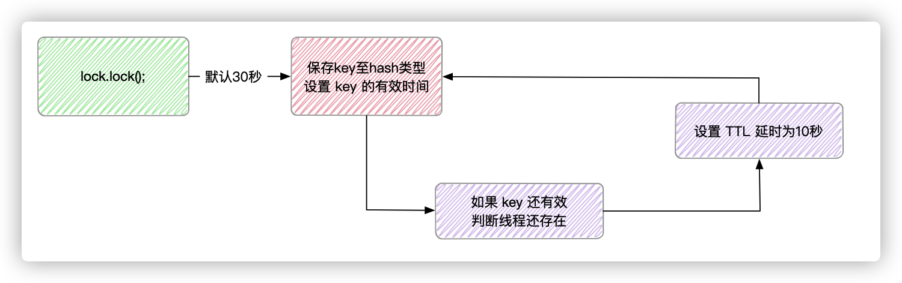

redisson 并不是等30秒都执行完了，再去续命，而是每过10秒就续10秒

我每隔一秒执行 ttl lock 发现

```sh
127.0.0.1:6379[10]> ttl lock
(integer) 23
127.0.0.1:6379[10]> ttl lock
(integer) 22
127.0.0.1:6379[10]> ttl lock
(integer) 21
127.0.0.1:6379[10]> ttl lock
(integer) 20
127.0.0.1:6379[10]> ttl lock
(integer) 29
127.0.0.1:6379[10]> ttl lock
(integer) 28
```

那我们知道了 redisson 通过上锁加续命的方式解决分布式锁。还有其他的办法吗？

### 解决方案四：RedLock 高可用并发锁

用之前，我先说一下大致原理，RedLock 思想为了保证高可用性，在设置key 的时候，会创建多个节点，单个节点设置成功不会告诉程序获得了锁，只有超过半数的节点设置成功，才会告诉程序锁上了

所以我们要创建多个 key

```java
@GetMapping("/redLockStock")
    public String redLockStock(){
        // 创建多个key，
        String key1 = "lock:1";
        String key2 = "lock:2";
        String key3 = "lock:3";
        RLock lock1 = redisson.getLock(key1);
        RLock lock2 = redisson.getLock(key2);
        RLock lock3 = redisson.getLock(key3);

        RedissonRedLock redLock = new RedissonRedLock(lock1, lock2, lock3);
        try {
            boolean tryLock = redLock.tryLock(10, 30, TimeUnit.SECONDS);
            if (tryLock){
                int stock = Integer.parseInt(stringRedisTemplate.opsForValue().get("stock"));
                if (stock>0){
                    int resultStock = stock - 1;
                    stringRedisTemplate.opsForValue().set("stock",String.valueOf(resultStock));
                    System.out.println("A服务 商品扣除成功，剩余商品:"+resultStock);
                }else {
                    System.out.println("A服务 库存不足...");
                }
            }
        }catch (InterruptedException e){
            e.printStackTrace();
        }finally {
            redLock.unlock();
        }
        return "end";
    }
```

多节点的Redis实现的分布式锁 RedLock 可以有效防止单点故障。

我们再来细说他为什么可以实现这样的功能

1. 获取当前时间戳

2. client 尝试按顺序使用相同的 key、value 获取所有 redis 服务的锁，在获取锁的过程中，获取时间比锁过期时间短的多，这是为了不要过长时间等待已经关闭的 Redis 服务，并且试着获取下一个 Redis 实例

	比如 TTL为5秒，设置获取锁的时间最多用1秒，如果1秒都没有获取到锁，那就放弃这个锁，立刻获取下一个锁

3. client通过获取所有能获取的时间减去第一步的时间，这个时间差小于TTL时间并且少于有3个redis实例成功获取锁，才算正在的获取锁成功

4. 如果成功拿到锁，锁的真正有效时间是 TTL 减去第三步的时间差，假如TTL是5秒，获取锁用了2秒，真正有效的就是3秒。

5. 如果客户端由于某些情况获取锁失败，便会开始解锁所有redis，因为可能也就获取了小于3个锁，必须释放，否则影响其他client获取锁

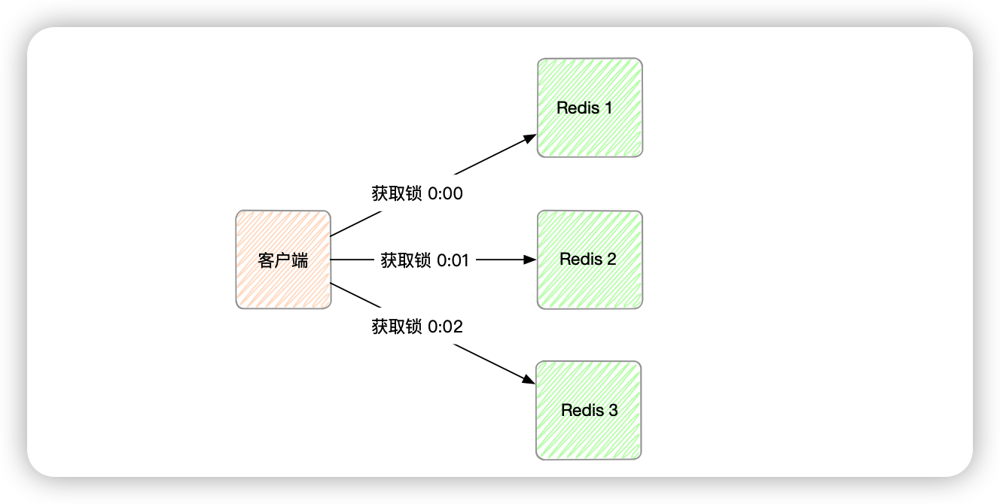

开始时间是T1是 0:00 ，获取锁时所有 key-value 都是一样的，TTL 是5min，假设漂移时间 1min，最后结束时间是 T2是 0:02 ，所以此锁最小有效时间为：TTL-(T2-T1)-漂移时间 = 5min - (0:02 - 0:00) -1min = 2min

+ RedLock 算法是否是异步算法？

可以看成是同步算法，因为即使进程间（多个电脑间）没有同步时间，但是每个进程时间流速大致相同，并且时钟漂移相对于 TTL 较小，可以忽略，所以可以看成同步算法。

+ RedLock 失败重试

当client 不能获取锁时，应该在随机时间后重试获取锁，并且最好在同一时刻并发把set命令发给所有redis实例，而且对于已经获取锁的client在完成任务后及时释放锁

+ RedLock 释放锁

由于释放锁会判断这个锁value是不是自己设置的，如果是才删除，所以释放的时候很简单，只要向所有实例发出释放锁的命令，不用考虑是否成功释放


好，到这里，相信你对卖超问题已经能很好的解决了！