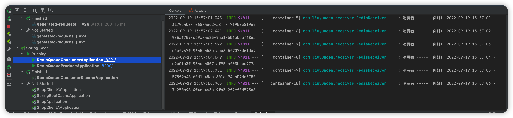

> 创建于2022年9月19日

## SpringBoot 整合 Redis 实现发布订阅功能

读文本之前，确保了解生产者消费者模式，了解Redis基础操作


我们模拟搭建2个服务去实现生产者和消费者

> 文章涉及的代码 Gitee
>
> https://gitee.com/Array_Xiang/spring-boot-redis.git

首先我们去创建2个微服务

需要一些依赖，如果有就不需要添加了

```xml
 <!-- 上面4个是 @Slf4j 的 -->
        <dependency>
            <groupId>org.projectlombok</groupId>
            <artifactId>lombok</artifactId>
            <version>1.18.0</version>
        </dependency>
        <dependency>
            <groupId>org.slf4j</groupId>
            <artifactId>slf4j-api</artifactId>
            <version>1.7.25</version>
        </dependency>
        <dependency>
            <groupId>ch.qos.logback</groupId>
            <artifactId>logback-classic</artifactId>
            <version>1.2.3</version>
        </dependency>
        <dependency>
            <groupId>org.junit.jupiter</groupId>
            <artifactId>junit-jupiter-api</artifactId>
            <version>5.2.0</version>
            <scope>test</scope>
        </dependency>


        <dependency>
            <groupId>org.springframework.boot</groupId>
            <artifactId>spring-boot-starter-web</artifactId>
        </dependency>
        <!--引入jedis依赖-->
        <dependency>
            <groupId>org.springframework.boot</groupId>
            <artifactId>spring-boot-starter-data-redis</artifactId>
            <version>2.7.3</version>
        </dependency>
        <dependency>
            <groupId>org.redisson</groupId>
            <artifactId>redisson</artifactId>
            <version>3.17.6</version>
        </dependency>
        <dependency>
            <groupId>redis.clients</groupId>
            <artifactId>jedis</artifactId>
        </dependency>
```

配置yml

```yml
server:
  port: 8290


spring:
  redis:
    host: 127.0.0.1
    port: 6379  # 主机redis端口信息，
    #password: xx
    database: 11 # 设置redis数据库索引，默认为0
    timeout: 30000 # 连接超时时间(毫秒)
    jedis:
      pool:
        max-active: 8 #最大连接数
        max-wait: 5000 # 连接池最大阻塞等待时间(-1表示无等待时间)
        max-idle: 8 #最大连接空闲
        min-idle: 2 #最小连接空闲
```

服务不同，更改不同的端口号，我这里用 `8290`、`8291`，其他的配置保持不变

### Produce 生产者

创建配置 `RedisTemplateConfig`

```java
package com.liuyuncen.config;

import org.springframework.context.annotation.Bean;
import org.springframework.context.annotation.Configuration;
import org.springframework.data.redis.connection.RedisConnectionFactory;
import org.springframework.data.redis.core.StringRedisTemplate;

/**
 * @belongsProject: radis_springboot
 * @belongsPackage: com.liuyuncen.config
 * @author: Xiang想
 * @createTime: 2022-09-19  10:19
 * @description: TODO
 * @version: 1.0
 */
@Configuration
public class RedisTemplateConfig {
    /**
     * @description: 使用默认的工厂初始化redis操作模板
     * @author: Xiang想
     * @date: 2022/9/19 10:19 AM
     * @param: [connectionFactory]
     * @return: org.springframework.data.redis.core.StringRedisTemplate
     **/
    @Bean
    StringRedisTemplate template(RedisConnectionFactory connectionFactory) {
        return new StringRedisTemplate(connectionFactory);
    }
}
```

写一个生产消息的接口

```java
package com.liuyuncen.controller;

import lombok.extern.slf4j.Slf4j;
import org.springframework.beans.factory.annotation.Autowired;
import org.springframework.data.redis.core.StringRedisTemplate;
import org.springframework.web.bind.annotation.GetMapping;
import org.springframework.web.bind.annotation.RequestMapping;
import org.springframework.web.bind.annotation.RestController;

import java.text.SimpleDateFormat;
import java.util.Date;
import java.util.UUID;

/**
 * @belongsProject: radis_springboot
 * @belongsPackage: com.liuyuncen.controller
 * @author: Xiang想
 * @createTime: 2022-09-19  10:21
 * @description: TODO
 * @version: 1.0
 */
@RestController
@Slf4j
@RequestMapping("/queue/")
public class SendController {
    @Autowired
    StringRedisTemplate stringRedisTemplate;

    @GetMapping("/send")
    public String sendMsg(){
        String uuid = UUID.randomUUID().toString();
        SimpleDateFormat sim = new SimpleDateFormat("yyyy-MM-dd HH:mm:ss");
        String date = sim.format(new Date());
        String msg = "你好！ "+date+" -  "+uuid;
        String channel = "channel";
        log.info("生产者 -----  " + msg);
        stringRedisTemplate.convertAndSend(channel, msg);
        return "OK!";
    }
}
```

### Consumer 消费者

消费者接收消息

```java
package com.liuyuncen.receiver;

import lombok.extern.slf4j.Slf4j;
import org.springframework.stereotype.Component;

/**
 * @belongsProject: redis_springboot
 * @belongsPackage: com.liuyuncen.receiver
 * @author: Xiang想
 * @createTime: 2022-09-19  10:57
 * @description: TODO
 * @version: 1.0
 */
@Slf4j
@Component
public class RedisReceiver {

    /**
     * @description: 接收 Redis 消息
     * @author: Xiang想
     * @date: 2022/9/19 10:58 AM
     * @param: [message]
     * @return: void
     **/
    public void getMsg(String message){
        log.info("消费者 -----  "+message);
    }

}
```

配置类

```java
package com.liuyuncen.config;

import com.liuyuncen.receiver.RedisReceiver;
import org.springframework.context.annotation.Bean;
import org.springframework.context.annotation.Configuration;
import org.springframework.data.redis.connection.RedisConnectionFactory;
import org.springframework.data.redis.core.StringRedisTemplate;
import org.springframework.data.redis.listener.PatternTopic;
import org.springframework.data.redis.listener.RedisMessageListenerContainer;
import org.springframework.data.redis.listener.adapter.MessageListenerAdapter;

/**
 * @belongsProject: radis_springboot
 * @belongsPackage: com.liuyuncen.config
 * @author: Xiang想
 * @createTime: 2022-09-19  10:19
 * @description: TODO
 * @version: 1.0
 */
@Configuration
public class RedisTemplateConfig {
    /**
     * @description: 使用默认的工厂初始化redis操作模板
     * @author: Xiang想
     * @date: 2022/9/19 10:19 AM
     * @param: [connectionFactory]
     * @return: org.springframework.data.redis.core.StringRedisTemplate
     **/
    @Bean
    StringRedisTemplate template(RedisConnectionFactory connectionFactory) {
        return new StringRedisTemplate(connectionFactory);
    }

    /**
     * @description: 初始化监听器
     * @author: Xiang想
     * @date: 2022/9/19 10:59 AM
     * @param: [connectionFactory, listenerAdapter]
     * @return: org.springframework.data.redis.listener.RedisMessageListenerContainer
     **/
    @Bean
    RedisMessageListenerContainer container(RedisConnectionFactory connectionFactory,
                                            MessageListenerAdapter listenerAdapter) {
        RedisMessageListenerContainer container = new RedisMessageListenerContainer();

        container.setConnectionFactory(connectionFactory);
        // 每条消息都需要从相同或不同的管道进入，此处只配置一个管道，如果需要多个消息订阅处理，则需要配置多个
        container.addMessageListener(listenerAdapter, new PatternTopic("channel"));

        return container;
    }

    /**
     * @description: 指定对象中的指定处理方法  对应 RedisReceiver 类中的 getMsg(String message)
     * @author: Xiang想
     * @date: 2022/9/19 11:00 AM
     * @param: [redisReceiver]
     * @return: org.springframework.data.redis.listener.adapter.MessageListenerAdapter
     **/
    @Bean
    MessageListenerAdapter listenerAdapter(RedisReceiver redisReceiver) {
        return new MessageListenerAdapter(redisReceiver, "getMsg");
    }
}
```

启动两个服务




###  如果有多个 Consumer

每个 consumer 都能获取到消息，类似于 RabbitMQ 中的 扇形 Fanout 模式