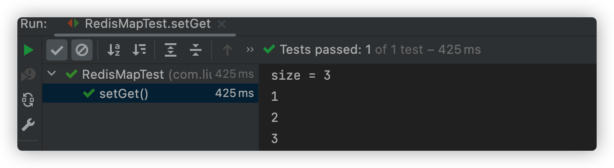

> 创建时间：2022年9月2日
>
> 标签：Redis、SpringBoot
>
> 内容：SpringBoot 实操 Redis，结合 redis-cli 和 RDM 查看其数据类型和结构
>
> 适用人群：会SpringBoot，了解Redis大致原理，想要学习SpringBoot实操Redis的人
>
> 参考：https://www.gxlcms.com/redis-366739.html
>
> https://www.cnblogs.com/daohangtaiqian/p/16533756.html
>
> https://blog.csdn.net/lydms/article/details/105224210 (这个也很全，可以看这篇文章的操作)

老样子，在阅读这篇文章之前，要保证你对 SpringBoot 有一定了解，且有可用的 Redis

**浪费别人的时间就是在谋财害命**

[toc]

言归正传，Redis 我们知道，他基于内存，非常快，这里不讲 Redis 大的方向，只做操作，和涉及的相关原理


首先，我们已经有了一个 Redis了

快速搭建一个 SpringBoot 项目

```pom
        <dependency>
            <groupId>org.springframework.boot</groupId>
            <artifactId>spring-boot-starter-data-redis</artifactId>
            <version>2.7.3</version>
        </dependency>
        <!--引入jedis依赖 这个说一下，他是一个redis的连接工具，为什么选他？后面我们再说-->
        <dependency>
            <groupId>redis.clients</groupId>
            <artifactId>jedis</artifactId>
        </dependency>
```

配置文件 application.yml

```yml
server:
  port: 8021

spring:
  application:
    name: redis-springboot
  redis:
    host: 127.0.0.1
    port: 6379
    password:
    database: 10
    jedis:
      # Redis连接池配置
      pool:
        # 最大连接数
        max-active: 8
        # 连接池最大阻塞等待时间
        max-wait: 1ms
        # 连接池中的最大空闲连接
        max-idle: 4
        # 连接池中的最小空闲连接
        min-idle: 0
```

RedisConfig 配置文件 

```java
package com.liuyuncen.config;

import org.springframework.context.annotation.Bean;
import org.springframework.context.annotation.Configuration;
import org.springframework.data.redis.connection.RedisConnectionFactory;
import org.springframework.data.redis.core.RedisTemplate;
import org.springframework.data.redis.serializer.GenericJackson2JsonRedisSerializer;
import org.springframework.data.redis.serializer.StringRedisSerializer;

/**
 * @belongsProject: radis_springboot
 * @belongsPackage: com.liuyuncen.config
 * @author: Xiang想
 * @createTime: 2022-09-02  15:13
 * @description: TODO
 * @version: 1.0
 */
@Configuration
public class RedisConfig {

    @Bean
    public RedisTemplate<String, Object> redisTemplate(RedisConnectionFactory factory){
        RedisTemplate<String ,Object> template = new RedisTemplate<>();
        template.setConnectionFactory(factory);
        // key 采用 String 序列化方式
        template.setKeySerializer(new StringRedisSerializer());
        // hash 的 key 也采用 String 序列化
        template.setHashKeySerializer(new StringRedisSerializer());
        // value 序列化采用 jackson
        template.setValueSerializer(new GenericJackson2JsonRedisSerializer());
        // hash 的 value 序列化采用 jackson
        template.setHashValueSerializer(new GenericJackson2JsonRedisSerializer());
        template.afterPropertiesSet();
        return template;
    }
}
```

这里我们说一下为什么要对 redis 的 key 和 value 做序列化。

序列化的目的，就是为了对象可以存储和跨越平台存储，从而进行网络传输，只要是涉及到微服务的网络传输，就一定要进行**序列化**

本质上呢，序列化把数据转换成另一种字节格式，然后方便网络传输，到了其他平台之后，再反序列化解析回来。

Redis 默认的序列化是 **JdkSerializationRedisSerializer** 听名字就知道是 jdk 的啊，**他的优点是反序列化时不需要提供类的信息，但是缺点是需要实现 Serializable 接口**，序列化后的结果非常庞大，是JSON格式的5倍左右，这样就会消耗Redis大量的内存，使用默认的 JDK 序列化方式，在 RDM 工具中查看 k-v 值会出现乱码，不方便查看

**GenericJackson2JsonRedisSerializer** 使用 Jackson 库将对象序列化为 JSON 字符串，优点是速度快，序列化后的字段短小精悍，不需要实现 Serializable 接口，但缺点也非常致命，那就是此类的构造函数必须要有一个类型参数，必须提供要序列化对象的类型信息（.class对象）通过查看源代码，发现其只在序列化中用了类型信息。

我们先写一个测试类

```java
package com.liuyuncen;

import org.junit.jupiter.api.Test;
import org.springframework.beans.factory.annotation.Autowired;
import org.springframework.boot.test.context.SpringBootTest;
import org.springframework.data.redis.core.RedisTemplate;

@SpringBootTest
class RadisSpringbootApplicationTests {

    @Autowired
    private RedisTemplate<String,Object> redisTemplate;

    /**
     * 普通缓存存入
     */
    @Test
    void setValue(){
         redisTemplate.opsForValue().set("String:A","Hello");
    }

}
```


## 1、String 类型

### 1.1、常规读写

1. 普通存入

如果实操要写 @Test 方法，为节省文章篇幅，我把方法名给省略了，直接给方法就好了。


```java
 redisTemplate.opsForValue().set("String:A","Hello");
```

对于 redis-cli 命令来说就是，后面就不过多解释了，Java命令的下面一行就是 Redis-cli 命令

默认 redis-cli 进入是 0 数据库

```sh
 127.0.0.1:6379> select 10
```


这样就可以切换到我们配置的10数据库了

```sh
 127.0.0.1:6379[10]> set String:A Hello
```

2. 普通取出

```java
String value = String.valueOf(redisTemplate.opsForValue().get("String:A"));
```

```sh
 127.0.0.1:6379[10]> get String:A
```


### 1.2、普通存入并设置时间

```java
redisTemplate.opsForValue().set("String:Time","10秒消失",10, TimeUnit.SECONDS);
```

```sh
 127.0.0.1:6379[10]> expire String:Time 10
# expire 指定key过期时间，单位秒，返回1成功，返回0失败
```

执行完可以用 RDM 看着，过了10秒自己就没了，很有意思。

如果给 **0** 会怎么样，那结果肯定是报错呀！如果是0的话，还得使用普通的存入哈

使用 ttl 返回过期的 key 剩余时间 单位秒，-1表示不过期，-2 表示不存在（可能也就到点了，他走了）


### 1.3、递增

很好解释，对一个指定的已存在的key进行递增

```java
// 我要先创建一个数字类型的，说是数字，但他还是属于 String 类型哟
redisTemplate.opsForValue().set("Integer:A",10L);
// 然后递增
redisTemplate.opsForValue().increment("Integer:A",1L);
```

可以看到他变成11 了


```sh
127.0.0.1:6379[10]> incr Integer:A
# 但每次只能+1
```

### 1.4、删除

```java
redisTemplate.delete("Integer:A");
```

```sh
127.0.0.1:6379[10]> del Integer:A
```


## 2、Map 类型

### 2.1map 类型存入

```java
// 传递一个map单个key
redisTemplate.opsForHash().put("Map:A","key","value");
Map<String,Object> map = new HashMap<>();
map.put("key1","value1");
map.put("key2","value2");
// 传递一个map中多个key
redisTemplate.opsForHash().putAll("Map:B",map);
```

```java
127.0.0.1:6379[10]> hset Map:B key3 value3
```


### 2.2、map 类型取出

1. 取出整个Map（所有键值对）

```java
Map<Object, Object> entries = redisTemplate.opsForHash().entries("Map:B");
```

2. 取出Map中指定的key

```java
Object value = redisTemplate.opsForHash().get("Map:B", "value");
```

### 2.3、向一个map表中放入一对数据，不存在就创建

```java
redisTemplate.opsForHash().put("Map:B","hello","world");
```

```sh
127.0.0.1:6379[10]> hset Map:B hi Xiang
```


### 2.4、删除map表中的key

```java
redisTemplate.opsForHash().delete("Map:B","key1");
```

```sh
127.0.0.1:6379[10]> hdel Map:B key2
```

### 2.5、判断map表中key是否存在

```java
Boolean flag = redisTemplate.opsForHash().hasKey("Map:B", "hi");
```

```sh
127.0.0.1:6379[10]> hmget Map:B key2
1) (nil)
```

### 2.6、map中数据做递增递减

```java
redisTemplate.opsForHash().put("Map:C","int",10);
int data = Integer.parseInt(String.valueOf(redisTemplate.opsForHash().get("Map:C","int")));
System.out.println("data = " + data);
redisTemplate.opsForHash().increment("Map:C", "int", 3);
data = Integer.parseInt(String.valueOf(redisTemplate.opsForHash().get("Map:C","int")));
System.out.println("data = " + data);
redisTemplate.opsForHash().increment("Map:C", "int", -6);
data = Integer.parseInt(String.valueOf(redisTemplate.opsForHash().get("Map:C","int")));
System.out.println("data = " + data);
```


```sh
127.0.0.1:6379[10]> hincrby Map:C int 9
(integer) 16
```


## 3、Set 类型

### 3.1、写入Set数据

```java
redisTemplate.opsForSet().add("Set:A","key1");
```

也可以放多个值

```java
redisTemplate.opsForSet().add("Set:A","key2","key3");
```

```sh
127.0.0.1:6379[10]> sadd Set:A value1 value2 value3 value4
(integer) 4
```

保留了 Set 数据格式的特性，不会出现重复的值

### 3.2、获取Set数据

```java
Long size = redisTemplate.opsForSet().size("Set:A");
System.out.println("size = " + size);
Set<Object> members = redisTemplate.opsForSet().members("Set:A");
for (Object member : members) {
  System.out.println(member);
}
```



### 3.3、获取交集

```java
// Set:A 有 1、2、3   Set:B 有 2、3、4  差异是 2、3
Set<Object> intersect = redisTemplate.opsForSet().intersect("Set:A", "Set:B");
for (Object o : intersect) {
  System.out.println(o);
}
```


```sh
127.0.0.1:6379[10]> smembers Set:A
1) "1"
2) "2"
3) "3"
127.0.0.1:6379[10]> smembers Set:B
1) "2"
2) "3"
3) "4"
127.0.0.1:6379[10]> sinter Set:A Set:B
1) "2"
2) "3"
```

### 3.4、获取并集

```java
Set<Object> union = redisTemplate.opsForSet().union("Set:A", "Set:B");
```

```java
127.0.0.1:6379[10]> sunion Set:A Set:B
1) "1"
2) "2"
3) "3"
4) "4"
```

### 3.5、获取差值

```java
Set<Object> intersect = redisTemplate.opsForSet().intersect("Set:A", "Set:B");
```

注意，这是用A去和B比较，比较的是 B中没有的值，因为B没有 1，所以返回的只有1，4在B中，并不是在A中，所以A不会在返回结果里

```sh
127.0.0.1:6379[10]> sdiff Set:A Set:B
1) "1"
127.0.0.1:6379[10]> sdiff Set:B Set:A
1) "4"
```

通过这两个例子就可以看出来

### 3.6、判断是否存在

```java
Boolean member = redisTemplate.opsForSet().isMember("Set:A", 1);
```

```sh
127.0.0.1:6379[10]> sismember Set:A 9
(integer) 0
127.0.0.1:6379[10]> sismember Set:A 1
(integer) 1
```

0 表示不存在

### 3.7、移除元素

```java
redisTemplate.opsForSet().remove("Set:A", 1);
```

```sh
127.0.0.1:6379[10]> srem Set:A 1
(integer) 1
127.0.0.1:6379[10]> smembers Set:A
1) "2"
2) "3"
```


## 4、List 类型

### 4.1、从头、尾新增

```java
redisTemplate.opsForList().leftPushAll("List:A",1,2,3);
redisTemplate.opsForList().rightPushAll("List:B",1,2,3);
```


```sh
127.0.0.1:6379[10]> rpush List:A 1 2 3
(integer) 6
```


### 4.2、获取整个List

```java
List<Object> range = redisTemplate.opsForList().range("List:B", 0, -1);
for (Object o : range) {
  System.out.println("data = " + o);
}
```

这里实际上是获取一个区间值，但是取 0和-1 就是取下标最小和最大，这样就可以拿到全部值了


这里取的是包含的值，如果取 `range("List:B", 0, 1)` 就把 下标0 和 下标1 的都拿出来。

```sh
127.0.0.1:6379[10]> lpush List:B 1 2 3 4 5
(integer) 5
127.0.0.1:6379[10]> lrange List:B 0 -1
1) "5"
2) "4"
3) "3"
4) "2"
5) "1"
```

### 4.3、根据索引修改值

```java
redisTemplate.opsForList().set("List:B",2,"Hello");
```

```sh
127.0.0.1:6379[10]> lset List:B 3 "world"
OK
```


### 4.4、移除List

```java
 redisTemplate.opsForList().remove("List:B",4,1);
```

解释一下，把 `List:B` 里是 1 的值移除前4个，如果要全部移除，就 `remove("List:B",-1,1)`

```sh
127.0.0.1:6379[10]> lrem List:B 8 1
(integer) 8
```

### 4.5、堆形式取出

```java
Long size = redisTemplate.opsForList().size("List:B");
for (int i = 0; i < size; i++) {
  System.out.println("data = " + redisTemplate.opsForList().leftPop("List:B"));
}
System.out.println("当 List:B 没有数据了，再继续Pop取出");
System.out.println("data = " + redisTemplate.opsForList().leftPop("List:B"));
```


```sh
127.0.0.1:6379[10]> lpop List:B
```


## 5、Zset类型

### 5.1、新增

```java
 redisTemplate.opsForZSet().add("ZSet:A","Hello2",2);
```

```sh
127.0.0.1:6379[10]> zadd ZSet:B 1 "Hello1"
(integer) 1
```


### 5.2、获取Zset

```java
Set<Object> range = redisTemplate.opsForZSet().range("ZSet:A", 0, -1);
for (Object o : range) {
  System.out.println("data = " + o);
}
```


```sh
127.0.0.1:6379[10]> zrange ZSet:A 0 -1
1) "\"Hello2\""
2) "\"Hello3\""
3) "\"Hello4\""
4) "\"Hello5\""
```

原理和 List  一样

### 5.3、返回 Score 区间值

```java
Set<Object> objects = redisTemplate.opsForZSet().rangeByScore("ZSet:A", 2, 3);
for (Object object : objects) {
  System.out.println("data = " + object);
}
```


```sh
127.0.0.1:6379[10]> zrangebyscore ZSet:A 2 3
1) "\"Hello2\""
2) "\"Hello3\""
```

