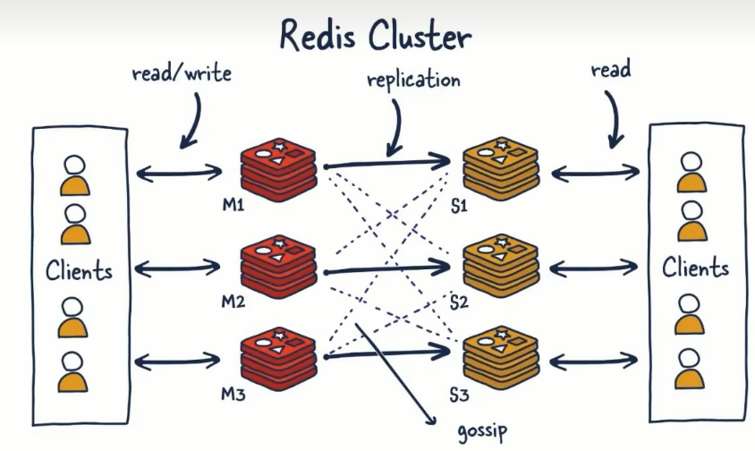

# Redis集群

哨兵+主从复制的缺点：在 master 宕机之后，会有一段时间无法写入，而且主从模式最大的缺点就是只有1台主节点。

此时引入 redis 集群，提供在多个Redis节点间共享数据的程序集，Redis集群可以支持**多个master**

- Redis集群支持多个master，每个master又可以挂载多个slave
  1. 读写分离
  2. 支持数据的高可用
  3. 支持海量数据的读写存储操作
- 由于Cluster自带Sentinel的故障转移机制，内置了高可用的支持，无需再去使用哨兵功能
- 客户端与Redis的节点连接，不再需要连接集群中所有的节点，只需要任意连接集群中的一个可用节点即可
- 槽位槽位slot负责分配到各个物理服务节点，由对应的集群来负责维护节点、插槽和数据之间的关系

### 分片与槽位

官方原话：集群数量小于1000，槽位数量小于 `16384`。每个集群节点负责一部分槽位。根据 `CRC16` 算法根据写入的 Key 分配到对应的槽位、节点。

优势是什么？

最大优势，方便扩容与缩容，以及数据分派查找

#### 哈希取余分区（小厂）

优点：简单粗暴，直接有效，只需要预估好数据规划好节点，例如3台、8台、10台，就能保证一段时间的数据 支撑。使用Hash算法让固定的一部分请求落到同一台服务器上，这样每台服务器固定处理一部分请求 (并维护这些请求的信息)， 起到负载均衡+分而治之的作用。

缺点：原来规划好的节点，进行扩容或者缩容就比较麻烦了额，不管扩缩，每次数据变动导致节点有变动，映射关系需要重新进行计算，在服务器个数固定不变时没有问题，如果需要弹性扩容或故障停机的情况下，原来的取模公式就会发生变化: Hash(key)/3会 变成Hash(key) /?。此时地址经过取余运算的结果将发生很大变化，根据公式获取的服务器也会变得不可控。 某个redis机器宕机了，由于台数数量变化，会导致hash取余全部数据重新洗牌。

#### 一致性哈希算法分区(中厂)

1. 算法构建一致性哈希环
2. 服务器各IP节点映射在环上
3. key值落到服务器的规则由环位置决定

为了在节点数目发生改变时尽可能少的迁移数据

将所有的存储节点排列在收尾相接的Hash环上，每个key在计算Hash后会顺时针找到临近的存储节点存放。而当有节点加入或退出时仅影响该节点在Hash环上顺时针相邻的后续节点。

优点 ：加入和删除节点只影响哈希环中顺时针方向的相邻的节点，对其他节点无影响。（容错、扩展）

缺点 ：数据的分布和节点的位置有关，因为这些节点不是均匀的分布在哈希环上的，所以数据在进行存储时达不到均匀分布的效果。（数据倾斜）

#### 哈希槽分区（大厂）

