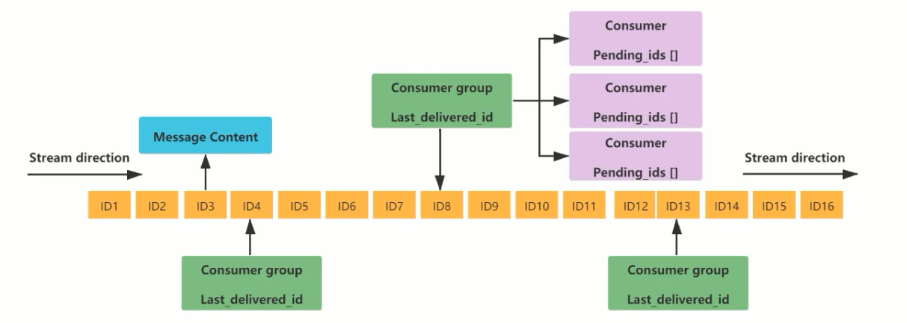

## Redis Key

[toc]

#### 1、查看当前库所有Key

有很大的性能问题

```sh
keys *
```

#### 2、判断key是否存在

```sh
exists k1
```

#### 3、查看key的类型

```sh
type k1
```

#### 4、删除key

```sh
del k1
```

#### 5、非阻塞删除

非阻塞删除，仅仅将keys从keyspace元数据中删除，真正的删除会在后续异步中操作。del key 是原子的删除，只有删除成功了才会返回删除结果，如果是删除大key用del会将后面的操作都阻塞，而unlink key 不会阻塞，它会在后台异步删除数据。

```sh
unlink key
```

#### 6、查看TTL

查看多久过期，-1表示永不过期，-2表示已经过期(不存在)

```
ttl k1
```

#### 7、设置过期时间

需要对已经存在的 key 进行设置

```sh
expire k1
```

#### 8、将Key移动到其他DB

```sh
move key DBINDEX
```

其他库如果有当前key值了，就会移动失败，返回 0

#### 9、查看当前数据库key数量

```sh
dbsize
```

#### 10、清空当前、所有库

```sh
flushdb
flushall
```


注意：命令不区分大小写，但是 Key 是区分大小写的

帮助命令： `help @string`


# 十种数据类型-Cli操作

## String 字符串

官网：[https://redis.io/docs/data-types/strings/](https://redis.io/docs/data-types/strings/)

#### set

```sh
set key value [NX|XX] [GET] [EX seconds|PX milliseconds|EXAT unix-time-seconds|PXAT unix-time-milliseconds|KEEPTTL]
```


理解 KEEPTTL，因为 SET 相当于插入修改动作，也有修改能力，在修改一个已 TTL 的Key，不加 KEEPTTL，会将已有的 TTL 修改为0，如果添加 KEEPTTL 指令，则会延续之前的 TTL 时间。

> 这里存在了一些新的问题，假设 k1 一开始创建就只有几秒钟
>
> 当 `set k1 newValue KEEPTTL` 执行之前，TTL 已经过期了，在执行，则 k1 会变成永久 TTL，（因为此时已经变成一个无TTL的key值了）


Java获取 UNIX时间

```java
System.out.println(Long.toString(System.currentTimeMillis()/1000L));
```

#### 多次操作

```sh
mset k1 v1 k2 v2 k3 v3
mget k1 k2 k3

# 事务一致，全失败、全成功，这里的 nx 表示上面的 NX key不存在的时候设置key
msetnx k1 v1 k4 v4
```

#### 字符串截取

```sh
127.0.0.1:6379> getrange k1 0 -1
"abcdefgh"
127.0.0.1:6379> getrange k1 2 3
"cd"
```

写入指定位置下标字符

```sh
127.0.0.1:6379> setrange k1 3 123
(integer) 8
127.0.0.1:6379> get k1
"abc123gh"
```

#### 自增、自减

```sh
127.0.0.1:6379> set k1 100
OK
127.0.0.1:6379> type k1
string
127.0.0.1:6379> incr k1
(integer) 101
127.0.0.1:6379> DECR k1
(integer) 99
# 一次减5
127.0.0.1:6379> decrby k1 5
(integer) 79
```

#### 字符串追加

```sh
127.0.0.1:6379> append k1 nice
(integer) 6
```


## List 集合

头插： `lpush`，尾插：`rpush` 

头取：`lpop`，尾取：`rpop`

读取：`lrange key 0 -1`

读取指定下标：`lindex key 3`

获取长度 `llen key`

根据元素匹配删除 `lrem list 1 4`

从第几个截取到第几个，类似于 substring 方法  `ltrim` ，保留截取部分，其他的全部删掉

从A集合的最后一个，放到B集合的第一个 `rpoplpush` 


指定坐标替换新值 `lset list INDEX VALUE`


## Hash哈希

插入 `hset user:001 id 11 name zs age 20`

获取单个：`hget user:001 id` ，获取多个：`hmget user:001 id name age`

删除 `hdel user:001 age name`

获取所有 `hgetall user:001`

获取元素个数 `hlen user:001`

判断是否存在 key 值 `hexists user:001 name` 返回1表示存在

元素自增 `hincrby user:001 age 2`，也可以加浮点数 `hincrbyfloat user:001 source 1.5`

默认两次赋值会被替换，使用 `hsetnx` 如果存在则赋值失败


### Set集合

插入 `sadd set 1 2 3`

查询 `smembers set`

判断是否存在，`sismember set x` 有 返回 1，没有返回 0

删除元素 `srem set 2`

返回元素个数 `scard set`

随机获取2个元素 `srandmember set 2`

随机弹出并删除 2 个元素 `spop set 2`

将元素 2 从一个集合移动到另一个集合 `smove set1 set2 2` 剪贴操作

差集 `sdiff set1 set2`

并集 `sunion set set2`

交集 `sinter set set2`

交集数到个数（基数）`sintercard 2 set set2`


### Zset有序集合

插入 `zadd zset 60 v1 70 v2 80 v3 90 v4 100 v5`  val 值前面是 score 分值

查询 `zrange zset 0 -1`

显示分数 `zrange zset 0 -1 withscores`

倒序查询 `zrevrange zset 0 -1`

条件查询 + 分页

1. `zrangebyscore zset 60 90`   取 60 <= X <= 90 
2. `zrangebyscore zset 60 90 withscores`  取 60 <= X <= 90 携带分数
3. `zrangebyscore zset (60 90`  取 60 < X <= 90 
4. `zrangebyscore zset (60 (90`  取 60 < X < 90 
5. `zrangebyscore zset 60 90 limit 0 2`  取 60 <= X <= 90，然后 分页

获取分数 `zscore zset v2` 

获取元素个数 `zscore zset v2`

删除 v5 元素 `zrem zset v5`

给 v1 元素的 score 分数 + 1 `zincrby zset 1 v1`  返回加1 后的新 score 值

统计 60 <= x < 70 元素个数  `zcount zset 60 (70` 

逆序获得元素下标 `zrevrank zset v1`


### bitMap位图

插入语法：`setbit key offset value`， 偏移量 从零开始计算，例如 `setbit bitmap 3 1`

获取偏移位的值  `getbit bitmap 3`

统计字节数占用多少 `strlen key` （不仅适用于 bitmap)

统计有多少个 1 `bitcount bitmap`

位运算，常见的 AND、OR、XOR、NOT，语法：`BITOP AND result_bitmap bitmap1 bitmap2`


### HyperLoglog基数统计

写入数据 `pfadd hyper value....` 

基数估算 `pfcount key`

多个 HyperLoglog  合并为一个 `pfmerge resultKey key2 key3`


### GEO地理空间

指定经纬度添加到指定key中 `geoadd city 116.403963 39.915119 "天安门"`

geo 实际是 zset 类型，如果使用 redlis-cli 乱码则可以这样

```sh
redis-cli --raw

127.0.0.1:6379> zrange city 0 -1
天安门
```

获取经纬度  `geopos city "天安门"` 

返回两个位置之间距离 `geodist city "故宫" "长城" km` ，单位：m 米、km 千米、ft 英寸、mi 英里

给定中心，返回不超过最大距离所有元素 `georadius city 116.418017 39.914402 10 km withcoord withhash count 10 desc`

生成 base32编码， 3维变2维变1维

### [Stream流](https://github.com/Romantic-Lei/Learning-in-practice/blob/master/Redis/3.redis10%E5%A4%A7%E6%95%B0%E6%8D%AE%E7%B1%BB%E5%9E%8B/12.Redis%E6%B5%81(Stream).md)

Redis 5.0 之前，只有 List、Pub/Sub 两种方案

list 生产者： `lpush mylist a b c d e`

list 消费者： `rpop mylist`


Tip: 一个消息链表，将所有加入的消息都串起来，每个消息都有一个位移的ID和对应的内容。



1. Message Context 消息内容
2. Consumer group 消费组，通过 xgroup create 命令创建
3. last_delivered_id 游标，每次读取都会使游标右移
4. consumer 消费者，消费组中的消费组
5. pending_ids 记录已读，但未ack的消息，确保客户端至少消费一次，而不会在网络中丢丢失没处理


添加消息队列： `XADD mystream * id 11 cname zhangsan` , 返回 时间戳 + 自增ID

指定时间：`XADD mystream 1722262542184-1 id 14 cname zhaoliu` 只可以比上一个时间戳往后，不可以重复最后一个时间戳，保证顺序


获取队列语法

```
XRANGE key start end [COUNT count]
```

1. start 表示开始值，-代表最小值
2. end 表示结束值，+代表最大值
3. count 表示最多获取多少个值

获取消息列表，start 表示开始值，end 表示结束值 `XRANGE mystream - +`

只返回1条 `xrange mystream - + count 1`

返回三条数据并降序排  `xrange mystream - + count 3`

删除一条 `XDEL mystream 1722262542184-0`

截取，比 xxx 小的值 `XTRIM mystream minid 1722263511485-0` 不再范围内的都删掉了。

查看长度 `xlen mystream`

读取多个 key，用于获取消息阻塞队列

+ 非阻塞

返回当前最大ID还要大的ID，也就是手动插入的时候，指定了更大的时间戳：`xread count 3 streams stream $`

`0-0` 表示最小的从最小的ID开始获取，当不指定 count 时，会返回 strem 中的所有信息， `0/0 0/00` 这样写也都可以

`xread count 0 streams stream 0-0`

`xread streams stream 0-0`

+ 阻塞

`xread count 1 block 0 streams stream $`  启动阻塞，控制台等待不结束，重开一个客户端，插入一条，则立刻释放，并返回客户端

#### [消费组相关概念](https://github.com/Romantic-Lei/Learning-in-practice/blob/master/Redis/3.redis10%E5%A4%A7%E6%95%B0%E6%8D%AE%E7%B1%BB%E5%9E%8B/12.Redis%E6%B5%81(Stream).md#%E6%B6%88%E8%B4%B9%E7%BB%84%E7%9B%B8%E5%85%B3%E6%8C%87%E4%BB%A4-1)

### Bitfiled位域

查看字符数值 `bitfield fieldkey get i8 0`