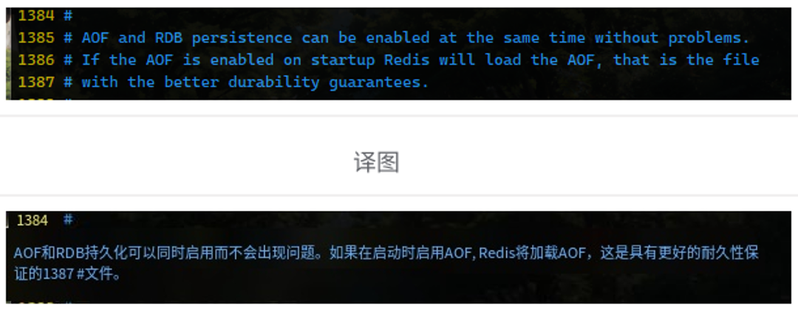

> 2024-07-30

Redis 持久化的几种方法

1. RDB 快照
2. AOF 追加写入，加载时，完整按顺序写入
3. No Persistence 不持久化
4. RDB + AOF


持久化双雄


### RDB

快照文件全称 dump.rdb。备份时，执行全量快照，一锅端。

#### 配置文件

> Redis 6.x 配置文件推荐
>
> `save 900 1` 、 `save 300 10` 、`save 60 10000` 
>
> Redis 7 配置文件推荐
>
> `save 3600 1 300 100 60 10000`

搜索： `SNAPSHOTTING`

命令：`save <seconds> <changes>`  seconds 时间、changes 频率

案例：`save 3600 1`  3600秒内有一次修改就保存 `save 60 10000` 60秒内有 10000次修改就保存，只要满足其中1条就写入磁盘 `save 5 2`，5秒内有2次变更就保存


```sh
#  指定 dump 文件路径 需要提前创建好 这个路径
dir /root/soft/redis-7.4-rc2/data
dir /root/soft/redis/redis-7.4-rc2/data

# 修改 dump 文件，后续这个文件肯定是集群环境使用，最好是按主机+端口号命名
dbfilename dump-192.168.58.10-6379.rdb
```


#### 物理恢复

备份 dump.rdb 文件，flushdb 删除所有数据，停掉 Redis 服务，物理回滚 dump文件，重启之后，flushdb 之前的数据都回来了。

注意：shutduwn redis 服务器会自动生成一个 dump.rdb 文件（覆盖）里面是空的，没有意义。

> 不可以把备份文件 dump.rdb 和 生产 redis 服务器放在同一台机器，必须分开各自存储，以防物理损坏后备份文件也挂了。


#### 手动备份

save 、 bgsave 命令

**save**：在主程序中执行会**阻塞**当前redis服务器，直到持久化工作完成执行save命令期间，Redis不能处理其他命令，**线上禁止使用**

**bgsave(默认)**：

- redis会在后台异步进行快照操作，**不阻塞**快照同时还可以相应客户端请求，该触发方式会fork一个子进程由子进程复制持久化过程


查看最后一次备份时间：`lastsave`  返回一个时间戳，不好直接看的话，使用Linux命令 `date -d @时间戳` 查看


#### 优劣


- RDB是Redis 数据的一个非常紧凑的单文件时间点表示。RDB文件非常适合备份。例如，您可能希望在最近的24小时内每小时归档一次RDB文件，并在30天内每天保存一个RDB快照。这使您可以在发生灾难时轻松恢复不同版本的数据集。
- RDB非常适合灾难恢复，它是一个可以传输到远程数据中心或Amazon S3(可能已加密）的压缩文件。
- RDB最大限度地提高了Redis 的性能，因为Redis 父进程为了持久化而需要做的唯一工作就是派生一个将完成所有其余工作的子进程。父进程永远不会执行磁盘I/О或类似操作。
- 与AOF 相比，RDB允许使用大数据集更快地重启。
- 在副本上，RDB支持重启和故障转移后的部分重新同步。

小总结：

- 适合大规模的数据恢复
- 按照业务定时备份
- 对数据完整性和一致性要求不高
- RDB文件在内存中的加载速度要比AOF快很多


#### 缺点 （快照间隙丢失数据）

- 如果您需要在Redis停止工作时（例如断电后）将数据丢失的可能性降到最低，那么RDB并不好。您可以配置生成RDB的不同保存点（例如，在对数据集至少5分钟和100次写入之后，您可以有多个保存点)。但是，您通常会每五分钟或更长时间创建一次RDB快照，因此，如果Redis由于任何原因在没有正确关闭的情况下停止工作，您应该准备好丢失最新分钟的数据。
- RDB需要经常fork()以便使用子进程在磁盘上持久化。如果数据集很大，fork()可能会很耗时，并且如果数据集很大并且CPU性能不是很好，可能会导致Redis停止为客户端服务几毫秒甚至一秒钟。AOF也需要fork()但频率较低，您可以调整要重写日志的频率，而不需要对持久性进行任何权衡。

小总结：

- 在一定间隔时间做一次备份，所以如果redis意外down掉的话，就会丢失从当前至最近一次快照期间的数据，**快照之间的数据会丢失**
- 内存数据的全量同步，如果数据量太大会导致IO严重影响服务器性能
- RDB依赖于主进程的fork，在更大的数据集中，这可能会导致服务请求的瞬间延迟。fork的时候内存中的数据被克隆了一份，大致2倍的膨胀性，需要考虑


#### 检查dump文件

命令： `redis-check-rdb ./dump-192.168.58.10-6379.rdb `


#### 触发 RDB 的几种行为

1. 配置文件中默认快照设置
2. 手动 save、bgsave 命令
3. 执行 flushdb/flushall 也会产生 dump.rdb
4. 执行 shutdown，且没有开启 AOF 持久化
5. 主从复制，主节点自动触发


#### 禁用快照

在 redis.conf 中配置 `save "" ` 

#### RDB优化配置项

1. stop-writes-on-bgsave-error：默认yes，如果配置成no，表示不在乎数据不一致或者有其他的手段发现和控制这种不一致，那么在快照写入失败时，也能确保redis继续接受新的请求
2. rdbcompression：默认yes，对于存储到磁盘中的快照，可以设置是否进行压缩存储。如果是的话，Redis会采用LZF算法进行压缩。如果你不想消耗CPU来进行压缩的话，可以设置为关闭此功能
3. rdbchecksum：默认yes，在存储快照后，还可以让redis使用CRC64算法来进行数据校验，但是这样做会增加大约10%的性能消耗，如果希望获取到最大的性能提升，可以关闭此功能
4. rdb-del-sync-files：在没有持久化的情况下删除复制中使用的RDB文件。默认情况下no，此选项是禁用的。


### AOF

以日志形式记录写操作，默认情况下，不开启AOF，**开启方式 `appendonly yes`**


步骤4: AOF 会自动优化AOF文件

回写策略 , 在 redis.conf 中找到配置 `appendsync`

1. **Always** 同步回写，立刻回写磁盘
2. **everysec** （默认）每秒写回，每个写命令执行完，只是先把日志写到AOF文件的内存缓冲区，每隔1秒把缓冲区中的内容写入到磁盘
3. **no**：操作系统控制的写回，每个写命令执行完，只是先把日志写到AOF文件的内存缓冲区，由操作系统决定何时将缓冲区内容写回磁盘


Redis 6.x 版本AOF日志目录格式

```text
./
├── appendonly.aof
└── dump-192.168.58.10-6379.rdb
```


Redis 7 版本 AOF 日志目录格式

```text
./
├── appendonlydir
│   ├── 192.168.58.10-3306-appendonly.aof.1.base.rdb
│   ├── 192.168.58.10-3306-appendonly.aof.1.incr.aof
│   └── 192.168.58.10-3306-appendonly.aof.manifest
└── dump-192.168.58.10-6379.rdb
```

目录和文件名可以从 redis.conf 中进行配置 `appenddirname "appendonlydir"` 、`appendfilename "192.168.58.10-3306-appendonly.aof""`


MP-AOF 实现方案，将原本单个 AOF 拆分成多个

1. **BASE: 表示基础AOF**，它一般由子进程通过重写产生，该文件最多只有一个。
2. **INCR:表示增量AOF**，它一般会在AOFRW开始执行时被创建，该文件可能存在多个。
3. **HISTORY**:表示历史AOF，它由BASE和INCR AOF变化而来，每次AOFRW成功完成时，本次AOFRW之前对应的BASE和INCR AOF都将变为HISTORY，HISTORY类型的AOF会被Redis自动删除。


AOF 和 RDB 同时存在，优先加载 AOF，细糠慢嚼


#### 异常恢复

Redis 可能在写入一个较大的数据后，Redis 挂了，在 `appendonly.aof.1.incr.aof` 文件中写到一半就挂了，就会导致这个文件损坏。

手动往这个文件写入任意字符串模拟损坏。

此文件损坏会导致 Redis 服务无法重启。 修复

```sh
redis-check-aof --fix 192.168.111.36-6379-appendonly.aof.1.incr.aof
```


#### 缺点

1. AOF 文件通常比 RDB 大，恢复速度也慢于 RDB
2. 根据确切的 fsync策略，AOF可能比 RDB 慢。一般来说，将fsync 设置为每秒性能仍然非常高，并且在禁用 fsync的情况下，即使在高负载下它也应该与 RDB 一样快。即使在巨大的写入负载的情况下，RDB仍然能够提供关于最大延迟的更多保证。


#### AOF重写机制

压缩原理

```sh
set k1 v1
set k1 v2
set k1 v3
```

最终只保留了` set k1 v3` 


```
auto-aof-rewrite-percentage 100
auto-aof-rewrite-min-size 64mb
```

1. 上次重写的aof大小必须是现在的1倍大
2. 重写时满足文件大小，同时且满足才会触发


- **自动触发**

满足配置文件中的选项后，Redis会记录上次重写时的AOF大小，默认配置是当AOF文件大小是上次rewrite后大小的一倍且文件大于64M时

- **手动触发**

客户端向服务器发送bgrewriteaof命令


### RDB和AOF共存

**Redis配置文档解答：RDB和AOF共存时会优先加载AOF文件**




> 推荐 RDB + AOF 混合模式
>
> 设置 `aof-use-rdb-preamble yes` 前提是必须开启　AOF


### 纯缓存模式

同时关闭RDB+AOF，专心做缓存

1. save "" -- 禁用RDB

   禁用RDB持久化模式下，我们仍然可以使用命令save、bgsave生成RDB文件

2. appendonly no -- 禁用AOF

   禁用AOF持久化模式下，我们仍然可以使用命令bgrewriteaof生成AOF文件

