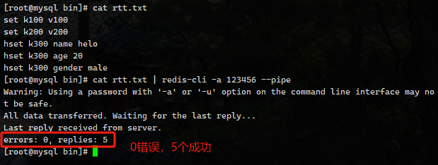

频繁的通过客户端操作 Redis，消耗TCP网络资源，引来问题

概念：RTT 发送命令、排队、执行命令、返回结果

管道的作用就是一次性发送多个命令，有点像 Mybatis 的 BatchUpdate，减少 通信次数 带来的网络消耗。

总结

- pipeline与原生批量命令对比
  1. 原生批量命令是原子性(例如：mset、mget)，**pipeline是非原子性的**
  2. 原生批量命令一次只能执行一种命令，pipeline支持批量执行不同命令
  3. 原生批量命令是服务端实现，而pipeline需要服务端与客户端共同完成
- pipeline与事务对比
  1. 事务具有原子性，管道不具有原子性
  2. 管道一次性将多条命令发送到服务器，事务是一条一条的发，事务只有在接收到exec命令后才会执行，管道不会
  3. 执行事务时会阻塞其他命令的执行，而执行管道中的命令时不会
- 使用pipeline注意事项
  1. pipeline缓冲的指令只是会依次执行，不保证原子性，如果执行中指令发生异常，将会继续执行后续的指令
  2. 使用pipeline组装的命令个数不能太多，不然数量过大客户端阻塞的时间可能过久，同时服务端此时也被迫回复一个队列答复，占用很多内存