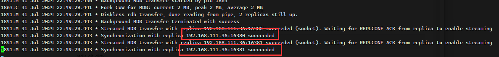

官网地址：[https://redis.io/docs/latest/operate/oss_and_stack/management/replication/](https://redis.io/docs/latest/operate/oss_and_stack/management/replication/)

作用：读写分离、冗杂恢复（RDB、AOF）、数据备份、水平扩容支持高并发

### 实操：

配置从库、不配主库

基础命令：

**info replication** ：可以查看复制结点的主从关系和配置信息

**replicaof 主库IP 主库端口** ：一般写入进Redis.conf配置文件内，重启后依然生效

**slaveof 主库IP 主库端口** ：每次与master断开之后，都需要重新连接，除非你配置进了redis.conf文件；在运行期间修改slave节点的信息，如果该数据库已经是某个主数据库的从数据库，那么会停止和原主数据库的同步关系 转而和新的主数据库同步，重新拜码头转而和新的主数据库同步，重新拜码头

**slaveof no one** ：使当前数据库停止与其他数据库的同步，转成主数据库，自立为王

目录环境 

```sh
./cluster
├── a-redis-16379
├── b-redis-16380
└── c-redis-16381
```

相关的配置文件：

```sh
port 16379
dbfilename dump-192.168.58.10-16379.rdb
dir /root/soft/cluster/data
appendfilename "192.168.58.10-16379-appendonly.aof"
pidfile /var/run/redis_16379.pid

port 16380
dbfilename dump-192.168.58.10-16380.rdb
dir /root/soft/cluster/data
appendfilename "192.168.58.10-16380-appendonly.aof"
pidfile /var/run/redis_16380.pid

port 16381
dbfilename dump-192.168.58.10-16381.rdb
dir /root/soft/cluster/data
appendfilename "192.168.58.10-16381-appendonly.aof"
pidfile /var/run/redis_16381.pid
```

基础的集群启动命令

```sh
/root/soft/cluster/a-redis-16379/src/redis-server /root/soft/cluster/a-redis-16379/redis.conf
/root/soft/cluster/b-redis-16380/src/redis-server /root/soft/cluster/b-redis-16380/redis.conf
/root/soft/cluster/c-redis-16381/src/redis-server /root/soft/cluster/c-redis-16381/redis.conf
```


一次性杀掉所有进程

```sh
#!/bin/bash

if [ $# -eq 0 ]; then
    echo "Usage: $0 <process_name>"
    exit 1
fi

process_name=$1

# 获取当前脚本的 PID
current_pid=$$

# 查找包含指定进程名的进程，排除掉当前脚本的进程
processes=$(ps -ef | grep "$process_name" | grep -v grep | grep -v "$current_pid")

if [ -z "$processes" ]; then
    echo "No processes found for: $process_name"
    exit 1
fi

# 显示找到的进程列表
echo "Processes found:"
echo "$processes"

# 提示用户确认是否杀掉进程
read -p "Do you want to kill these processes? (y/n): " answer

if [ "$answer" == "y" ]; then
    # 使用循环逐个杀死进程
    echo "$processes" | while read -r line; do
        pid=$(echo "$line" | awk '{print $2}')
        echo "Killing process $pid..."
        kill -9 "$pid"
    done
    echo "Processes killed."
else
    echo "No processes killed."
fi

exit 0
```


##  主从配置详细介绍

> 第一遍参考 Home 虚拟机 192.168.111.36:/root/bin/README

建议从原始文件开始修改 （主节点配置文件）

1. 开启后台启动 `daemonize yes`
2. 注释掉 `bind 127.0.0.1` 解除白名单模式
3. 关闭保护模式 `protected-mode no` 
4. 端口 `port 6379`
5. 指定工作目录 `dir /root/soft/redis/cluster/data`
6. 指定 pid 文件名 `pidfile /var/run/redis_16379.pid`
7. 日志级别及日志文件名 `loglevel notice` (还有其他几个，在配置文件里有介绍)， `logfile /root/soft/redis/cluster/logs/16379.log`
8. 设置redis密码 `requirepass 123456`
9. dump文件名 `dbfilename dump-192.168.111.36-16379.rdb`
10. 开启 AOF 并配置 aof 文件 `appendonly yes`  `appendfilename "192.168.111.36-16379-appendonly.aof"` 可选、非必须
10. 主机也可以配置 `masterauth "123456"`  便于后续哨兵把主变从了

开始配置从机地址

1. 指定主节点 `replicaof 192.168.111.36 16379`
2. 指定主节点密码 `masterauth "123456"`


分别启动所有主、从节点，查看日志，挂载成功




### 相关问题

1. 从机只可以读取，不能写入
2. 中途掉队的子节点，重启后，全量加载主节点数据
3. 主机down后，从机傻傻等着，主机上线后，依旧是 master 状态，主从关系依旧保持。


指定主节点：`slaveof 192.168.111.36 16380` 可以串联起来，但是指定的节点依旧没有

将自己节点设置为 master 节点，后续其他节点可以通过 `slaveof` 指向自己使得改变整体结构


#### 主从复制的原理以及工作流程？

1. slave 启动：slave 启动成功连接到 master 后会发送 sync命令，一次性将 master数据覆盖掉自身 slave
2. master 节点收到 sync 后会立刻触发RDB持久化，发送给 slave 
3. 心跳保持，通过 repl-ping-replica-period 10 配置心跳间隔
4. master 将新收集到的数据增量发给 slave
5. slave 下线后，重新上线，会追上 master 的所有数据，原理根据 backlog 中的 offset 定位需要跟进的跨度。断点续传。


#### 主从复制的缺点？

复制延时，信号衰减，睡着深度与宽度的增加，衰减会越来越

