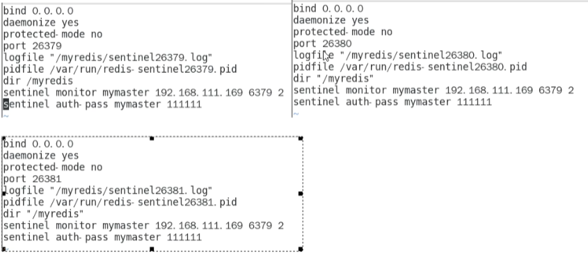
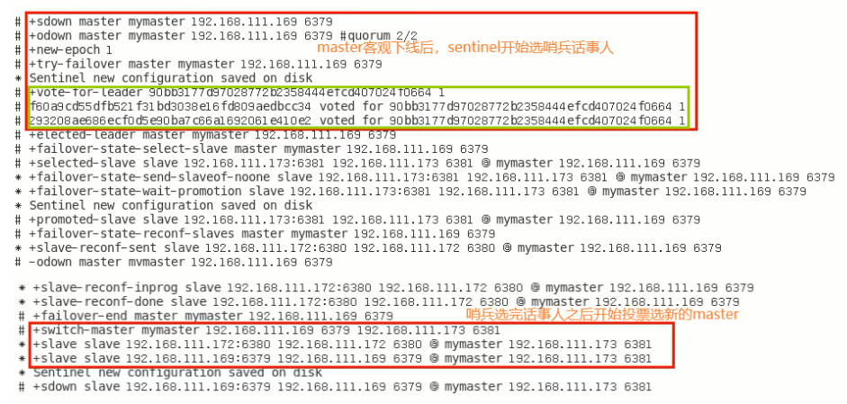

## 哨兵

巡查后台 master 主机是否故障，如果故障了，根据投票数，选举新的 master，一般哨兵配3台集群。

官网的介绍说：哨兵和集群是两个不同的概念

作用：

1. 主从监控：检查主从 redis是否运行正常
2. 消息通知：哨兵可以将故障转移的结果发给客户端
3. 故障转移，如果 Master 故障，会重新选举
4. 配置中心，客户端通过连接哨兵获取当前 redis 服务的主节点地址


### 模拟哨兵集群

设置哨兵监控的服务 `sentinel monitor <master-name> <ip> <redis-port> <quorum>` 

quorum 客观下线最少的哨兵数量，sentinel 相互沟通，保证公平性。

```
sentinel monitor a 192.168.111.36 16379 2
```


设置哨兵连接密码 `sentinel auth-pass <master-name> <password>`

```
sentinel auth-pass a 123456
```


主观判定，指定多少毫秒，主节点挂了，哨兵判定主节点下线 `sentinel down-after-milliseconds <master-name> <milliseconds>`


允许并行同步的 slave 个数，master 挂了之后，哨兵会选出新的 master，剩余的 slave 会向 master 发起数据同步 `sentinel parallel-syncs <master-name> <numreplicas>`


故障转移时，超过设置毫秒，判定故障转移失败 `sentinel failover-timeout <master-name> <milliseconds>`


配置当某一件事发生时所需要执行的脚本 `sentinel notification-script <master-name> <script-path>`


客户端重新配置主节点参数脚本 `sentinel client-reconfig-script <master-name> <script-path>`


### 哨兵配置文件

```conf
bind 0.0.0.0
daemonize yes
protected-mode no
port 26381
logfile "/root/soft/redis/cluster/logs/26381.log"
pidfile /var/run/redis-sentinel-26381.pid
dir /root/soft/redis/cluster/data
sentinel monitor a 192.168.111.36 16379 2
sentinel auth-pass a 123456
```


对照一下 




### 启动过程

1. 先启动 1主2从服务
2. 启动哨兵

```sh
/root/soft/redis/cluster/a-redis-16379/src/redis-sentinel /root/soft/redis/cluster/config/sentinel-26379.conf --sentinel
/root/soft/redis/cluster/b-redis-16380/src/redis-sentinel /root/soft/redis/cluster/config/sentinel-26380.conf --sentinel
/root/soft/redis/cluster/c-redis-16381/src/redis-sentinel /root/soft/redis/cluster/config/sentinel-26381.conf --sentinel
```


#### 为什么能自动主从替换？

有哨兵之后，哨兵会修改 redis.conf　配置文件，　Master-Slave 切换后，master_redis.conf 和 slave_redis.conf 和 sentinel.conf 的内容都会发生改变，即 master_redis.conf 中会多出一行 slaveof 配置。


#### 哨兵的运行流程和选举原理？

流程：当一个主从配置的 master 失效后，sentinel 可以选举出一个新的 master，用于自动替换原来 master 工作，主从配置中的其他 redis 服务自动指向新的 master 同步数据。一般建议 sentinel 采取奇数集群数，防止某一台 sentinel 无法连接到 master 导致误切换。


SDown主观下线(Subjectively Down)

1. SDOWN（主观不可用）是**单个sentinel自己主观上**检测到的关于master的状态，从sentinel的角度来看，如果发送了PING心跳后，在一定时间内没有收到合法的回复，就达到了SDOWN的条件。
2. sentinel配置文件中的down-after-milliseconds设置了判断主观下线的时间长度


ODown客观下线(Objectively Down)

1. ODOWN需要一定数量的sentinel，多个哨兵达成一致意见才能认为一个master客观上已经宕机


sentinel 中也要选出一个 leader，并不是所有 sentinel 去操作主从切换，所以被选出来的 leader 会被派往操作 redis 的主从切换。



Raft 算法：基本思路先到先得


#### Master选举原理

1. 查看 redis.conf 配置文件，根据 `replica-priority` 去选举（数字越小优先级越高）
2. 对比偏移量 offset 最大节点，最小代价保证数据完整
3. 最小的 RUNID，对比 ASCII 码

选举出了一个新的 master，被选中的节点，通过执行 slaveof no one 变成一个独立节点，并通过 slaveof 命令让其他节点称为该节点的 slave。（这里是 sentinel leader）来操作这个事情。

原本下线的 master 重新上线后，会被降级为 slave

上述HA操作，完全由 sentinel 独立完成，无需人工介入。


## 哨兵的一些建议

1. 哨兵节点应该大于3个，且为奇数集群
2. 各个哨兵配置应该一致
3. 人工哨兵节点部署在 docker 容器里面，应该注意端口正确映射。
4. 哨兵+主从复制，并不能保证数据零丢失。


