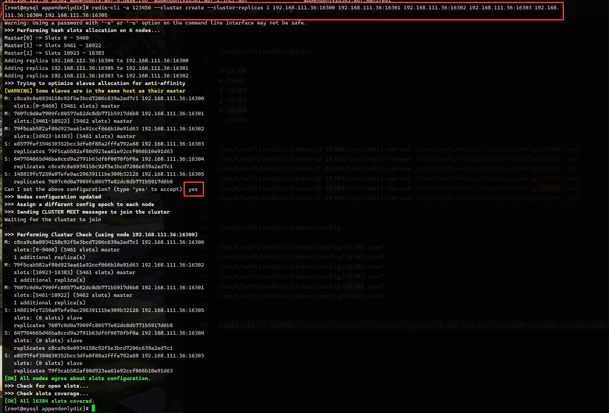
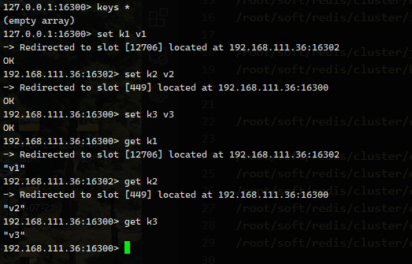

# Redis集群


哨兵+主从复制的缺点：在 master 宕机之后，会有一段时间无法写入，而且主从模式最大的缺点就是只有1台主节点。

此时引入 redis 集群，提供在多个Redis节点间共享数据的程序集，Redis集群可以支持**多个master**


- Redis集群支持多个master，每个master又可以挂载多个slave
  1. 读写分离
  2. 支持数据的高可用
  3. 支持海量数据的读写存储操作
- 由于Cluster自带Sentinel的故障转移机制，内置了高可用的支持，无需再去使用哨兵功能
- 客户端与Redis的节点连接，不再需要连接集群中所有的节点，只需要任意连接集群中的一个可用节点即可
- 槽位槽位slot负责分配到各个物理服务节点，由对应的集群来负责维护节点、插槽和数据之间的关系


### 分片与槽位

官方原话：集群数量小于1000，槽位数量小于 `16384`。每个集群节点负责一部分槽位。根据 `CRC16` 算法根据写入的 Key 分配到对应的槽位、节点。

优势是什么？

最大优势，方便扩容与缩容，以及数据分派查找


#### 哈希取余分区（小厂）

优点：简单粗暴，直接有效，只需要预估好数据规划好节点，例如3台、8台、10台，就能保证一段时间的数据 支撑。使用Hash算法让固定的一部分请求落到同一台服务器上，这样每台服务器固定处理一部分请求 (并维护这些请求的信息)， 起到负载均衡+分而治之的作用。

缺点：原来规划好的节点，进行扩容或者缩容就比较麻烦了额，不管扩缩，每次数据变动导致节点有变动，映射关系需要重新进行计算，在服务器个数固定不变时没有问题，如果需要弹性扩容或故障停机的情况下，原来的取模公式就会发生变化: Hash(key)/3会 变成Hash(key) /?。此时地址经过取余运算的结果将发生很大变化，根据公式获取的服务器也会变得不可控。 某个redis机器宕机了，由于台数数量变化，会导致hash取余全部数据重新洗牌。


#### 一致性哈希算法分区(中厂)

1. 算法构建一致性哈希环
2. 服务器各IP节点映射在环上
3. key值落到服务器的规则由环位置决定

为了在节点数目发生改变时尽可能少的迁移数据

将所有的存储节点排列在收尾相接的Hash环上，每个key在计算Hash后会顺时针找到临近的存储节点存放。而当有节点加入或退出时仅影响该节点在Hash环上顺时针相邻的后续节点。

优点 ：加入和删除节点只影响哈希环中顺时针方向的相邻的节点，对其他节点无影响。（容错、扩展）

缺点 ：数据的分布和节点的位置有关，因为这些节点不是均匀的分布在哈希环上的，所以数据在进行存储时达不到均匀分布的效果。（数据倾斜）


#### 哈希槽分区（大厂）


##### 为什么最大槽位是 16384 个？

官方原话：正常的心跳数据包带有节点的完整配置，可以用幂等方式用旧的节点替换旧节点，以便更新旧的配置。 这意味着它们包含原始节点的插槽配置，该节点使用2k的空间和16k的插槽，但是会使用8k的空间（使用65k的插槽）。同时，由于其他设计折衷，Redis集群不太可能扩展到1000个以上的主节点。 因此16k处于正确的范围内，以确保每个主机具有足够的插槽，最多可容纳1000个矩阵，但数量足够少，可以轻松地将插槽配置作为原始位图传播。请注意，在小型群集中，位图将难以压缩，因为当N较小时，位图将设置的slot / N位占设置位的很大百分比。

1. 如果槽位过大，发送心跳信息消息头也会很大。假设是 65536 ，则消息头有 8kb，所以推荐用 16384

在消息头中最占空间的是myslots[CLUSTER_SLOTS/8]。当槽位为65536时，这块的大小是:65536÷8÷1024=8kb

在消息头中最占空间的是myslots[CLUSTER_SLOTS/8]。当槽位为16384时，这块的大小是:16384∶8∶1024=2kb

2. Redis 的集群主节点数量基本不可能超过个1000个

集群节点越多，心跳包的消息体内携带的数据越多。如果节点过1000个，也会导致网络拥堵。因此redis作者不建议redis cluster节点数量超过1000个。那么，对于节点数在1000以内的redis cluster集群，16384个槽位够用了。没有必要拓展到65536个。

3. 槽位越小，节点少的情况下，压缩比高，容易传输

Redis 槽位越小，节点少的情况下，压缩比高，容易传输 Redis主节点的配置信息中它所负责的哈希槽是通过一张bitmap的形式来保存的，在传输过程中会对bitmap进行压缩，但是如果bitmap的填充率slots /N很高的话(N表示节点数)， bitmap的压缩率就很低。如果节点数很少，而哈希槽数量很多的话，bitmap的压缩率就很低。


> Redis 集群不保证强一致性，舍弃了数据一致性，保证了 AP，也就是会有一部分数据会被抛弃。


## 3主3从配置

```conf
bind 0.0.0.0
daemonize yes
protected-mode no
port 6381
logfile "/myredis/cluster/cluster6381.log"
pidfile /myredis/cluster6381.pid
dir /myredis/cluster
dbfilename dump6381.rdb
appendonly yes
appendfilename "appendonly6381.aof"
requirepass 123456
masterauth 123456

# 集群打开
cluster-enabled yes
# 集群配置文件
cluster-config-file nodes-6381.conf
# 集群超时
cluster-node-timeout 5000
```


通过 redis-cli 命令为 6台机器构建集群关系

```sh
// 一定要注意，此处要修改自己的IP为真实IP
redis-cli -a 123456 --cluster create --cluster-replicas 1 192.168.111.175:6381 192.168.111.175:6382 192:168.111.172:6383 192.168.111.172:6384 192.168.111.174:6385 192.168.111.174:6386
```





创建完成后，需要使用 -c 命令连接 redis 集群，例如

```sh
redis-cli -a 123456 -c
```

如果不用 `-c`  redis 不会自动将 key 转移到对应槽位，只有正确才能写入，错误则无法写入。

查看某一个key 在哪个槽位 `cluster keyslot key` 返回一个数值，查看这个数值属于哪个槽位




### [主从容错切换](https://github.com/Romantic-Lei/Learning-in-practice/blob/master/Redis/10.Redis%E9%9B%86%E7%BE%A4(cluster)/6.%E4%B8%BB%E4%BB%8E%E5%AE%B9%E9%94%99%E5%88%87%E6%8D%A2%E8%BF%81%E7%A7%BB.md#%E4%B8%BB%E4%BB%8E%E5%AE%B9%E9%94%99%E5%88%87%E6%8D%A2%E8%BF%81%E7%A7%BB)

主节点挂掉之后，原主节点下的 slave 会立刻上位，成为 master，旧主回归后，会以 slave 形式回归。


### 节点从属调整

在主从容错后，原主节点上位以 slave 回归，如果强制回归成 master ，在希望变成 master 的节点上 redlis-cli 执行 `cluster failover` 

查看主从状态 `cluster nodes`

## 主从扩容

按之前创建 cluster 节点配置一致，然后执行

```sh
redis-cli -a 123456 --cluster add-node 192.168.111.174:6387 192.168.111.175:6381
```

检查集群情况

```sh
redis-cli -a 123456 --cluster check 192.168.111.175:6381
```

重新分配槽位 `reshard`

```sh
redis-cli -a 123456 --cluster reshard 192.168.111.175:6381
# 因为是3台，分一个槽位给第四个节点，所 以第一个参数是 4096

```

第二次检查集群情况

```sh
redis-cli -a 123456 --cluster check 192.168.111.175:6381
```

为刚才创建的主节点添加从属

```sh
redis-cli -a 111111 --cluster add-node 192.168.111.174:6388 192.168.111.174:6387 --cluster-slave --cluster-master-id 4feb6a7ee0ed2b39f86474cf4189ab2a554a40f
# 这个是 192.168.111.174:6387 编号
```

第三次检查集群情况

```sh
redis-cli --cluster check 192.168.111.175:6381
```


### 主从缩容

查看集群情况

```sh
redis-cli -a 123456 --cluster check 192.168.111.174:6388
```

删除这个节点

```sh
redis-cli -a 123456 --cluster del-node 192.168.111.174:6388 218e7b8b4f81be54ff173e4776b4f4faaf7c13da
```

重新分配 槽位

```sh
redis-cli -a 123456 --cluster reshard 192.168.111.175:6381
```

检查一遍集群情况，就可以删除主节点了

```sh
redis-cli -a 123456 --cluster del-node 192.168.111.174:6387 307a5f6617a6eeb4949f3cb9124ed04c6962c348
```


## 集群操作和CRC161

不在同一个槽位下的键值，无法使用 mset、mget 等多键操作，可以通过 `{}` 打包 `mset  k1{z} z1 k2{z} z2 k3{z} z3`

底层源码 cluster.c 有一个 keyHashSlot 方法，根据 `{}` 判断，如果没有，直接就 crc16 计算


## 配置


集群不完整是否继续提供服务配置项：`cluster-require-full-coverage yes` 默认为 yes 表示，主节点挂了，就不提供服务，设置为 no ，表示即使挂了几个，活着的依旧继续服务。


判断槽位 12306 是否被占用 `CLUSTER COUNTKEYSINSLOT 12306` ， 大致是判断这个槽位上有没有 key，1表示被占用，0表示没有占用

查看某一个键应该存放在哪个槽位上 `cluster keyslot key` 

查看集群信息 `cluster nodes`

