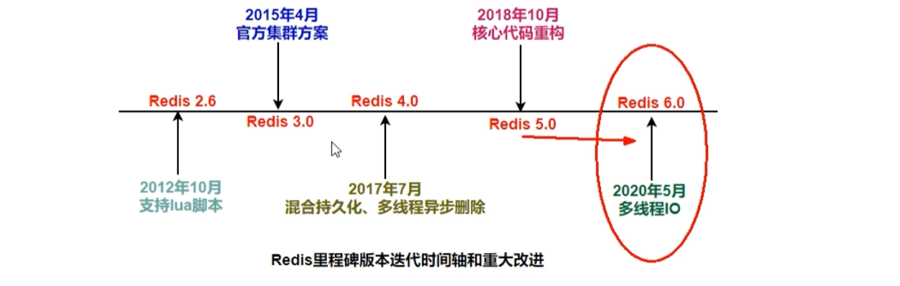
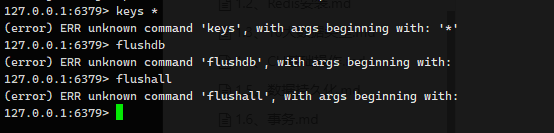
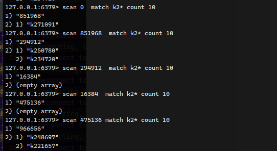
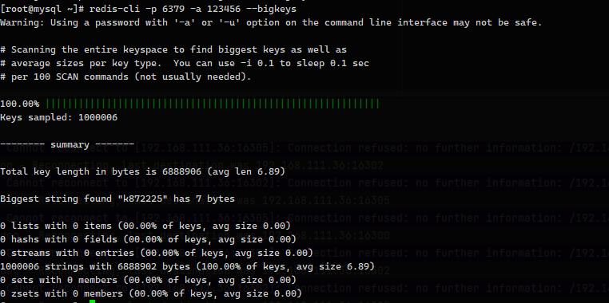
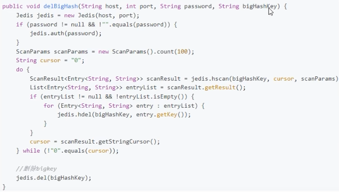
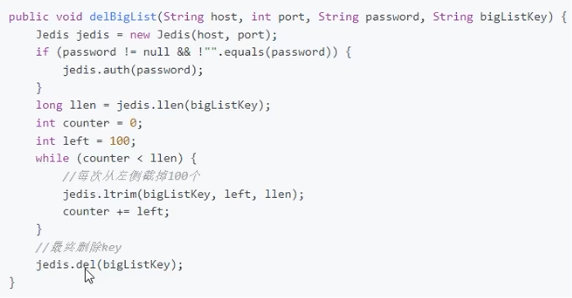
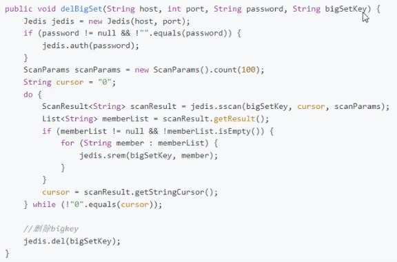
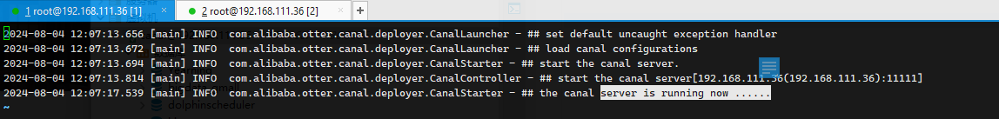
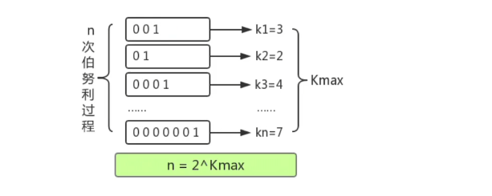

#  Redis高阶面试题


### Redis是多线程还是单线程？

严谨回答：Redis有很多版本，Redis4之后才慢慢支持多线程，直到 Redis6、7之后才趋于稳定。

严格意义来讲，4.x 版本也不能说是单线程，而是负责处理客户端请求的线程是单线程，但是开始加了多线程的东西（异步删除）

2020年5月 Redis6.x版本发布，以及 2022年 7.x版本，彻底告别了大家印象中的单线程，用一种全新多线程解决问题。




Redis 整体是多线程的，但是执行十大类型的操作是单线程的

引进新问题：为什么在3.x以前还那么快的主要原因 （单线程的好处）

1. 基于内存操作
2. 数据结构简单，这些简单的数据结构查询和操作大部分都的时间复杂度都是 O(1) ，K-V键值对
3. **多路复用和非阻塞IO**：Redis使用I/O多路复用监听多个Socker连接客户端，使用一个线程连接来处理多个请求，减少切换线程带来的开销，同时也避免I/O阻塞
4. 避免上下文切换，**没有多线程竞争和加锁解锁带来的资源消耗**。


### BigKey问题

当`删除`的对象是一个包含了成千上万个元素的hash集合时，那么单线程的指令会使得 Redis 主线程卡顿，同时影响所有客户端对Redis的使用体验。所以这个问题是 Redis3.x 时代最经典的问题。

在 4.x 版本，就新增了多线程模块，这个线程就是单独去解决删除数据效率较低的问题。

```sh
unlink key
flushdb async
flushall async
# 把删除工作交给后台小弟处理
```


### Redis的I/O多路复用

Redis的性能瓶颈不大可能是 CPU，而是内存、网络。至于内存这个是个硬件的东西没什么操控性。所以做好网络层面优化，是 Redis提升性能的抓手。

四个阶段

1. 服务端和客户端建立 Socket 连接，并分配处理线程

主线程接收请求后，建立连接，并将连接放入全局队列中进行等待，主线程通过轮询方式分配IO线程

2. IO线程读取并解析请求

Socket分配给IO之后就会阻塞，等待IO线程完成客户端请求和解析，这里我认为有多个 生产者往队列写内容，因为消费者速度太快了

3. 主线程执行请求操作

消费者在队列里拿到 socket 请求，以单线程的形式执行这些命令

4. IO线程回写socket主线程清空全局队列

消费者会消费完所有队列，然后等待后续生产者的请求。


### Redis7.x默认关闭多线程，优化步骤

Redis7.x 将所有数据存放在内存中，内存下响应大约在100纳秒，对于小数据包，Redis服务器可以处理到 8W-10W 的 QPS，相对于大多数公司足够用了。

在 Redis6.0、7.x 多线程机制默认关闭的，如果需要多线程功能，修改如下配置

```conf
# 搜索 THREADED I/O

# So for instance if you have a four cores boxes, try to use 2 or 3 I/O
# threads, if you have a 8 cores, try to use 6 threads. In order to
# enable I/O threads use the following configuration directive:
io-threads 4

# 修改为 yes
io-threads-do-reads yes
```

> 在实际工作中，遇到CPU开销不大，但吞吐量没有提升的情况下，可以修改如上配置。


在 Redis6/7 引入的I/O多线程的读写，至少将 I/O 读写变成了多线程，而命令的执行依旧是主线程串行执行的，因此多线程操作 Redis不会出现线程安全问题。


### Redis为什么这么快

如果你只回答到 Redis基于内存读写，内存比磁盘快 就这么一个方面。我认为你的 Redis仅仅停留在入门或应用级别。

完整的回答应该是：（2024-08-04）

Redis这么快的原因有如下方面

1. Redis基于内存，所有数据都是存放在内存中的，内存下的响应大约在100纳秒所有，对于小数据包，Redis服务器可以处理8W-10W的QPS
2. Redis这种简单的数据结构使查询和操作大部分都的时间复杂度都是 O(1)
3. **多路复用和非阻塞I/O**，一个线程连接来处理多个请求，减少切换线程带来的开销，同时也避免I/O阻塞
4. Redis执行命令的主线程（操作十大类数据）是串行单线程的，没有上下文切换和加减锁带来的开销。

如上原因使得 Redis在4.x版本之前就具有非常高的读写性能

在 2020年5月 Redis6.x版本发布，以及 2022年 7.x版本，也逐渐引入多线程机制，这使得Redis性能进一步增强，便于处理BigKey等问题。这也是很多高级工程师在Redis性能优化配置的步骤之一，默认6.x和7.x版本的Redis没有开启多线程机制。这里说归说是多线程，其实只是将I/O读写变成了多线程，而命令的执行依旧是主线程串行执行的。不会存在线程安全问题。

在Redis官方文档里，多个版本都在强调同一句话，Redis瓶颈不在CPU，而是内存和网络IO，内存是硬件资源，那是运维管的事情，而我们处理的就是网络I/O，上面提及的 **多路复用** 相关概念。在实际环境中，如果遇到CPU开销不大，但吞吐量没有提升的情况下，可以修改 Redis配置文件，用到 Redis在网络层面这一块的多线程资源。


1. 海量数据里查询某个固定前缀的key
2. 如何生产上限制 `keys *` `flushdb ` `flushall `这种危险命令
3. memory usage 命令用过吗？
4. BigKey问题，多大算Big，你如何发现，如何删除，如何处理
5. BigKey做过调优吗？惰性释放lazyfree了解过吗？
6. Morekey问题，生产上Redis数据库有 1000W记录，你如何遍历? `keys *` 可以吗


### BigKey100W记录案例和生产故障


```sh
for((i=1;i<100*10000;i++)); do echo "set k$i v$i" >> /root/soft/redis/cluster/data/redis100W.txt ;done;

for((i=1;i<100*10000;i++)); do echo "set k$i v$i" >> /root/soft/redis-7.4-rc2/data/redis100W.txt ;done;
```

生成一个 100w数据的文件，通过 redis提供管道 --pipe 插入100w大批量数据

```sh
cat /root/soft/redis/cluster/data/redis100W.txt | redis-cli -p 6379 -a 123456 --pipe

cat /root/soft/redis-7.4-rc2/data/redis100W.txt | redis-cli -p 6379 -a 123456 --pipe
```

dbsize 查看数据量

禁用` keys *`、`flushdb`、`flushall `这类命令，配置文件中搜索 `SECURITY`

```conf
rename-command keys ""
rename-command flushdb ""
rename-command flushall ""
```




#### 不用`Keys *`，用什么呢？

```
scan
sscan
hscan
zscan
```

语法：`scan cursor [MATCH pattern] [COUNT count] `

count 默认10条 




#### 多大算Big

Redis原文：【强制】拒绝bigkey 防止网卡流量、慢查询

String类型控制在**10Kb**内，理论最大512M，hash、list、zset、set元素个数不超过 **5000**，理论最大40亿

非字符串的bigkey **不能使用 del 删除**，使用 hscan、sscan、zscan 渐进删除，同时要注意防止 bigkey 过期自动删除问题。

#### BigKey那些危害

1. 内存不均、集群迁移困难
2. 删除超时，网络流量阻塞

#### bigKey如何产生的

1. 社交类，突然的峰值，评论、点赞、用户数激增这类情况
2. 报表数据，年月日累计起来的

#### 如何排查

第一种：--bigkeys

第二种：memory usage


```
redis-cli -p 6379 -a 123456 --bigkeys
```

+ -i 0.1 , 每扫描 100个就停0.1秒



只能统计小于 10Kb 的所有key，如上图， string类型，最大的也就是 6.89字节，离10kb差得远了。


memory usage 统计具体一个key占字节大小

```sh
127.0.0.1:6379> memory usage k10000
(integer) 64
```


#### 怎么删除

zset、set、hash 等，需要渐进式删除

1. String类型，一般直接删，保险的话用 unlink

2. hash类型，hscan 每次获取少量 filed-value，在使用 hdel 删除每个 field

   

3. list类型，也是渐进式，让列表区间之外的数据，全部删除，最后删除整个 key

   

4. set、zset 大致差不多

   

   

#### 调优，lazy freeing

Redis 内部提供了阻塞与非阻塞命令，`flushdb async` 这种。

改这三个就可以了。

```conf
lazyfree-lazy-server-del yes
replica-lazy-flush yes

lazyfree-lazy-user-del yes
```


### 缓存双写一致性更新策略

1. 只读缓存
2. 读写缓存
	1. 同步直写策略：MySQL修改后，立刻同步到 Redis一份，保证数据一致
	2. 异步缓写策略：mysql修改后，业务允许一段时间后起作用，
		1. 异常情况到出现，不得不做些其他操作。

代码案例：[redis-module-study-yun](https://github.com/YuncenLiu/redis-module-study-yun/blob/master/springboot-jedis-redis7/src/main/java/com/liuyuncen/service/impl/UserServiceImpl.java)


判定是否可以停机的情况，如下是不停机会有如下问题：

1. 先更新数据库，再更新缓存：1、存在脏数据，2、可能存在覆盖更新（数据不一致）

2. 先更新缓存，再更新数据库：1、不太推荐，业务一般以MySQL为底单。2、覆盖更新

3. 先删除缓存，再更新数据库：1、覆盖顺序错误导致脏数据

	采用延双删策略，悲观的认为一定会有线程修改了我的数据，先删一遍缓存，修改完数据，再删一遍缓存，保证最终数据一致性。

	1. 删除休眠多久？自行评估项目在读数据和写数据的耗时，以此评估，休眠时间则是读数据的耗时+百毫秒即可，目的就是保证读请求结束后，写请求可以删除读请求造成的缓存脏数据（避免删完了，还有请求过来覆盖写）
		1. 将第二次删除设置为异步，自己起一个现场，异步删除。写请求不用沉睡了，这么做会加大吞吐量
	
	2. 吞吐量降低了怎么办？

4. 先更新数据库，再删除缓存：（主流）

   异常问题，缓存删除不及时（更新数据库不及时），只是影响数据旧值。

   如果我们反方向操作，如果先删缓存，容易导致请求打到MySQL，导致MySQL压力增高，延迟双删策略的等待删除时间不好估算，太短和太长都有弊端。只有先更新数据库，再删缓存才能较高质量保证数据一致性。


一般都是MQ兜底的

| 策略                   | 高并发 | 问题                             | 现象     | 解决方案              |
| ---------------------- | ------ | -------------------------------- | -------- | --------------------- |
| 先删Redis，再更新MySQL | 无     | 缓存删除成功但数据库更新失败     | 脏数据   | 再次更新数据库        |
|                        | 有     | 缓存删除成功但数据库更新有并发   | 覆盖更新 | 延迟双删              |
| 先更MySQL，再删Redis   | 无     | 数据库更新成功，但缓存删除失败   | 脏数据   | 再次删除缓存，重试    |
|                        | 有     | 数据库更新成功，但缓存删除有并发 | 覆盖更新 | redis删除前会有不一致 |


### canal MySQL解析日志

官方：[https://github.com/alibaba/canal](https://github.com/alibaba/canal)

以一个虚拟从节点的形式加入到MySQL集群，读取主MySQL的binlog日志。


#### 检查MySQL配置

```mysql
select version();
show master status;
show variables like 'log_bin'; -- 如果为 OFF，则开启
```

开启 binlog `vim /etc/my.cnf`

```
log-bin=mysql-bin
binlog_format=row
# 支持配置多个库
binlog-do-db=bigdata_gmall
binlog-do-db=mysql_canal
```


binlog_format 配置项

+ ROW 模式，除了记录SQL语句之外，还会记录每个字段的变化，能够清楚的记录每行数据的变化历史，会占用较多空间
+ STATEMENT 只记录SQL，但没有记录上下文信息，在进行数据恢复的时候，会导致数据丢失
+ MIX 灵活记录，理论上当遇到表结构变更的时候，会变成 statement模式，当遇到数据更新或者删除时候会变成 row模式


重启之后，通过 `show master status;`  查看主从库

创建 canal 用户，并赋权

```sql
flush privileges;


drop user if exists 'cannal'@'%';
create user 'canal'@'%' identified by 'canal';
grant all privileges on *.* TO 'canal'@'%' identified BY 'canal';
flush privileges;

-- 查询所有用户 
select * from mysql.user;
```


下载 canal 程序 [https://github.com/alibaba/canal/releases]( https://github.com/alibaba/canal/releases) 这里使用 `deployer` 后缀应用 这里用[canal.deployer-1.1.6.tar.gz](https://github.com/alibaba/canal/releases/download/canal-1.1.6/canal.deployer-1.1.6.tar.gz) 高版本配置好像不太行...

上传到 `/root/soft/canal`  并解压


修改配置文件 `/root/soft/canal/conf/example/instance.properties`

```
# position info
canal.instance.master.address=192.168.111.36:3306

# username/password
canal.instance.dbUsername=canal
canal.instance.dbPassword=canal
```


一些配置信息

```conf
# table regex 匹配的表
canal.instance.filter.regex=.*\\..*

# table black regex 黑名单表
canal.instance.filter.black.regex=mysql\\.slave_.*
```


启动 `/root/soft/canal/bin/startup.sh`

查看 server 日志 `/root/soft/canal/logs/canal/canal.log`



表示启动成功

创建表、插入数据

```sql
create table t_user(
id int not null auto_increment primary key,
name varchar(100) 
);

insert into t_user(name) values('张三');
```


### 亿级系统四种常见统计方式

#### 1、聚合统计

统计多个集合之间的结果，运算（交集、并集、差集）猜你喜欢、推广社交场景使用。

#### 2、排序统计

实时性质

思路：zset 实现抖音评论列表，时间戳+点赞数+底部评论数。 十位数的时间戳/8个0，变成2位数，没多一个点赞分值+20，多一个评论分值+15，倒叙排列分值。

#### 3、二值统计

集合取值，使用 bitmap

#### 4、基数统计

统计一个元素中不重复的个数，使用 hyperloglog


#### hyperloglog

`UV` 独立访客，需要考虑去重

`PV` 页面浏览器，不用去重

`DAU`  日活，登录或者使用了某个产品的用户（去除重复登录）

`MAU` 月活，月活跃用户


只存储不重复元素的个数，对集合去重后剩余元素的计算

```sh
127.0.0.1:6379> pfadd hell 1 3 4 5 6 9
1
127.0.0.1:6379> pfadd hell 2 4 4 4 7 9
1
127.0.0.1:6379> pfcount hell
8
127.0.0.1:6379> pfadd hell2 1 2
1
127.0.0.1:6379> pfmerge disResult hell hell2
OK
127.0.0.1:6379> pfcount disResult
8
```


牺牲准确率来换取空间，误差是 0.81%


#### 亿级UV统计 HyperLogLog 


原理：

HyperLogLog 就是用来做奇数统计的，只需要花费 12KB内存，就可以计算 2^64 个不同元素的基数，元素越多，节省内存越大。

传统统计基数方式，使用 Set、HashSet，当数据进来判断是否存在，如果存在，基数S不变，如果不存在基数S+1，传统方案虽然精确，会导致空间复杂度较高


伯努利过程：HyperLogLog 通过Hash转换成二进制序列，低位数作为桶编号 H，存放高位数据 W。W中都是二进制数，如果第一位是1，则这个数为1，第n个数为1，则记为n。



这是一个概率性质的问题，当桶号相同的时，W 进入桶内，得到k值，也就是1在第几位，如果这个k值，刷新了这个桶内的最大数值，则k就替换桶成为这个桶的MaxK，最终我们可以通过概率学运算，计算多少种可能会出现这种 k 值的情况。

打个具体的比方，00001 这个值，为当前 MaxK，当我们随机生产 10000次，才有可能出现1次， 00001 这个值，则我们认为，我们统计了 10000个值，也就是10000个基数。

当然，我们可以使用成千上万个桶，去降低这个误差。最终通过一个常量方法计算得出结果。

在 Redis 的HyperLogLog，以12Kb去计算 2^64 个不同元素基数，就是这样估算得来的，但实际误差只有 0.81%


[HyperLogLog 代码案例](https://github.com/YuncenLiu/redis-module-study-yun/blob/master/springboot-jedis-redis7/src/main/java/com/liuyuncen/service/HyperLogLogService.java)


### LBS应用，获取附近用户信息

[百度拾取坐标系统](http://api.map.baidu.com/lbsapi/getpoint/)

[GEO 代码案例](https://github.com/YuncenLiu/redis-module-study-yun/blob/master/springboot-jedis-redis7/src/main/java/com/liuyuncen/service/GeoService.java)


### 布隆过滤器


### 预热、雪崩、穿透、击穿分别是什么

1. 预热：MySQL数据需要初始化到 Redis 数据库中
2. 雪崩：Redis挂掉，导致MySQL挂掉
3. 穿透：
4. 击穿：热点key失效，暴打MySQL，互斥更新、随机退避、差异失效时间。
   1. 对于访问频繁的key，不设置失效时间
   2. 互斥更新，双检加锁（也支持穿透）


| 缓存问题     | 产生原因               | 解决方案                                   |
| ------------ | ---------------------- | ------------------------------------------ |
| 缓存更新方式 | 数据变更，缓存时效性   | 同步更新、异步更新、失效更新、定时更新     |
| 缓存不一致   | 同步更新失败，异步更新 | 增加重试、补充人物、最终一致性             |
| 缓存穿透     | 恶意攻击               | 空对象缓存，bloomfilter过滤器（推荐guava） |
| 缓存击穿     | 热点key失效            | 互斥更新、随机避退、差异失效时间           |
| 缓存雪崩     | 缓存挂掉               | 快速熔断、主从模式、集群模式               |

