Redis 数据类型的底层数据结构

1. SDS 动态字符串
2. 双向链表
3. 压缩列表 ziplist
4. 哈希表 hashtable
5. 跳表 skiplist
6. 整数集合 intset
7. 快速列表 quicklist
8. 紧凑列表 listpack


目标 k-v 键值对领域专家。

### SDS 动态字符串

C语言原本是没有字符串一说，通过 数组拼接的字符串，Redis 自己搞了一套 SDS 字符串


```
====== redis 6 底层相关的模型和结构
String = SDS
Set = intset + hashtable
ZSet = skiplist + zipList
List = quickList + zipList 快速列表 + 压缩列表
Hash = hashtable + zipList

======= 2023年 ， Redis 7出版， 不再使用 zipList，但因为兼容问题保留

String = SDS （不变）
Set = intset + hashtable （不变）
ZSet = skiplist + listpack 
List = quickList 快速列表
Hash = hashtable + listpack
```

7.x版本后，listpack 紧凑列表 替换了zipList 压缩列表


以 `redis-7.4-rc2` 版本源码为例

每一个键值对都会有一个 dictEntry，以 set hello world 为例，因为 Redis 是 k-v 型数据库 `dict.h:45`  


next 指向下一个 dictEntry，key 是字符串，Redis 没有直接使用 C 的字符数组，而是存储在 Redis 自定义的 SDS 中，value 既不是直接作为字符串存储，也不是直接存储在 SDS 中，而是存储在 redisObject 中，实际上五种常用数据类型的任何一种，都是存储在 redisObject 中

redisObject  `server.h:898` 理解为承上启下对外暴露的高级接口 `外观设计模式` 


4位的type表示具体数据类型，encoding 表示该物理编码方式，同一种数据类型可能有不同编码方式，例如String就提供了三种 int、embstr、raw

```sh
192.168.58.10:6372> set int 1
OK
192.168.58.10:6372> set embstr embstr
OK
192.168.58.10:6372> object encoding int
int
192.168.58.10:6372> object encoding embstr
embstr
```

ptr 指向真实数据，


### Debug Key

`redis.conf`  配置 ` enable-debug-command local ` 即可调试 redis

```sh
127.0.0.1:6389> DEBUG object age
Value at:0x7f81db657650 refcount:2147483647 encoding:int serializedlength:2 lru:0 lru_seconds_idle:12524771
```

+ lru_seconds_idle 数字越大 越空闲
+ refcount 引用计数
+ encoding 具体数据结构


### String数据结构

三大物理编码方式

int 保存 long 类型，默认值 0，只有整数才会是这个类型，浮点数转化成字符串

embstr（嵌入式字符串），SDS 保存长度小于44字节字符串

raw 保存长度大于 44 字节字符串


### 为什么要存在SDS


源码文件中 `sds.h` ，sds 的类型

```c
    uint8_t len; /* used */
    uint8_t alloc; /* excluding the header and null terminator */
    unsigned char flags; /* 3 lsb of type, 5 unused bits */
    char buf[];
```

直接存储字符串长度，`len`  ，每次获取字段长度，时间复杂度 O(1)， 根据每次放入的数据不同，紧凑形的分配空间。尽量避免内存碎片

`buff` 实际存储数据

为了更加高效的分配内存，减少内存碎片、管理数据，所以重新设计 SDS动态字符串、内存重新分配、二进制安全。 `\0` 这是 C语言字符串中之符


### 1.String数据结构

Redis 只有整数才会使用int，如果是浮点数，Redis内部其实是先将浮点数转换为字符串，然后再保存

embstr 与 raw 类型底层都是 SDS 简单动态字符串

1. int 类型，long类型整形，如果小于10000，直接从共享内存里拿数据，类似于 Interger < 128 这个概念。
2. embstr ，字符串小于 44，分配一块连续内存空间，元数据与数据共用一块内存空间
3. raw 大于44字节时，元数据（RedisObject）与真实数据（SDS）分开，由元数据指针指向真实数据，占据两块内存


### 2.Hash数据结构

#### Redis6

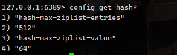

`hash-max-ziplist-entries` 使用压缩列表保存哈希集合最大元素个数

`hash-max-ziplist-value` 使用压缩列表保存哈希集合中单个元素最大长度

这两者任意一个不满足，使用 `OBJ_ENCODING_HT `编码格式，否则才使用 `OBJ_ENCODING_ZIPLIST `

> 可以通过 `config set hash-max-ziplist-value 10` 修改

原本是 ziplist，当元素修改变大时称为 hashtable 再变小也无法降级为 ziplist


hashtable -> dict 字典 -> dictht 哈希表 -> dictEntry 哈希节点（层层嵌套）

源码在 `t_hash.c`


ziplist：一种紧凑的编码，总体思想是多花时间来换取节省空间，以读写性能为代价，带来极高的空间利用率

由连续内存块组成的顺序型数据结构，类似数组，像是双向链表，但不存储 prev、next，仅仅存上一个节点长度和当前节点的长度。

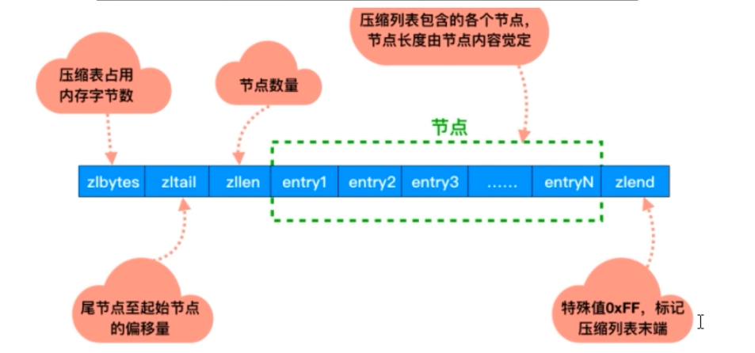

**只存储长度不存储地址值的目的** 记录起始和结束位置，无需遍历当前节点，即可立刻找到下一节点

内部的 entry 结构，类似于 Java HashMap 里面的 Node<K,V>


源码在 `ziplist.c`

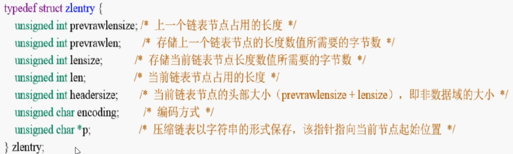

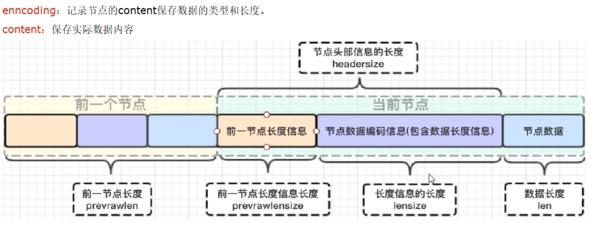

#### 为什么这么设计

为什么记录前节点编码长度？ enncoding 长度可以根据编码方式推断，真正变化的是 content，而 content长度记录在 encoding里面，因此 entry 长度就求出来了，

 entry = privious_entry_length 字节数 + encoding 字节数 + content 字节数

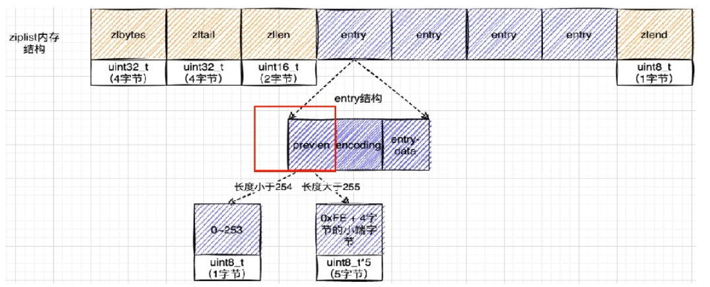

链表在内存中，不像数组是连续的，遍历相对变慢，而 ziplist 可以很好的解决这个问题。

已经有链表了，为什么还要整个压缩链表呢？

1. 普通的双向链表都有两个指针，在存储数据小的情况下，存储的实际数据可能还没有指针占用内存大，得不偿失。ziplist是特殊的双向链表，没有维护前后指针，而是通过记录长度，去推算下一个元素在什么位置，牺牲读取性能获取高效存储空间。经典的时间换空间
2. 链表在内存中一般是不连续的，遍历相对比较慢，而 ziplist 可以很好的解决， 通过存储在元数据中的长度，叠加跳到指定位置，总比挨个遍历其中的数据要强把。
3. 这里就要说到 SDS了，因为长度也是放在元数据头的，直接拿len值就可以了，时间复杂度 O(1)

ziplist 不能保存过多元素，否则查询效率就会降低，数据小内容小的情况下可以使用，所以这就是为什么在写入时候需要判断长度从而决定保存 ziplist 还是 hashtable


#### Redis7

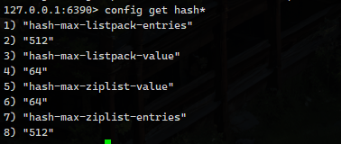

相对于 Redis6 来说，只是将 ziplist 替换为了 listpack，概念都差不多，就是把 ziplist 的连续删除问题解决了

在 Redis7 里,如果要修改这两个参数, 连带效果都会修改掉


ziplist 连锁更新问题, 第一个节点长度扩容了,后面所有节点中的 前节点长度,都要被扩容.

listpack 就是来解决整个问题的,不在记录前一个长度了..... 具体咋操作,还是没明白....


### 3.List数据结构

6.x 和 7.x 都是双向链表, 底层 quickList 结构,6,x 还是使用了 ziplist,7.x 就只有 quicklist 了

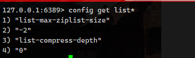


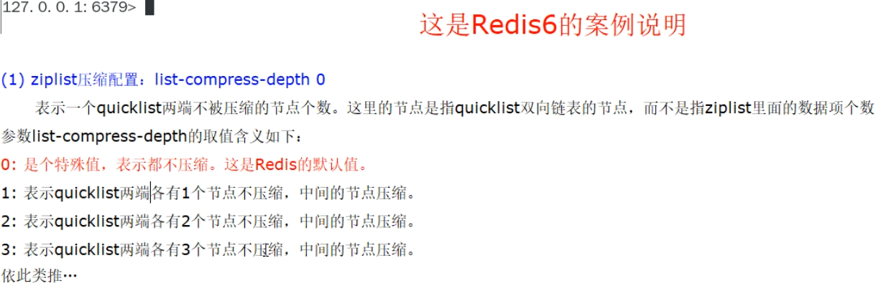

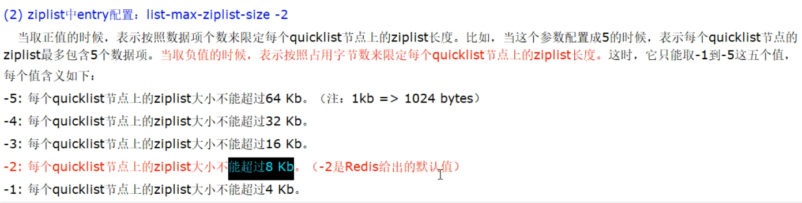


Redis7.x

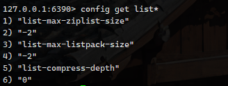


### 4.Set数据结构

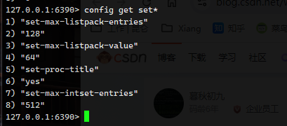

意思大差不差，小的时候是 intset、超过之后，就是 hashtable


#### 5.ZSet数据结构

redis6.x 就是 压缩列表+跳表、redis7.x 是紧凑列表+跳表

为什么引出跳表？

单链表的痛点是查询时效率低，时间复杂度 O(n)，以空间换时间的方式解决问题。

跳表特点：索引升级、两两取首，将一条链表，形成一个完整的倒叉树，创建索引，提升查询效率。

假设 64 个节点，两两取首，就需要五级索引，最大11步就能找到对用的值。

> 所谓跳表：链表 + 多级索引

跳表时间复杂度：O(log2n), 计算过程如下：

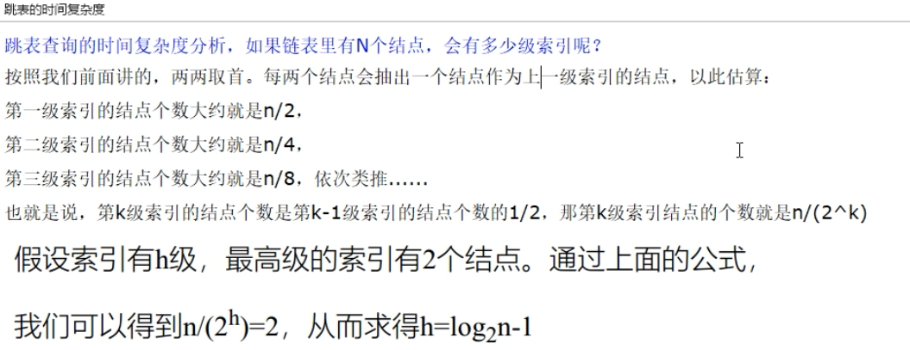


时间复杂度 O(n)


