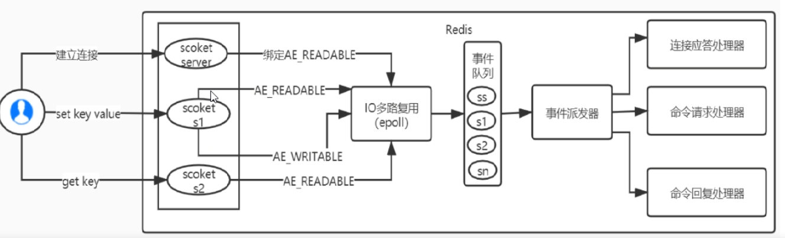

Redis 为什么被要求安装在 Linux 系统上。在 Windows上可以用，但是100%无法体现效果处理，和 Nginx 效果差不多。

epoll 和 IO 多路复用，这是　Ｌｉｎｕｘ　提供的，

实现了一个进程处理大量连接。Ｌｉｎｕｘ　可以分为　select > poll > epoll ，epoll 最强

将连接信息和事件放到队列中，一次放到文件事件分派器，然后分发给事件处理器

工作线程单线程，保证安全

多线程搞定IO网络连接

