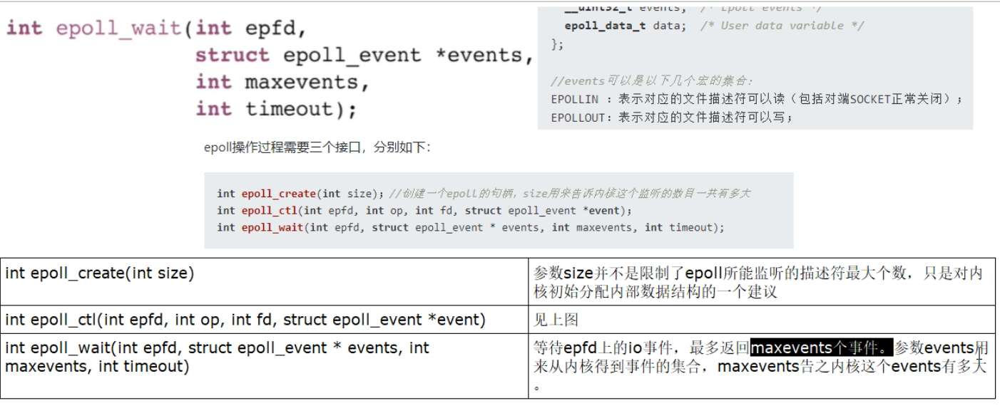

Blocking IO ，阻塞 IO

NoneBlocking IO，非阻塞 IO

IO multiplexing，IO多路复用

1. BIO 只能 一对一，只有当前客户端处理完成，走了，下一个客户端才能进来。
2. NIO 虽然是非阻塞的，但是连接多了，还是需要那么多的线程去处理，来一个就得掏一个线程给他，来多了受不了
3. IO 多路复用，Linux内核干这件事，大致就是一个线程监听多个请求，谁请求，处理谁，这是 epllo 函数干的事情，也叫驱动函数。

安装 man 库 `yum install man-pages`

查看 select 函数 `man select`

select 函数缺点

1. bitmap 默认大小 1024，虽然可以调整，但是又限度
2. rset 不可重用，每次 socket 有数据就相应的位会被置位
3. 文件描述符拷贝进了内存态，存在开销，select 调用需要传入 fd 数组，需要拷贝一份到内核态，高并发场景下这样的拷贝消耗很惊人的，可优化为不复制
4. select 并没有通知用户态哪一个 socket 有数据，仍旧需要遍历，优化为只返回给用户就绪的文件描述符即可，无需用户态做无效遍历

epoll 函数

