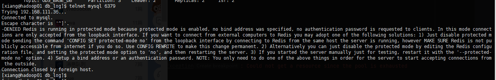
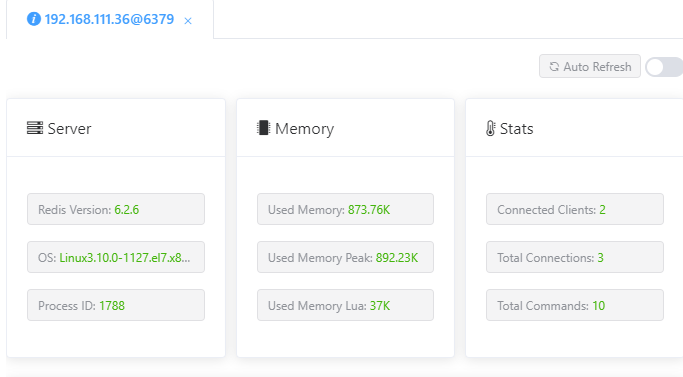

> 参考：https://blog.csdn.net/qq_41538097/article/details/118226758

#### 报错信息：

```sh
# 其他服务器ping Redis
telnet mysql 6379
```




```
-DENIED Redis is running in protected mode because protected mode is enabled, no bind address was specified, no authentication password is requested to clients. In this mode connections are only accepted from the loopback interface. If you want to connect from external computers to Redis you may adopt one of the following solutions: 1) Just disable protected mode sending the command 'CONFIG SET protected-mode no' from the loopback interface by connecting to Redis from the same host the server is running, however MAKE SURE Redis is not publicly accessible from internet if you do so. Use CONFIG REWRITE to make this change permanent. 2) Alternatively you can just disable the protected mode by editing the Redis configuration file, and setting the protected mode option to 'no', and then restarting the server. 3) If you started the server manually just for testing, restart it with the '--protected-mode no' option. 4) Setup a bind address or an authentication password. NOTE: You only need to do one of the above things in order for the server to start accepting connections from the outside.

Connection closed by foreign host.
```

翻译信息：

```
-DENIED Redis运行在保护模式因为启用了保护模式，没有指定绑定地址，没有向客户端请求身份验证密码。在这种模式下，只接受loopback接口的连接。如果你想从外部计算机连接到Redis，你可以采用以下解决方案之一:1)只需禁用保护模式，通过从服务器正在运行的同一主机连接到Redis，从环回接口发送命令` CONFIG SET protected-mode no `，但是如果你这样做，请确保Redis不是从互联网公开访问的。使用CONFIG REWRITE使此更改永久生效。2)或者您可以通过编辑Redis配置文件来禁用保护模式，并将保护模式选项设置为“no”，然后重新启动服务器。3)如果你手动启动服务器只是为了测试，用`——protected-mode no `选项重启它。4)设置绑定地址或身份验证密码。注意:你只需要做上面的事情之一，服务器就可以开始接受来自外部的连接。

连接被外部主机关闭。
```


修改参数 `redis.conf`

将 yes 改为 no

```properties
protected-mode no
```


#### 重启

```sh
 ./redis-server ../etc/redis.conf &
```



【完！】