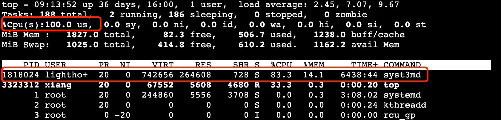
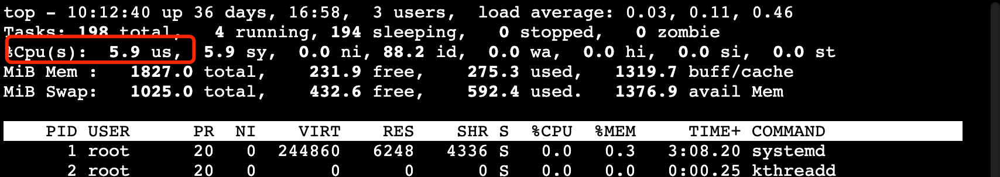
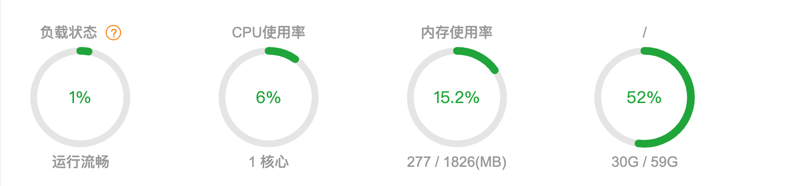

> 创建于 2021年11月17日
> 作者：想想

[toc]


## syst3md矿机病毒及解决办法

​		一大早起来，发现自己的服务器，cpu 100%，第一时间想到的就是服务器被肉机了，但我之前改过 ssh 登陆的端口哇，不应该这么容易被暴力`ssh`破解，先解决问题吧。


### 1、top 查看cpu占用情况



​		发现这个玩意儿叫 `syst3md` 百度发现，这玩意儿是个矿机病毒


​		距离上一次巡查有一个礼拜了，估计被这小子白白挖了我一个礼拜的矿，话不多说，直接解决

### 2、查看定时任务

用`root` 用户执行 `crontab -l`  查看死否存在定时任务，如果存在不认识的，统统删除 `crontab -r`

### 3、查看程序位置

通过 `top` 命令，我们可以知道这个 `syst3md` 的进程 PID 为 `1818024`  所以我们执行 `ls -l /proc/1818024/exe`

```sh
[root@Xiang ~]# ls -l /proc/1818024/exe
lrwxrwxrwx 1 lighthouse lighthouse 0 Nov 17 09:27 /proc/1818024/exe -> /tmp/.../syst3md
```

> 这个地方就很狡诈了，因为路径中带有 “..." 我原本以为这个文件 在 tmp 路径下的多层级文件夹内，用 find 命令在 tmp 下找半天，也还是 `/tmp/.../syst3md` 这个结果，原来，黑客在创建文件夹的时候，文件夹名就叫 `...`  

进入到程序路径，把这些文件都干掉

```sh
rm -rf /tmp/.../
```

### 4、杀进程

```sh
kill -9 1818024
```

执行完成后，立竿见影





### 5、扩展

当然，解决完问题，不能就此结束，我们需要反思一下，为何会发生这样的问题

1. 因为我们的服务器是直接暴露在公网情况下，任何一台服务器都可以通过互联网访问到这台主机，因此，对必要的端口进行限制访问，是明确之举，就拿SSH端口来说，吧自己的SSH端口设置为单个或多个IP访问，不要轻易设置为 `0.0.0.0` ，这样能从源头上解决大部分问题，一些有防范意识的中小企业，都不会把轻易把服务器暴露在公网下。除非他有非常强大的运维团队！
2. 通过top查看cpu访问情况，我们发现启动用户竟然是 `lighthouse` 用户，这个用户是买服务器后，Linux 系统自带的一个用户，不难想到，这个用户可能被某些黑客所破解，即使你更换了 SSH 端口，仍然可以破解你的服务器！所以对于自己用不到的用户，要第一时间删掉，不要给黑客留下可乘之机！


我是想想，我坚信越努力、越幸运，感谢关注！

