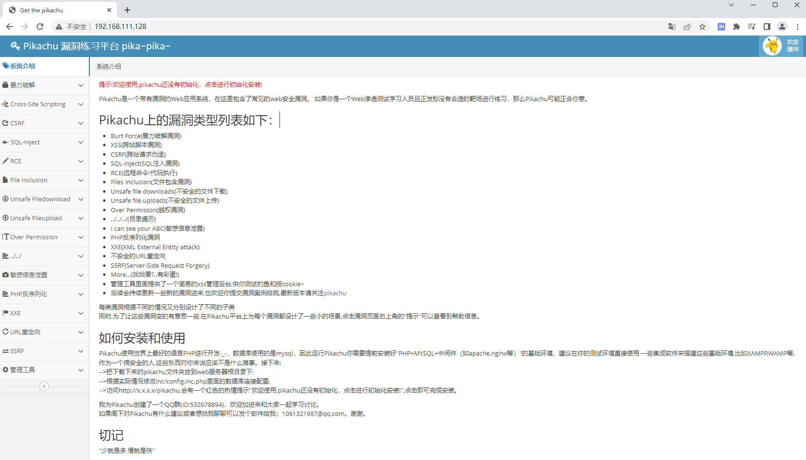

### 1、工具准备

- VMware 虚拟机

~~~
// 下载地址
https://www.vmware.com/products/workstation-pro/workstation-pro-evaluation.html
// 注册码
NZ4RR-FTK5H-H81C1-Q30QH-1V2LA
~~~


- docker

- Kali 操作系统

  - Kali 操作系统基于 Debian，安装了常用的安全工具和开发环境，免去了入门学习配置环境的繁琐步骤

  ~~~~
  下载地址
  https://www.kali.org/get-kali/#kali-virtual-machines
  ~~~~

  

  我们下载 VMware 2.6G 版本，解压后，直接拖拽到 VMware 里就可以了，如果出现打不开的原因，把VMware卸载重装就好了。我个人卸载重装后，原先所有的服务器配置还在！

  ~~~
  用户名和密码都是  kali
  ~~~

### 2、操作Kali

切换 root 用户

```sh
sudo su
# 密码也是 kali
```

```sh
apt update
# 更新 apt, apt是kali操作系统的软件包管理器
apt install -y docker.io
# 安装 docker
```

docker-compose 是python模块，能够基于 docker-compose 配置文件快速开启 docker 容器

```sh
pip3 install docker-compose
# 需要切到 root 用户执行
```

### 3、靶场搭建

#### 3.1、常见漏洞

+ dvwa 是 owasp-web 漏洞综合靶场，适合 web 安全入门分析使用

  ~~~sh
  # 开启docker
  systemctl start docker
  # 拉取 dvwa 镜像
  docker pull vulnerables/web-dvwa
  # 运行
  docker run -dit --name dvwa -p 80:80 vulnerables/web-dvwa
  ~~~

  

  

~~~
admin/password
# 登录进去之后，最下面需要初始化数据库，点击初始化即可
~~~

+ pikachu 也是 web 漏洞综合靶场，涵盖漏洞分类范围更广

  ~~~sh
  # 拉取 pikachu 
  docker pull area39/pikachu
  # 运行
  docker run -dit --name pikachu -p 80:80 area39/pikachu
  ~~~

  

#### 3.2、通用漏洞

+ vulhub 是一个开源的历史漏洞靶场集合，基于 docker-compose ，方便安全学习者快速搭建和复现历史漏洞

  ~~~
  https://vulhub.org
  ~~~

  下载 Vulhub 

  ~~~sh
  git clone https://github.com/vulhub/vulhub.git
  ~~~

  

  克隆完成后，里面各种各样的漏洞都有

  选择相应的漏洞开启就行，我们这里选择 `jboss`

  ```
  ┌──(root㉿kali)-[/home/kali/project/vulhub]
  └─# cd jboss 
  
  ┌──(root㉿kali)-[/home/kali/project/vulhub/jboss]
  └─# ls
  CVE-2017-12149  CVE-2017-7504  JMXInvokerServlet-deserialization
  ```

  我们可以看到有 三个漏洞  `CVE-2017-12149`  `CVE-2017-7504`  `JMXInvokerServlet-deserialization`

  