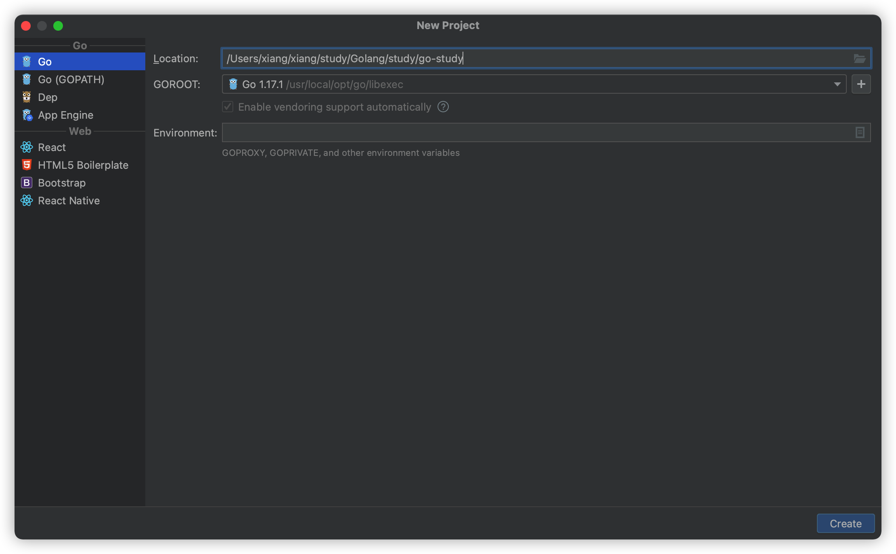
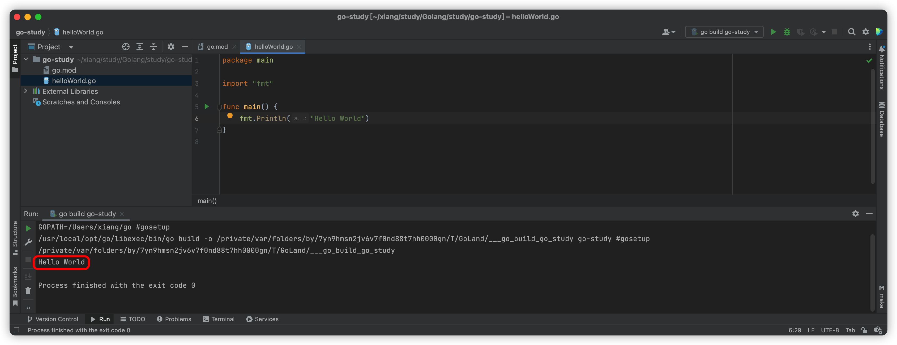

> 2022年10月27日
>
> 参考：[8小时转职Golang工程师-刘丹冰Aceld](https://www.yuque.com/aceld/mo95lb)
>
> [Go语言超全详解（入门级）-大家好，我是好同学](https://blog.csdn.net/weixin_50941083/article/details/125590486)

​	作者在学习 Golang 语言之前，有一些 Java 基础。善于用 Mac 系统和 JetBrains 软件进行学习编码

​	所以在书写笔记的过程中，可能不会特别完整，比如说 `:=` 赋值，我觉得一个Java工作者肯定都能看的懂，为了节省文章篇幅，就不会在文章中提及，还请见谅。


[toc]

在学习 Go 之前，我们先简单的看一下 Go 的家族史，Go 继承了C语言的表达式、控制流、基础数据结构、调用参数、指针等，但是Go对C语言进行了大版本的迭代，舍弃了指针预算，重新设计了部分不太合理的运算符优先级，在很多细微处进行打磨，大致理解就是，在C的基础上，“青出于蓝，更胜于蓝”

## 1、HelloWorld



第一步、创建一个 HelloWorld

```go
package main

import "fmt"

func main() {
	fmt.Println("Hello World")
}

```



## 2、变量

### 2.1、全局和非全局变量

```go
// 变量
package main

import "fmt"

// 全局变量
var a, b int
var c, d int = 1, 2
var (
   e int
   f bool
)

func main() {
   // 局部变量
   g, h := 123, "hello"
   fmt.Println(a, b, c, d, e, f, g, h)
}
```

输出结果：

```
0 0 1 2 0 false 123 hello
```

### 2.2、匿名变量

```go
package main

import "fmt"

func GetData() (int, int) {
	return 10, 20
}

func main() {
	a, _ := GetData()
	_, b := GetData()
	fmt.Println(a, b)
}
```

输出结果：

```
10 20
```

匿名变量的特点是一个下划线 `_` ，任何值赋给这个标识符都会被抛弃，因此这些值不能在后续中使用。匿名变量不会占用内存空间，不会分配内存。匿名变量与变量之间也不会因为多次声明而无法使用。

## 3、指针

引用传递，说到这里，就可以关联到堆栈之间关系，栈中地址值引用堆中数据。这里怎么理解看大家自己了。有要具体了解的可以阅读这篇文章 [JVM之堆栈](https://mp.weixin.qq.com/s?__biz=MzUzMTk1ODU0NA==&mid=2247484584&idx=1&sn=566ae15e11e6ab90889d611608fecd04&chksm=fabbdad7cdcc53c1316172099eb38466e08ca275b2e0a4722ef1f388f48dad41c7a861a791fa&token=419749160&lang=zh_CN#rd)

简洁一点，指针存的不是真正数据，是记录数据的地址值。

```go
package main

import "fmt"

func main() {
	a := 100
	b := 200
	fmt.Println(a, b)
	fmt.Println(&a, &b)

  // 传入地址值进行交换
	swap(&a, &b)
	fmt.Println(a, b)
}

func swap(x *int, y *int) {
	var temp int
	temp = *x
	*x = *y
	*y = temp
}
```

输出结果

```
100 200
0xc00012a008 0xc00012a010
200 100
```

## 4、数组

指定、不指定长度

直接赋值和重新赋值

截取、添加

```go
package main

import "fmt"

// 直接赋值 不指定长度
var nullArray [10]float32
var array = [...]float32{1000.0, 2.0, 3.4, 7.0, 50.0}

func main() {
	fmt.Println("nullArray:", nullArray)
	fmt.Println("array:", array)
	// 赋值
	array := [...]int{1, 2, 3, 4, 5, 6, 7}
	fmt.Println("赋值后 array:", array)

	// 直接切片
	s := array[:]
	fmt.Println("s切片:", s)

	// 截取 2-4
	s1 := array[2:4]
	fmt.Println("s1裁剪后:", s1)

	s1 = append(s1, 100, 200)
	fmt.Println("append后的s1:", s1)
	fmt.Printf("实际长度len=%d 最大长度cap=%d 值slice=%v\n", len(s1), cap(s1), s1)

}
```

输出结果

```
nullArray: [0 0 0 0 0 0 0 0 0 0]
array: [1000 2 3.4 7 50]
赋值后 array: [1 2 3 4 5 6 7]
s切片: [1 2 3 4 5 6 7]
s1裁剪后: [3 4]
append后的s1: [3 4 100 200]
实际长度len=4 最大长度cap=5 值slice=[3 4 100 200]
```

## 5、Map

Map 和数组类似，就是数据结构不一样

```go
package main

import (
	"fmt"
)

func main() {
	//第一种声明
	var test1 map[string]string
	//在使用map前，需要先make，make的作用就是给map分配数据空间
	test1 = make(map[string]string, 10)
	test1["one"] = "php"
	test1["two"] = "golang"
	test1["three"] = "java"
	fmt.Println(test1) //map[two:golang three:java one:php]

	//第二种声明
	test2 := make(map[string]string)
	test2["one"] = "php"
	test2["two"] = "golang"
	test2["three"] = "java"
	fmt.Println(test2) //map[one:php two:golang three:java]

	//第三种声明
	test3 := map[string]string{
		"one":   "php",
		"two":   "golang",
		"three": "java",
	}
	fmt.Println(test3) //map[one:php two:golang three:java]

	language := make(map[string]map[string]string)
	language["php"] = make(map[string]string, 2)
	language["php"]["id"] = "1"
	language["php"]["desc"] = "php是世界上最美的语言"
	language["golang"] = make(map[string]string, 2)
	language["golang"]["id"] = "2"
	language["golang"]["desc"] = "golang抗并发非常good"

	fmt.Println(language) //map[php:map[id:1 desc:php是世界上最美的语言] golang:map[id:2 desc:golang抗并发非常good]]

	//增删改查
	val, key := language["php"] //查找是否有php这个子元素
	if key {
		fmt.Printf("%v", val)
	} else {
		fmt.Printf("no")
	}

	language["php"]["id"] = "3"         //修改了php子元素的id值
	language["php"]["nickname"] = "啪啪啪" //增加php元素里的nickname值
	delete(language, "php")             //删除了php子元素
	fmt.Println(language)
}
```

### 5.1、Map查找数据

```go
val, key := language["php"]
```

Key  是一个 bool 值，表示是 val 是否存在，如果存在 val 则是有值的