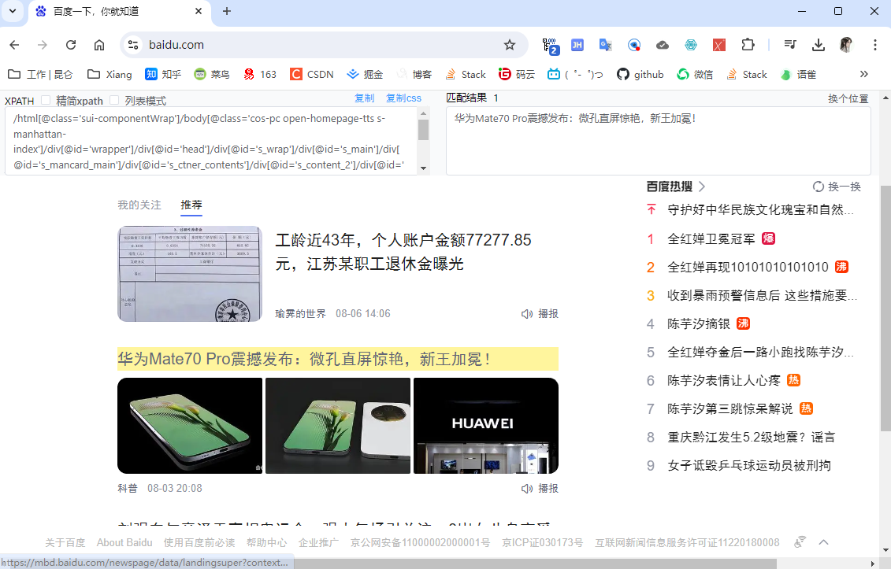

# DrissionPage

官网网站：[https://drissionpage.cn/](https://drissionpage.cn/)

查看 chrome/edge 路径，谷歌： chrome://version，edge://version/


在 Pycharm 中安装插件 `from DrissionPage import ChromiumPage`

Xpath 文章 https://blog.csdn.net/weixin_43411585/article/details/131208719

Xpath plus 工具 https://github.com/mic1on/xpath-helper-plus/tags

左Shift + 鼠标选中元素




杀掉一个浏览器进程

```sh
taskkill /f /im msedge.exe
```


假设爬取图片有防盗链配置，参考这个：  [head头文件.md](..\..\..\07_Frontend 前端\HTML前端\前端知识\head头文件.md) 
